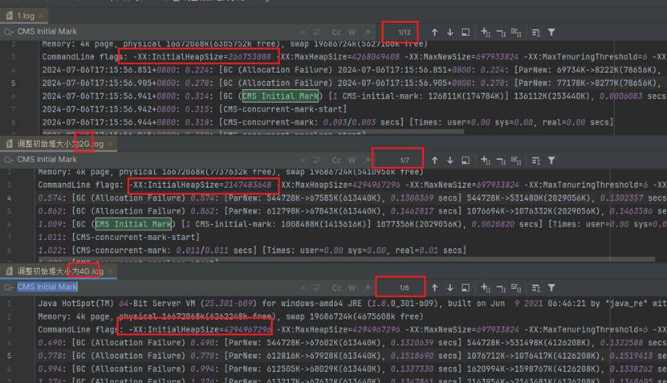
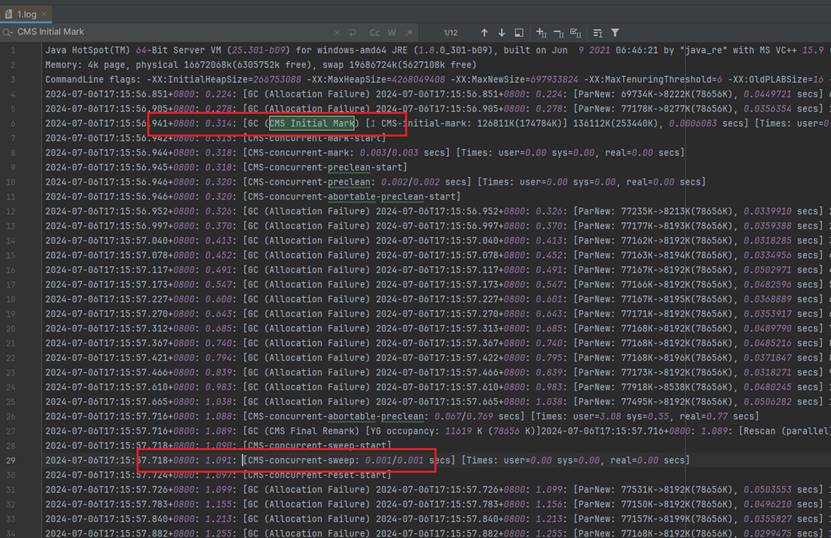
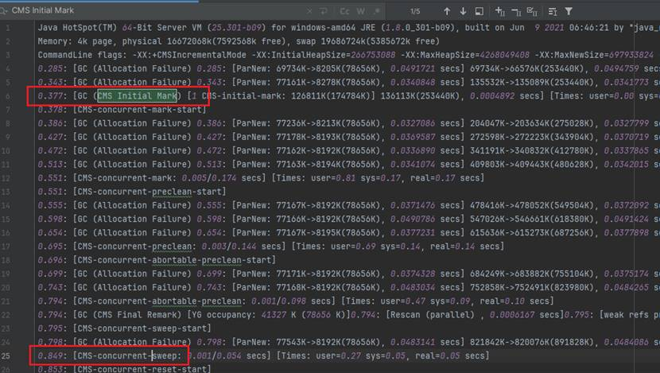
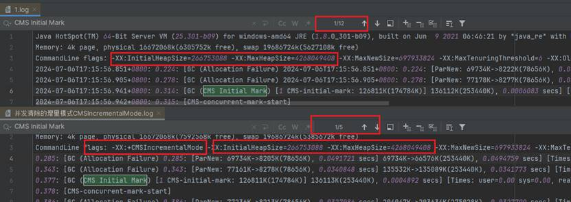

# 1、java程序

```java
public class CMSGCExample {
    public static void main(String[] args) {
        List<byte[]> memoryHog = new ArrayList<>();
        int k = 1;
        while (true) {
            for (int i = 0; i < 1000; i++) {
                // 分配1MB的数组
                byte[] array = new byte[1024 * 1024];
                memoryHog.add(array);
            }
            System.out.println("第" + k++ + "分配1M内存" + "List 大小：" + memoryHog.size());
            // 模拟内存使用情况
            if (memoryHog.size() > 1000) {
                memoryHog.subList(0, 500).clear();
            }

            try {
                // 暂停一段时间，模拟应用程序的其他工作
                Thread.sleep(100);
            } catch (InterruptedException e) {
                e.printStackTrace();
            }
        }
    }
}
```

# 2、java命令

```
  -XX:+UseConcMarkSweepGC   
  -XX:+PrintGCDetails   
  -XX:+PrintGCDateStamps   
  -Xloggc:./gc.log  
```

命令解释：

```angular2html
-XX:+UseConcMarkSweepGC：启用并发标记清除（CMS）垃圾收集器。
-XX:+PrintGCDetails：在垃圾收集时打印详细的GC日志信息。包括每次GC的类型、时间、回收的内存量等详细信息。
-XX:+PrintGCDateStamps：在GC日志中添加真实的时间戳
-Xloggc:./gc.log：指定GC日志的输出文件路径。
```

# 3、运行结果


# 4、GC日志部分分析

<details>
    <summary>1.log日志</summary>

```log
Java HotSpot(TM) 64-Bit Server VM (25.301-b09) for windows-amd64 JRE (1.8.0_301-b09), built on Jun  9 2021 06:46:21 by "java_re" with MS VC++ 15.9 (VS2017)
Memory: 4k page, physical 16672068k(6305752k free), swap 19686724k(5627108k free)
CommandLine flags: -XX:InitialHeapSize=266753088 -XX:MaxHeapSize=4268049408 -XX:MaxNewSize=697933824 -XX:MaxTenuringThreshold=6 -XX:OldPLABSize=16 -XX:+PrintGC -XX:+PrintGCDateStamps -XX:+PrintGCDetails -XX:+PrintGCTimeStamps -XX:+UseCompressedClassPointers -XX:+UseCompressedOops -XX:+UseConcMarkSweepGC -XX:-UseLargePagesIndividualAllocation -XX:+UseParNewGC 
2024-07-06T17:15:56.851+0800: 0.224: [GC (Allocation Failure) 2024-07-06T17:15:56.851+0800: 0.224: [ParNew: 69734K->8222K(78656K), 0.0449721 secs] 69734K->66593K(253440K), 0.0452289 secs] [Times: user=0.30 sys=0.02, real=0.04 secs] 
2024-07-06T17:15:56.905+0800: 0.278: [GC (Allocation Failure) 2024-07-06T17:15:56.905+0800: 0.278: [ParNew: 77178K->8277K(78656K), 0.0356354 secs] 135549K->135088K(253440K), 0.0357393 secs] [Times: user=0.19 sys=0.05, real=0.04 secs] 
2024-07-06T17:15:56.941+0800: 0.314: [GC (CMS Initial Mark) [1 CMS-initial-mark: 126811K(174784K)] 136112K(253440K), 0.0006083 secs] [Times: user=0.00 sys=0.00, real=0.00 secs] 
2024-07-06T17:15:56.942+0800: 0.315: [CMS-concurrent-mark-start]
2024-07-06T17:15:56.944+0800: 0.318: [CMS-concurrent-mark: 0.003/0.003 secs] [Times: user=0.00 sys=0.00, real=0.00 secs] 
2024-07-06T17:15:56.945+0800: 0.318: [CMS-concurrent-preclean-start]
2024-07-06T17:15:56.946+0800: 0.320: [CMS-concurrent-preclean: 0.002/0.002 secs] [Times: user=0.00 sys=0.00, real=0.00 secs] 
2024-07-06T17:15:56.946+0800: 0.320: [CMS-concurrent-abortable-preclean-start]
2024-07-06T17:15:56.952+0800: 0.326: [GC (Allocation Failure) 2024-07-06T17:15:56.952+0800: 0.326: [ParNew: 77235K->8213K(78656K), 0.0339910 secs] 204046K->203633K(275028K), 0.0341050 secs] [Times: user=0.19 sys=0.02, real=0.03 secs] 
2024-07-06T17:15:56.997+0800: 0.370: [GC (Allocation Failure) 2024-07-06T17:15:56.997+0800: 0.370: [ParNew: 77177K->8193K(78656K), 0.0359388 secs] 272598K->272223K(343904K), 0.0360709 secs] [Times: user=0.14 sys=0.05, real=0.04 secs] 
2024-07-06T17:15:57.040+0800: 0.413: [GC (Allocation Failure) 2024-07-06T17:15:57.040+0800: 0.413: [ParNew: 77162K->8192K(78656K), 0.0318285 secs] 341191K->340832K(412780K), 0.0319341 secs] [Times: user=0.17 sys=0.02, real=0.03 secs] 
2024-07-06T17:15:57.078+0800: 0.452: [GC (Allocation Failure) 2024-07-06T17:15:57.078+0800: 0.452: [ParNew: 77163K->8194K(78656K), 0.0334956 secs] 409803K->409443K(481656K), 0.0335672 secs] [Times: user=0.17 sys=0.05, real=0.03 secs] 
2024-07-06T17:15:57.117+0800: 0.491: [GC (Allocation Failure) 2024-07-06T17:15:57.117+0800: 0.491: [ParNew: 77167K->8192K(78656K), 0.0502971 secs] 478416K->478052K(549504K), 0.0503734 secs] [Times: user=0.19 sys=0.03, real=0.05 secs] 
2024-07-06T17:15:57.173+0800: 0.547: [GC (Allocation Failure) 2024-07-06T17:15:57.173+0800: 0.547: [ParNew: 77166K->8192K(78656K), 0.0482596 secs] 547026K->546661K(618380K), 0.0483362 secs] [Times: user=0.33 sys=0.00, real=0.05 secs] 
2024-07-06T17:15:57.227+0800: 0.600: [GC (Allocation Failure) 2024-07-06T17:15:57.227+0800: 0.601: [ParNew: 77167K->8195K(78656K), 0.0368889 secs] 615636K->615273K(687256K), 0.0369739 secs] [Times: user=0.14 sys=0.05, real=0.04 secs] 
2024-07-06T17:15:57.270+0800: 0.643: [GC (Allocation Failure) 2024-07-06T17:15:57.270+0800: 0.643: [ParNew: 77171K->8192K(78656K), 0.0353917 secs] 684249K->683882K(756132K), 0.0354682 secs] [Times: user=0.17 sys=0.03, real=0.04 secs] 
2024-07-06T17:15:57.312+0800: 0.685: [GC (Allocation Failure) 2024-07-06T17:15:57.313+0800: 0.685: [ParNew: 77168K->8192K(78656K), 0.0489790 secs] 752858K->752491K(823980K), 0.0490834 secs] [Times: user=0.27 sys=0.03, real=0.05 secs] 
2024-07-06T17:15:57.367+0800: 0.740: [GC (Allocation Failure) 2024-07-06T17:15:57.367+0800: 0.740: [ParNew: 77168K->8192K(78656K), 0.0485216 secs] 821468K->821100K(892856K), 0.0486005 secs] [Times: user=0.30 sys=0.03, real=0.05 secs] 
2024-07-06T17:15:57.421+0800: 0.794: [GC (Allocation Failure) 2024-07-06T17:15:57.422+0800: 0.795: [ParNew: 77168K->8196K(78656K), 0.0371847 secs] 890077K->889714K(961732K), 0.0375472 secs] [Times: user=0.22 sys=0.08, real=0.04 secs] 
2024-07-06T17:15:57.466+0800: 0.839: [GC (Allocation Failure) 2024-07-06T17:15:57.466+0800: 0.839: [ParNew: 77173K->8192K(78656K), 0.0318271 secs] 958691K->958323K(1029580K), 0.0319270 secs] [Times: user=0.09 sys=0.08, real=0.03 secs] 
2024-07-06T17:15:57.610+0800: 0.983: [GC (Allocation Failure) 2024-07-06T17:15:57.610+0800: 0.983: [ParNew: 77918K->8538K(78656K), 0.0480245 secs] 1028050K->1025231K(1096400K), 0.0481013 secs] [Times: user=0.22 sys=0.05, real=0.05 secs] 
2024-07-06T17:15:57.665+0800: 1.038: [GC (Allocation Failure) 2024-07-06T17:15:57.665+0800: 1.038: [ParNew: 77495K->8192K(78656K), 0.0506282 secs] 1094188K->1093829K(1165660K), 0.0507213 secs] [Times: user=0.27 sys=0.03, real=0.05 secs] 
2024-07-06T17:15:57.716+0800: 1.088: [CMS-concurrent-abortable-preclean: 0.067/0.769 secs] [Times: user=3.08 sys=0.55, real=0.77 secs] 
2024-07-06T17:15:57.716+0800: 1.089: [GC (CMS Final Remark) [YG occupancy: 11619 K (78656 K)]2024-07-06T17:15:57.716+0800: 1.089: [Rescan (parallel) , 0.0008016 secs]2024-07-06T17:15:57.717+0800: 1.089: [weak refs processing, 0.0000298 secs]2024-07-06T17:15:57.717+0800: 1.089: [class unloading, 0.0003171 secs]2024-07-06T17:15:57.717+0800: 1.090: [scrub symbol table, 0.0004576 secs]2024-07-06T17:15:57.717+0800: 1.090: [scrub string table, 0.0001314 secs][1 CMS-remark: 1085637K(1087004K)] 1097256K(1165660K), 0.0018498 secs] [Times: user=0.00 sys=0.00, real=0.00 secs] 
2024-07-06T17:15:57.718+0800: 1.090: [CMS-concurrent-sweep-start]
2024-07-06T17:15:57.718+0800: 1.091: [CMS-concurrent-sweep: 0.001/0.001 secs] [Times: user=0.00 sys=0.00, real=0.00 secs] 
2024-07-06T17:15:57.724+0800: 1.097: [CMS-concurrent-reset-start]
2024-07-06T17:15:57.726+0800: 1.099: [GC (Allocation Failure) 2024-07-06T17:15:57.726+0800: 1.099: [ParNew: 77531K->8192K(78656K), 0.0503553 secs] 1163167K->1161413K(1888052K), 0.0504781 secs] [Times: user=0.25 sys=0.05, real=0.05 secs] 
2024-07-06T17:15:57.783+0800: 1.155: [GC (Allocation Failure) 2024-07-06T17:15:57.783+0800: 1.156: [ParNew: 77150K->8192K(78656K), 0.0496210 secs] 1230372K->1230022K(1888052K), 0.0497153 secs] [Times: user=0.30 sys=0.11, real=0.05 secs] 
2024-07-06T17:15:57.840+0800: 1.213: [GC (Allocation Failure) 2024-07-06T17:15:57.840+0800: 1.213: [ParNew: 77157K->8199K(78656K), 0.0355827 secs] 1298987K->1298639K(1888052K), 0.0356723 secs] [Times: user=0.17 sys=0.05, real=0.04 secs] 
2024-07-06T17:15:57.882+0800: 1.255: [GC (Allocation Failure) 2024-07-06T17:15:57.882+0800: 1.255: [ParNew: 77168K->8192K(78656K), 0.0299475 secs] 1367608K->1367248K(1888052K), 0.0300422 secs] [Times: user=0.17 sys=0.05, real=0.03 secs] 
2024-07-06T17:15:57.919+0800: 1.292: [GC (Allocation Failure) 2024-07-06T17:15:57.919+0800: 1.292: [ParNew: 77164K->8192K(78656K), 0.0486246 secs] 1436219K->1435857K(1888052K), 0.0487223 secs] [Times: user=0.25 sys=0.08, real=0.05 secs] 
2024-07-06T17:15:57.976+0800: 1.349: [GC (Allocation Failure) 2024-07-06T17:15:57.976+0800: 1.349: [ParNew: 77165K->8192K(78656K), 0.0485800 secs] 1504830K->1504466K(1888052K), 0.0486973 secs] [Times: user=0.22 sys=0.05, real=0.05 secs] 
2024-07-06T17:15:58.027+0800: 1.400: [CMS-concurrent-reset: 0.039/0.304 secs] [Times: user=1.39 sys=0.41, real=0.30 secs] 
2024-07-06T17:15:58.031+0800: 1.404: [GC (Allocation Failure) 2024-07-06T17:15:58.031+0800: 1.404: [ParNew: 77166K->8192K(78656K), 0.0524748 secs] 1573440K->1573075K(1888052K), 0.0525701 secs] [Times: user=0.30 sys=0.01, real=0.05 secs] 
2024-07-06T17:15:58.084+0800: 1.457: [GC (CMS Initial Mark) [1 CMS-initial-mark: 1564883K(1809396K)] 1574099K(1888052K), 0.0002117 secs] [Times: user=0.00 sys=0.00, real=0.00 secs] 
2024-07-06T17:15:58.084+0800: 1.457: [CMS-concurrent-mark-start]
2024-07-06T17:15:58.091+0800: 1.464: [GC (Allocation Failure) 2024-07-06T17:15:58.091+0800: 1.464: [ParNew: 77167K->8192K(78656K), 0.0389426 secs] 1642050K->1641684K(1888052K), 0.0390295 secs] [Times: user=0.25 sys=0.06, real=0.04 secs] 
2024-07-06T17:15:58.132+0800: 1.505: [CMS-concurrent-mark: 0.009/0.048 secs] [Times: user=0.25 sys=0.06, real=0.05 secs] 
2024-07-06T17:15:58.133+0800: 1.506: [CMS-concurrent-preclean-start]
2024-07-06T17:15:58.136+0800: 1.509: [CMS-concurrent-preclean: 0.003/0.003 secs] [Times: user=0.00 sys=0.00, real=0.00 secs] 
2024-07-06T17:15:58.136+0800: 1.509: [CMS-concurrent-abortable-preclean-start]
2024-07-06T17:15:58.139+0800: 1.512: [GC (Allocation Failure) 2024-07-06T17:15:58.139+0800: 1.512: [ParNew: 77167K->8192K(78656K), 0.0481076 secs] 1710660K->1710293K(1888052K), 0.0481974 secs] [Times: user=0.25 sys=0.05, real=0.05 secs] 
2024-07-06T17:15:58.193+0800: 1.566: [GC (Allocation Failure) 2024-07-06T17:15:58.194+0800: 1.567: [ParNew: 77168K->8192K(78656K), 0.0501173 secs] 1779269K->1778902K(1888052K), 0.0502449 secs] [Times: user=0.27 sys=0.03, real=0.05 secs] 
2024-07-06T17:15:58.252+0800: 1.625: [GC (Allocation Failure) 2024-07-06T17:15:58.252+0800: 1.625: [ParNew: 77168K->8192K(78656K), 0.0489005 secs] 1847878K->1847511K(1919920K), 0.0489969 secs] [Times: user=0.41 sys=0.02, real=0.05 secs] 
2024-07-06T17:15:58.310+0800: 1.684: [GC (Allocation Failure) 2024-07-06T17:15:58.310+0800: 1.684: [ParNew: 77168K->8202K(78656K), 0.0371421 secs] 1916487K->1916131K(1987768K), 0.0372554 secs] [Times: user=0.16 sys=0.03, real=0.04 secs] 
2024-07-06T17:15:58.355+0800: 1.729: [GC (Allocation Failure) 2024-07-06T17:15:58.355+0800: 1.729: [ParNew: 77179K->8192K(78656K), 0.0303288 secs] 1985107K->1984740K(2056644K), 0.0304336 secs] [Times: user=0.16 sys=0.05, real=0.03 secs] 
2024-07-06T17:15:58.509+0800: 1.882: [GC (Allocation Failure) 2024-07-06T17:15:58.509+0800: 1.882: [ParNew: 77168K->8194K(78656K), 0.0495277 secs] 2053716K->2053351K(2125520K), 0.0496124 secs] [Times: user=0.26 sys=0.05, real=0.05 secs] 
2024-07-06T17:15:58.559+0800: 1.932: [CMS-concurrent-abortable-preclean: 0.021/0.423 secs] [Times: user=1.51 sys=0.23, real=0.42 secs] 
2024-07-06T17:15:58.559+0800: 1.932: [GC (CMS Final Remark) [YG occupancy: 11633 K (78656 K)]2024-07-06T17:15:58.559+0800: 1.932: [Rescan (parallel) , 0.0009123 secs]2024-07-06T17:15:58.560+0800: 1.933: [weak refs processing, 0.0000132 secs]2024-07-06T17:15:58.560+0800: 1.933: [class unloading, 0.0002748 secs]2024-07-06T17:15:58.560+0800: 1.933: [scrub symbol table, 0.0003630 secs]2024-07-06T17:15:58.560+0800: 1.934: [scrub string table, 0.0001448 secs][1 CMS-remark: 2045157K(2046864K)] 2056791K(2125520K), 0.0017845 secs] [Times: user=0.00 sys=0.00, real=0.00 secs] 
2024-07-06T17:15:58.561+0800: 1.934: [CMS-concurrent-sweep-start]
2024-07-06T17:15:58.562+0800: 1.936: [CMS-concurrent-sweep: 0.002/0.002 secs] [Times: user=0.00 sys=0.00, real=0.00 secs] 
2024-07-06T17:15:58.569+0800: 1.942: [CMS-concurrent-reset-start]
2024-07-06T17:15:58.569+0800: 1.942: [GC (Allocation Failure) 2024-07-06T17:15:58.569+0800: 1.942: [ParNew: 77170K->8192K(78656K), 0.0531231 secs] 2122312K->2121942K(3487228K), 0.0532359 secs] [Times: user=0.28 sys=0.03, real=0.05 secs] 
2024-07-06T17:15:58.631+0800: 2.005: [CMS-concurrent-reset: 0.009/0.062 secs] [Times: user=0.31 sys=0.03, real=0.06 secs] 
2024-07-06T17:15:58.633+0800: 2.007: [GC (Allocation Failure) 2024-07-06T17:15:58.633+0800: 2.007: [ParNew: 77168K->8192K(78656K), 0.0561739 secs] 2190919K->2190551K(3487228K), 0.0562709 secs] [Times: user=0.25 sys=0.03, real=0.06 secs] 
2024-07-06T17:15:58.697+0800: 2.071: [GC (Allocation Failure) 2024-07-06T17:15:58.697+0800: 2.071: [ParNew: 77168K->8192K(78656K), 0.0598681 secs] 2259528K->2259160K(3487228K), 0.0599550 secs] [Times: user=0.33 sys=0.05, real=0.06 secs] 
2024-07-06T17:15:58.766+0800: 2.140: [GC (Allocation Failure) 2024-07-06T17:15:58.766+0800: 2.140: [ParNew: 77168K->8192K(78656K), 0.0555423 secs] 2328137K->2327769K(3487228K), 0.0556841 secs] [Times: user=0.31 sys=0.09, real=0.06 secs] 
2024-07-06T17:15:58.830+0800: 2.204: [GC (Allocation Failure) 2024-07-06T17:15:58.830+0800: 2.204: [ParNew: 77168K->8192K(78656K), 0.0824270 secs] 2396746K->2396378K(3487228K), 0.0825673 secs] [Times: user=0.50 sys=0.06, real=0.08 secs] 
2024-07-06T17:15:58.913+0800: 2.287: [GC (CMS Initial Mark) [1 CMS-initial-mark: 2388186K(3408572K)] 2397402K(3487228K), 0.0002227 secs] [Times: user=0.00 sys=0.00, real=0.00 secs] 
2024-07-06T17:15:58.913+0800: 2.287: [CMS-concurrent-mark-start]
2024-07-06T17:15:58.923+0800: 2.297: [GC (Allocation Failure) 2024-07-06T17:15:58.923+0800: 2.297: [ParNew: 77168K->8192K(78656K), 0.0580586 secs] 2465355K->2464987K(3487228K), 0.0581535 secs] [Times: user=0.38 sys=0.05, real=0.06 secs] 
2024-07-06T17:15:58.985+0800: 2.359: [CMS-concurrent-mark: 0.013/0.072 secs] [Times: user=0.38 sys=0.05, real=0.07 secs] 
2024-07-06T17:15:58.985+0800: 2.359: [CMS-concurrent-preclean-start]
2024-07-06T17:15:58.990+0800: 2.364: [CMS-concurrent-preclean: 0.005/0.005 secs] [Times: user=0.03 sys=0.00, real=0.01 secs] 
2024-07-06T17:15:58.991+0800: 2.364: [GC (Allocation Failure) 2024-07-06T17:15:58.991+0800: 2.364: [ParNew: 77168K->8192K(78656K), 0.0559815 secs] 2533964K->2533596K(3487228K), 0.0560546 secs] [Times: user=0.23 sys=0.05, real=0.06 secs] 
2024-07-06T17:15:59.047+0800: 2.420: [GC (CMS Final Remark) [YG occupancy: 9216 K (78656 K)]2024-07-06T17:15:59.047+0800: 2.420: [Rescan (parallel) , 0.0013758 secs]2024-07-06T17:15:59.048+0800: 2.422: [weak refs processing, 0.0000204 secs]2024-07-06T17:15:59.049+0800: 2.422: [class unloading, 0.0005155 secs]2024-07-06T17:15:59.049+0800: 2.422: [scrub symbol table, 0.0007690 secs]2024-07-06T17:15:59.050+0800: 2.423: [scrub string table, 0.0002273 secs][1 CMS-remark: 2525404K(3408572K)] 2534620K(3487228K), 0.0030710 secs] [Times: user=0.00 sys=0.00, real=0.00 secs] 
2024-07-06T17:15:59.050+0800: 2.423: [CMS-concurrent-sweep-start]
2024-07-06T17:15:59.053+0800: 2.426: [CMS-concurrent-sweep: 0.002/0.002 secs] [Times: user=0.03 sys=0.00, real=0.00 secs] 
2024-07-06T17:15:59.053+0800: 2.426: [CMS-concurrent-reset-start]
2024-07-06T17:15:59.065+0800: 2.438: [GC (Allocation Failure) 2024-07-06T17:15:59.065+0800: 2.438: [ParNew: 77168K->8192K(78656K), 0.0204544 secs] 2090558K->2090190K(3487228K), 0.0206155 secs] [Times: user=0.17 sys=0.02, real=0.02 secs] 
2024-07-06T17:15:59.086+0800: 2.459: [CMS-concurrent-reset: 0.012/0.033 secs] [Times: user=0.17 sys=0.02, real=0.03 secs] 
2024-07-06T17:15:59.095+0800: 2.468: [GC (Allocation Failure) 2024-07-06T17:15:59.095+0800: 2.469: [ParNew: 77168K->8192K(78656K), 0.0219095 secs] 2159167K->2158799K(3487228K), 0.0221224 secs] [Times: user=0.19 sys=0.00, real=0.02 secs] 
2024-07-06T17:15:59.126+0800: 2.499: [GC (Allocation Failure) 2024-07-06T17:15:59.126+0800: 2.499: [ParNew: 77168K->8192K(78656K), 0.0198121 secs] 2227776K->2227408K(3487228K), 0.0198949 secs] [Times: user=0.16 sys=0.02, real=0.02 secs] 
2024-07-06T17:15:59.154+0800: 2.528: [GC (Allocation Failure) 2024-07-06T17:15:59.154+0800: 2.528: [ParNew: 77168K->8192K(78656K), 0.0180045 secs] 2296385K->2296017K(3487228K), 0.0181441 secs] [Times: user=0.13 sys=0.00, real=0.02 secs] 
2024-07-06T17:15:59.173+0800: 2.546: [GC (CMS Initial Mark) [1 CMS-initial-mark: 2287825K(3408572K)] 2297042K(3487228K), 0.0002186 secs] [Times: user=0.00 sys=0.00, real=0.00 secs] 
2024-07-06T17:15:59.173+0800: 2.546: [CMS-concurrent-mark-start]
2024-07-06T17:15:59.183+0800: 2.556: [GC (Allocation Failure) 2024-07-06T17:15:59.183+0800: 2.556: [ParNew: 77168K->8192K(78656K), 0.0196773 secs] 2364994K->2364627K(3487228K), 0.0198117 secs] [Times: user=0.06 sys=0.00, real=0.02 secs] 
2024-07-06T17:15:59.207+0800: 2.580: [CMS-concurrent-mark: 0.014/0.034 secs] [Times: user=0.16 sys=0.00, real=0.03 secs] 
2024-07-06T17:15:59.207+0800: 2.580: [CMS-concurrent-preclean-start]
2024-07-06T17:15:59.212+0800: 2.585: [CMS-concurrent-preclean: 0.005/0.005 secs] [Times: user=0.00 sys=0.00, real=0.00 secs] 
2024-07-06T17:15:59.212+0800: 2.585: [GC (Allocation Failure) 2024-07-06T17:15:59.212+0800: 2.585: [ParNew: 77168K->8192K(78656K), 0.0204898 secs] 2433603K->2433236K(3487228K), 0.0205835 secs] [Times: user=0.06 sys=0.00, real=0.02 secs] 
2024-07-06T17:15:59.233+0800: 2.606: [GC (CMS Final Remark) [YG occupancy: 9216 K (78656 K)]2024-07-06T17:15:59.233+0800: 2.606: [Rescan (parallel) , 0.0016034 secs]2024-07-06T17:15:59.234+0800: 2.608: [weak refs processing, 0.0000155 secs]2024-07-06T17:15:59.234+0800: 2.608: [class unloading, 0.0003687 secs]2024-07-06T17:15:59.235+0800: 2.608: [scrub symbol table, 0.0006877 secs]2024-07-06T17:15:59.236+0800: 2.609: [scrub string table, 0.0002301 secs][1 CMS-remark: 2425043K(3408572K)] 2434260K(3487228K), 0.0030657 secs] [Times: user=0.00 sys=0.00, real=0.00 secs] 
2024-07-06T17:15:59.236+0800: 2.609: [CMS-concurrent-sweep-start]
2024-07-06T17:15:59.238+0800: 2.612: [CMS-concurrent-sweep: 0.003/0.003 secs] [Times: user=0.00 sys=0.00, real=0.00 secs] 
2024-07-06T17:15:59.240+0800: 2.613: [CMS-concurrent-reset-start]
2024-07-06T17:15:59.250+0800: 2.624: [GC (Allocation Failure) 2024-07-06T17:15:59.251+0800: 2.624: [ParNew: 77168K->8192K(78656K), 0.0216713 secs] 2502212K->2501845K(3566848K), 0.0218727 secs] [Times: user=0.16 sys=0.00, real=0.02 secs] 
2024-07-06T17:15:59.273+0800: 2.647: [CMS-concurrent-reset: 0.011/0.034 secs] [Times: user=0.16 sys=0.00, real=0.03 secs] 
2024-07-06T17:15:59.389+0800: 2.762: [GC (Allocation Failure) 2024-07-06T17:15:59.389+0800: 2.762: [ParNew: 77168K->8192K(78656K), 0.0416380 secs] 2570821K->2570454K(3566848K), 0.0418114 secs] [Times: user=0.28 sys=0.03, real=0.04 secs] 
2024-07-06T17:15:59.440+0800: 2.814: [GC (Allocation Failure) 2024-07-06T17:15:59.440+0800: 2.814: [ParNew: 77168K->8192K(78656K), 0.0556516 secs] 2639430K->2639063K(3566848K), 0.0557694 secs] [Times: user=0.31 sys=0.06, real=0.06 secs] 
2024-07-06T17:15:59.505+0800: 2.878: [GC (Allocation Failure) 2024-07-06T17:15:59.505+0800: 2.878: [ParNew: 77168K->8192K(78656K), 0.0602381 secs] 2708039K->2707672K(3566848K), 0.0603613 secs] [Times: user=0.22 sys=0.03, real=0.06 secs] 
2024-07-06T17:15:59.574+0800: 2.947: [GC (Allocation Failure) 2024-07-06T17:15:59.574+0800: 2.947: [ParNew: 77168K->8192K(78656K), 0.0569894 secs] 2776648K->2776281K(3566848K), 0.0571214 secs] [Times: user=0.36 sys=0.06, real=0.06 secs] 
2024-07-06T17:15:59.641+0800: 3.014: [GC (Allocation Failure) 2024-07-06T17:15:59.641+0800: 3.014: [ParNew: 77168K->8192K(78656K), 0.0656872 secs] 2845257K->2844890K(3566848K), 0.0658435 secs] [Times: user=0.30 sys=0.11, real=0.07 secs] 
2024-07-06T17:15:59.717+0800: 3.090: [GC (Allocation Failure) 2024-07-06T17:15:59.717+0800: 3.090: [ParNew: 77168K->8192K(78656K), 0.0553360 secs] 2913866K->2913499K(3566848K), 0.0554807 secs] [Times: user=0.36 sys=0.05, real=0.06 secs] 
2024-07-06T17:15:59.781+0800: 3.154: [GC (Allocation Failure) 2024-07-06T17:15:59.781+0800: 3.154: [ParNew: 77168K->8192K(78656K), 0.0540177 secs] 2982476K->2982108K(3566848K), 0.0541588 secs] [Times: user=0.39 sys=0.03, real=0.05 secs] 
2024-07-06T17:15:59.845+0800: 3.218: [GC (Allocation Failure) 2024-07-06T17:15:59.845+0800: 3.218: [ParNew: 77168K->8192K(78656K), 0.0595975 secs] 3051085K->3050717K(3566848K), 0.0597671 secs] [Times: user=0.27 sys=0.06, real=0.06 secs] 
2024-07-06T17:15:59.905+0800: 3.278: [GC (CMS Initial Mark) [1 CMS-initial-mark: 3042525K(3488192K)] 3051741K(3566848K), 0.0002085 secs] [Times: user=0.00 sys=0.00, real=0.00 secs] 
2024-07-06T17:15:59.905+0800: 3.278: [CMS-concurrent-mark-start]
2024-07-06T17:15:59.915+0800: 3.288: [GC (Allocation Failure) 2024-07-06T17:15:59.915+0800: 3.289: [ParNew: 77168K->8192K(78656K), 0.0599094 secs] 3119694K->3119326K(3566848K), 0.0600662 secs] [Times: user=0.28 sys=0.05, real=0.06 secs] 
2024-07-06T17:15:59.982+0800: 3.355: [CMS-concurrent-mark: 0.016/0.076 secs] [Times: user=0.33 sys=0.05, real=0.08 secs] 
2024-07-06T17:15:59.982+0800: 3.355: [CMS-concurrent-preclean-start]
2024-07-06T17:15:59.988+0800: 3.362: [CMS-concurrent-preclean: 0.007/0.007 secs] [Times: user=0.00 sys=0.00, real=0.01 secs] 
2024-07-06T17:15:59.988+0800: 3.362: [GC (Allocation Failure) 2024-07-06T17:15:59.989+0800: 3.362: [ParNew: 77168K->8192K(78656K), 0.0569421 secs] 3188303K->3187935K(3566848K), 0.0570553 secs] [Times: user=0.19 sys=0.06, real=0.06 secs] 
2024-07-06T17:16:00.046+0800: 3.419: [GC (CMS Final Remark) [YG occupancy: 9216 K (78656 K)]2024-07-06T17:16:00.046+0800: 3.419: [Rescan (parallel) , 0.0013359 secs]2024-07-06T17:16:00.047+0800: 3.420: [weak refs processing, 0.0000179 secs]2024-07-06T17:16:00.047+0800: 3.420: [class unloading, 0.0006180 secs]2024-07-06T17:16:00.048+0800: 3.421: [scrub symbol table, 0.0012560 secs]2024-07-06T17:16:00.049+0800: 3.422: [scrub string table, 0.0002910 secs][1 CMS-remark: 3179743K(3488192K)] 3188959K(3566848K), 0.0037452 secs] [Times: user=0.00 sys=0.00, real=0.00 secs] 
2024-07-06T17:16:00.050+0800: 3.423: [CMS-concurrent-sweep-start]
2024-07-06T17:16:00.054+0800: 3.427: [CMS-concurrent-sweep: 0.004/0.004 secs] [Times: user=0.03 sys=0.00, real=0.00 secs] 
2024-07-06T17:16:00.054+0800: 3.427: [CMS-concurrent-reset-start]
2024-07-06T17:16:00.066+0800: 3.440: [GC (Allocation Failure) 2024-07-06T17:16:00.066+0800: 3.440: [ParNew: 77168K->8192K(78656K), 0.0267001 secs] 2744904K->2744536K(3566848K), 0.0268799 secs] [Times: user=0.06 sys=0.03, real=0.03 secs] 
2024-07-06T17:16:00.095+0800: 3.468: [CMS-concurrent-reset: 0.014/0.041 secs] [Times: user=0.06 sys=0.03, real=0.04 secs] 
2024-07-06T17:16:00.104+0800: 3.478: [GC (Allocation Failure) 2024-07-06T17:16:00.105+0800: 3.478: [ParNew: 77168K->8192K(78656K), 0.0564108 secs] 2813513K->2813145K(3566848K), 0.0565530 secs] [Times: user=0.25 sys=0.05, real=0.06 secs] 
2024-07-06T17:16:00.171+0800: 3.544: [GC (Allocation Failure) 2024-07-06T17:16:00.171+0800: 3.544: [ParNew: 77168K->8208K(78656K), 0.0468834 secs] 2882122K->2881771K(3566848K), 0.0470514 secs] [Times: user=0.28 sys=0.02, real=0.05 secs] 
2024-07-06T17:16:00.229+0800: 3.602: [GC (Allocation Failure) 2024-07-06T17:16:00.229+0800: 3.602: [ParNew: 77185K->8192K(78656K), 0.0392669 secs] 2950747K->2950380K(3566848K), 0.0394253 secs] [Times: user=0.17 sys=0.03, real=0.04 secs] 
2024-07-06T17:16:00.278+0800: 3.651: [GC (Allocation Failure) 2024-07-06T17:16:00.278+0800: 3.651: [ParNew: 77168K->8192K(78656K), 0.0563316 secs] 3019356K->3018989K(3566848K), 0.0564340 secs] [Times: user=0.28 sys=0.11, real=0.06 secs] 
2024-07-06T17:16:00.335+0800: 3.708: [GC (CMS Initial Mark) [1 CMS-initial-mark: 3010797K(3488192K)] 3020013K(3566848K), 0.0002098 secs] [Times: user=0.00 sys=0.00, real=0.00 secs] 
2024-07-06T17:16:00.335+0800: 3.708: [CMS-concurrent-mark-start]
2024-07-06T17:16:00.347+0800: 3.720: [CMS-concurrent-mark: 0.012/0.012 secs] [Times: user=0.00 sys=0.00, real=0.01 secs] 
2024-07-06T17:16:00.347+0800: 3.720: [CMS-concurrent-preclean-start]
2024-07-06T17:16:00.351+0800: 3.724: [CMS-concurrent-preclean: 0.004/0.004 secs] [Times: user=0.02 sys=0.00, real=0.00 secs] 
2024-07-06T17:16:00.351+0800: 3.724: [CMS-concurrent-abortable-preclean-start]
2024-07-06T17:16:00.448+0800: 3.821: [GC (Allocation Failure) 2024-07-06T17:16:00.448+0800: 3.821: [ParNew2024-07-06T17:16:00.463+0800: 3.836: [CMS-concurrent-abortable-preclean: 0.004/0.112 secs] [Times: user=0.05 sys=0.03, real=0.11 secs] 
: 77168K->8192K(78656K), 0.0273142 secs] 3087965K->3087598K(3566848K), 0.0274367 secs] [Times: user=0.16 sys=0.03, real=0.03 secs] 
2024-07-06T17:16:00.476+0800: 3.849: [GC (CMS Final Remark) [YG occupancy: 9216 K (78656 K)]2024-07-06T17:16:00.476+0800: 3.849: [Rescan (parallel) , 0.0015173 secs]2024-07-06T17:16:00.477+0800: 3.850: [weak refs processing, 0.0000280 secs]2024-07-06T17:16:00.478+0800: 3.850: [class unloading, 0.0002790 secs]2024-07-06T17:16:00.478+0800: 3.851: [scrub symbol table, 0.0003957 secs]2024-07-06T17:16:00.478+0800: 3.851: [scrub string table, 0.0001258 secs][1 CMS-remark: 3079406K(3488192K)] 3088622K(3566848K), 0.0024271 secs] [Times: user=0.00 sys=0.00, real=0.00 secs] 
2024-07-06T17:16:00.478+0800: 3.851: [CMS-concurrent-sweep-start]
2024-07-06T17:16:00.481+0800: 3.854: [CMS-concurrent-sweep: 0.003/0.003 secs] [Times: user=0.00 sys=0.00, real=0.00 secs] 
2024-07-06T17:16:00.481+0800: 3.854: [CMS-concurrent-reset-start]
2024-07-06T17:16:00.491+0800: 3.864: [GC (Allocation Failure) 2024-07-06T17:16:00.491+0800: 3.864: [ParNew: 77168K->8192K(78656K), 0.0197121 secs] 3156564K->3156196K(3566848K), 0.0198401 secs] [Times: user=0.08 sys=0.00, real=0.02 secs] 
2024-07-06T17:16:00.512+0800: 3.885: [CMS-concurrent-reset: 0.011/0.031 secs] [Times: user=0.11 sys=0.00, real=0.03 secs] 
2024-07-06T17:16:00.520+0800: 3.893: [GC (Allocation Failure) 2024-07-06T17:16:00.520+0800: 3.893: [ParNew: 77168K->8192K(78656K), 0.0245710 secs] 3225173K->3224805K(3566848K), 0.0247443 secs] [Times: user=0.06 sys=0.00, real=0.03 secs] 
2024-07-06T17:16:00.545+0800: 3.918: [GC (CMS Initial Mark) [1 CMS-initial-mark: 3216613K(3488192K)] 3225829K(3566848K), 0.0002600 secs] [Times: user=0.00 sys=0.00, real=0.00 secs] 
2024-07-06T17:16:00.545+0800: 3.918: [CMS-concurrent-mark-start]
2024-07-06T17:16:00.556+0800: 3.929: [GC (Allocation Failure) 2024-07-06T17:16:00.556+0800: 3.929: [ParNew: 77168K->8192K(78656K), 0.0251304 secs] 3293782K->3293414K(3566848K), 0.0252763 secs] [Times: user=0.08 sys=0.00, real=0.03 secs] 
2024-07-06T17:16:00.588+0800: 3.961: [CMS-concurrent-mark: 0.017/0.042 secs] [Times: user=0.17 sys=0.00, real=0.04 secs] 
2024-07-06T17:16:00.588+0800: 3.961: [CMS-concurrent-preclean-start]
2024-07-06T17:16:00.596+0800: 3.969: [CMS-concurrent-preclean: 0.008/0.008 secs] [Times: user=0.00 sys=0.00, real=0.01 secs] 
2024-07-06T17:16:00.596+0800: 3.969: [GC (Allocation Failure) 2024-07-06T17:16:00.596+0800: 3.969: [ParNew: 77168K->8192K(78656K), 0.0292940 secs] 3362391K->3362023K(3566848K), 0.0293952 secs] [Times: user=0.16 sys=0.03, real=0.03 secs] 
2024-07-06T17:16:00.626+0800: 3.999: [GC (CMS Final Remark) [YG occupancy: 9216 K (78656 K)]2024-07-06T17:16:00.626+0800: 3.999: [Rescan (parallel) , 0.0021071 secs]2024-07-06T17:16:00.628+0800: 4.001: [weak refs processing, 0.0000298 secs]2024-07-06T17:16:00.628+0800: 4.001: [class unloading, 0.0006758 secs]2024-07-06T17:16:00.629+0800: 4.002: [scrub symbol table, 0.0018040 secs]2024-07-06T17:16:00.631+0800: 4.004: [scrub string table, 0.0002902 secs][1 CMS-remark: 3353831K(3488192K)] 3363047K(3566848K), 0.0051549 secs] [Times: user=0.02 sys=0.00, real=0.01 secs] 
2024-07-06T17:16:00.631+0800: 4.004: [CMS-concurrent-sweep-start]
2024-07-06T17:16:00.634+0800: 4.007: [CMS-concurrent-sweep: 0.003/0.003 secs] [Times: user=0.00 sys=0.00, real=0.00 secs] 
2024-07-06T17:16:00.635+0800: 4.008: [CMS-concurrent-reset-start]
2024-07-06T17:16:00.649+0800: 4.022: [CMS-concurrent-reset: 0.014/0.014 secs] [Times: user=0.03 sys=0.00, real=0.01 secs] 
2024-07-06T17:16:00.649+0800: 4.022: [GC (Allocation Failure) 2024-07-06T17:16:00.649+0800: 4.022: [ParNew: 77168K->8192K(78656K), 0.0227484 secs] 2918992K->2918624K(3566848K), 0.0228525 secs] [Times: user=0.08 sys=0.02, real=0.02 secs] 
2024-07-06T17:16:00.683+0800: 4.056: [GC (Allocation Failure) 2024-07-06T17:16:00.683+0800: 4.056: [ParNew: 77168K->8192K(78656K), 0.0216787 secs] 2987601K->2987233K(3566848K), 0.0218744 secs] [Times: user=0.09 sys=0.00, real=0.02 secs] 
2024-07-06T17:16:00.715+0800: 4.088: [GC (Allocation Failure) 2024-07-06T17:16:00.715+0800: 4.088: [ParNew: 77168K->8192K(78656K), 0.0260440 secs] 3056210K->3055843K(3566848K), 0.0263520 secs] [Times: user=0.14 sys=0.01, real=0.03 secs] 
2024-07-06T17:16:00.742+0800: 4.115: [GC (CMS Initial Mark) [1 CMS-initial-mark: 3047650K(3488192K)] 3056867K(3566848K), 0.0002368 secs] [Times: user=0.00 sys=0.00, real=0.00 secs] 
2024-07-06T17:16:00.742+0800: 4.115: [CMS-concurrent-mark-start]
2024-07-06T17:16:00.752+0800: 4.125: [GC (Allocation Failure) 2024-07-06T17:16:00.752+0800: 4.125: [ParNew: 77168K->8192K(78656K), 0.0264516 secs] 3124819K->3124452K(3566848K), 0.0266369 secs] [Times: user=0.19 sys=0.00, real=0.03 secs] 
2024-07-06T17:16:00.782+0800: 4.155: [CMS-concurrent-mark: 0.013/0.040 secs] [Times: user=0.19 sys=0.00, real=0.04 secs] 
2024-07-06T17:16:00.782+0800: 4.155: [CMS-concurrent-preclean-start]
2024-07-06T17:16:00.790+0800: 4.163: [CMS-concurrent-preclean: 0.007/0.007 secs] [Times: user=0.03 sys=0.00, real=0.01 secs] 
2024-07-06T17:16:00.790+0800: 4.163: [CMS-concurrent-abortable-preclean-start]
2024-07-06T17:16:00.791+0800: 4.164: [GC (Allocation Failure) 2024-07-06T17:16:00.791+0800: 4.164: [ParNew: 77168K->8192K(78656K), 0.0269998 secs] 3193428K->3193061K(3566848K), 0.0271392 secs] [Times: user=0.16 sys=0.00, real=0.03 secs] 
2024-07-06T17:16:00.830+0800: 4.203: [GC (Allocation Failure) 2024-07-06T17:16:00.830+0800: 4.203: [ParNew: 77168K->8192K(78656K), 0.0303204 secs] 3262037K->3261670K(3566848K), 0.0304998 secs] [Times: user=0.17 sys=0.02, real=0.03 secs] 
2024-07-06T17:16:00.877+0800: 4.249: [GC (Allocation Failure) 2024-07-06T17:16:00.877+0800: 4.250: [ParNew: 77168K->8192K(78656K), 0.0238428 secs] 3330646K->3330279K(3566848K), 0.0239479 secs] [Times: user=0.17 sys=0.01, real=0.02 secs] 
2024-07-06T17:16:00.900+0800: 4.273: [CMS-concurrent-abortable-preclean: 0.022/0.111 secs] [Times: user=0.53 sys=0.03, real=0.11 secs] 
2024-07-06T17:16:00.900+0800: 4.274: [GC (CMS Final Remark) [YG occupancy: 11631 K (78656 K)]2024-07-06T17:16:00.900+0800: 4.274: [Rescan (parallel) , 0.0024568 secs]2024-07-06T17:16:00.903+0800: 4.276: [weak refs processing, 0.0000278 secs]2024-07-06T17:16:00.903+0800: 4.276: [class unloading, 0.0005924 secs]2024-07-06T17:16:00.904+0800: 4.277: [scrub symbol table, 0.0009561 secs]2024-07-06T17:16:00.905+0800: 4.278: [scrub string table, 0.0002151 secs][1 CMS-remark: 3322087K(3488192K)] 3333718K(3566848K), 0.0044931 secs] [Times: user=0.00 sys=0.00, real=0.00 secs] 
2024-07-06T17:16:00.905+0800: 4.278: [CMS-concurrent-sweep-start]
2024-07-06T17:16:00.909+0800: 4.282: [CMS-concurrent-sweep: 0.004/0.004 secs] [Times: user=0.00 sys=0.00, real=0.00 secs] 
2024-07-06T17:16:00.909+0800: 4.283: [CMS-concurrent-reset-start]
2024-07-06T17:16:00.921+0800: 4.294: [GC (Allocation Failure) 2024-07-06T17:16:00.921+0800: 4.294: [ParNew: 77168K->8192K(78656K), 0.0245500 secs] 3399255K->3398888K(3566848K), 0.0246603 secs] [Times: user=0.22 sys=0.00, real=0.03 secs] 
2024-07-06T17:16:00.947+0800: 4.319: [CMS-concurrent-reset: 0.012/0.037 secs] [Times: user=0.25 sys=0.00, real=0.04 secs] 
2024-07-06T17:16:00.957+0800: 4.330: [GC (Allocation Failure) 2024-07-06T17:16:00.957+0800: 4.330: [ParNew: 77168K->8192K(78656K), 0.0241908 secs] 3467864K->3467497K(3566848K), 0.0243068 secs] [Times: user=0.08 sys=0.00, real=0.02 secs] 
2024-07-06T17:16:00.981+0800: 4.355: [GC (CMS Initial Mark) [1 CMS-initial-mark: 3459305K(3488192K)] 3468521K(3566848K), 0.0002749 secs] [Times: user=0.00 sys=0.00, real=0.00 secs] 
2024-07-06T17:16:00.981+0800: 4.355: [CMS-concurrent-mark-start]
2024-07-06T17:16:00.995+0800: 4.368: [GC (Allocation Failure) 2024-07-06T17:16:00.995+0800: 4.368: [ParNew: 77168K->77168K(78656K), 0.0000317 secs]2024-07-06T17:16:00.995+0800: 4.368: [CMS2024-07-06T17:16:01.013+0800: 4.386: [CMS-concurrent-mark: 0.016/0.031 secs] [Times: user=0.05 sys=0.00, real=0.03 secs] 
 (concurrent mode failure): 3459305K->3487961K(3488192K), 0.8093325 secs] 3536473K->3536089K(3566848K), [Metaspace: 3874K->3874K(1056768K)], 0.8109582 secs] [Times: user=0.78 sys=0.00, real=0.81 secs] 
2024-07-06T17:16:02.209+0800: 5.582: [Full GC (Allocation Failure) 2024-07-06T17:16:02.209+0800: 5.582: [CMS: 3487961K->3487961K(3488192K), 0.3517132 secs] 4099907K->3587291K(4101632K), [Metaspace: 3875K->3875K(1056768K)], 0.3518457 secs] [Times: user=0.34 sys=0.00, real=0.35 secs] 
2024-07-06T17:16:02.561+0800: 5.934: [GC (CMS Initial Mark) [1 CMS-initial-mark: 3487961K(3488192K)] 3600208K(4101632K), 0.0008228 secs] [Times: user=0.00 sys=0.00, real=0.00 secs] 
2024-07-06T17:16:02.562+0800: 5.935: [CMS-concurrent-mark-start]
2024-07-06T17:16:02.579+0800: 5.952: [CMS-concurrent-mark: 0.017/0.017 secs] [Times: user=0.05 sys=0.00, real=0.02 secs] 
2024-07-06T17:16:02.579+0800: 5.952: [CMS-concurrent-preclean-start]
2024-07-06T17:16:02.588+0800: 5.961: [CMS-concurrent-preclean: 0.009/0.009 secs] [Times: user=0.03 sys=0.00, real=0.01 secs] 
2024-07-06T17:16:02.588+0800: 5.961: [CMS-concurrent-abortable-preclean-start]
2024-07-06T17:16:02.588+0800: 5.961: [CMS-concurrent-abortable-preclean: 0.000/0.000 secs] [Times: user=0.00 sys=0.00, real=0.00 secs] 
2024-07-06T17:16:02.588+0800: 5.961: [GC (CMS Final Remark) [YG occupancy: 365178 K (613440 K)]2024-07-06T17:16:02.588+0800: 5.961: [Rescan (parallel) , 0.0018334 secs]2024-07-06T17:16:02.590+0800: 5.963: [weak refs processing, 0.0000151 secs]2024-07-06T17:16:02.590+0800: 5.963: [class unloading, 0.0002829 secs]2024-07-06T17:16:02.590+0800: 5.963: [scrub symbol table, 0.0004045 secs]2024-07-06T17:16:02.591+0800: 5.964: [scrub string table, 0.0001130 secs][1 CMS-remark: 3487961K(3488192K)] 3853140K(4101632K), 0.0027420 secs] [Times: user=0.00 sys=0.00, real=0.00 secs] 
2024-07-06T17:16:02.591+0800: 5.964: [CMS-concurrent-sweep-start]
2024-07-06T17:16:02.593+0800: 5.966: [CMS-concurrent-sweep: 0.002/0.002 secs] [Times: user=0.00 sys=0.00, real=0.00 secs] 
2024-07-06T17:16:02.593+0800: 5.966: [CMS-concurrent-reset-start]
2024-07-06T17:16:02.600+0800: 5.973: [CMS-concurrent-reset: 0.007/0.007 secs] [Times: user=0.03 sys=0.00, real=0.01 secs] 
2024-07-06T17:16:02.723+0800: 6.096: [GC (Allocation Failure) 2024-07-06T17:16:02.723+0800: 6.097: [ParNew: 611966K->611966K(613440K), 0.0000435 secs]2024-07-06T17:16:02.723+0800: 6.097: [CMS: 3487961K->3487961K(3488192K), 0.6021636 secs] 4099927K->3587291K(4101632K), [Metaspace: 3875K->3875K(1056768K)], 0.6023545 secs] [Times: user=0.59 sys=0.00, real=0.60 secs] 
2024-07-06T17:16:03.325+0800: 6.699: [GC (CMS Initial Mark) [1 CMS-initial-mark: 3487961K(3488192K)] 3599994K(4101632K), 0.0007456 secs] [Times: user=0.00 sys=0.00, real=0.00 secs] 
2024-07-06T17:16:03.326+0800: 6.700: [CMS-concurrent-mark-start]
2024-07-06T17:16:03.345+0800: 6.719: [CMS-concurrent-mark: 0.019/0.019 secs] [Times: user=0.05 sys=0.00, real=0.02 secs] 
2024-07-06T17:16:03.345+0800: 6.719: [CMS-concurrent-preclean-start]
2024-07-06T17:16:03.354+0800: 6.728: [CMS-concurrent-preclean: 0.009/0.009 secs] [Times: user=0.03 sys=0.00, real=0.01 secs] 
2024-07-06T17:16:03.354+0800: 6.728: [CMS-concurrent-abortable-preclean-start]
2024-07-06T17:16:03.354+0800: 6.728: [CMS-concurrent-abortable-preclean: 0.000/0.000 secs] [Times: user=0.00 sys=0.00, real=0.00 secs] 
2024-07-06T17:16:03.355+0800: 6.728: [GC (CMS Final Remark) [YG occupancy: 401829 K (613440 K)]2024-07-06T17:16:03.355+0800: 6.728: [Rescan (parallel) , 0.0019668 secs]2024-07-06T17:16:03.357+0800: 6.730: [weak refs processing, 0.0000130 secs]2024-07-06T17:16:03.357+0800: 6.730: [class unloading, 0.0002753 secs]2024-07-06T17:16:03.357+0800: 6.731: [scrub symbol table, 0.0004023 secs]2024-07-06T17:16:03.357+0800: 6.731: [scrub string table, 0.0001253 secs][1 CMS-remark: 3487961K(3488192K)] 3889790K(4101632K), 0.0028657 secs] [Times: user=0.00 sys=0.00, real=0.00 secs] 
2024-07-06T17:16:03.358+0800: 6.731: [CMS-concurrent-sweep-start]
2024-07-06T17:16:03.360+0800: 6.733: [CMS-concurrent-sweep: 0.002/0.002 secs] [Times: user=0.00 sys=0.00, real=0.00 secs] 
2024-07-06T17:16:03.360+0800: 6.733: [CMS-concurrent-reset-start]
2024-07-06T17:16:03.367+0800: 6.740: [CMS-concurrent-reset: 0.007/0.007 secs] [Times: user=0.03 sys=0.00, real=0.01 secs] 
2024-07-06T17:16:03.376+0800: 6.750: [GC (Allocation Failure) 2024-07-06T17:16:03.376+0800: 6.750: [ParNew: 612776K->612776K(613440K), 0.0000176 secs]2024-07-06T17:16:03.376+0800: 6.750: [CMS: 3487961K->3487961K(3488192K), 0.0666981 secs] 4100738K->4100323K(4101632K), [Metaspace: 3875K->3875K(1056768K)], 0.0668121 secs] [Times: user=0.08 sys=0.00, real=0.07 secs] 
2024-07-06T17:16:03.444+0800: 6.817: [Full GC (Allocation Failure) 2024-07-06T17:16:03.444+0800: 6.817: [CMS: 3487961K->3487909K(3488192K), 0.4087018 secs] 4100323K->4100271K(4101632K), [Metaspace: 3875K->3875K(1056768K)], 0.4087645 secs] [Times: user=0.41 sys=0.00, real=0.41 secs] 
2024-07-06T17:16:03.853+0800: 7.226: [GC (CMS Initial Mark) [1 CMS-initial-mark: 3487909K(3488192K)] 4100838K(4101632K), 0.0008853 secs] [Times: user=0.00 sys=0.00, real=0.00 secs] 
2024-07-06T17:16:03.854+0800: 7.227: [CMS-concurrent-mark-start]
Heap
 par new generation   total 613440K, used 612933K [0x00000006c1800000, 0x00000006eb190000, 0x00000006eb190000)
  eden space 545344K, 100% used [0x00000006c1800000, 0x00000006e2c90000, 0x00000006e2c90000)
  from space 68096K,  99% used [0x00000006e2c90000, 0x00000006e6e915a0, 0x00000006e6f10000)
  to   space 68096K,   0% used [0x00000006e6f10000, 0x00000006e6f10000, 0x00000006eb190000)
 concurrent mark-sweep generation total 3488192K, used 3487909K [0x00000006eb190000, 0x00000007c0000000, 0x00000007c0000000)
 Metaspace       used 3906K, capacity 4636K, committed 4864K, reserved 1056768K
  class space    used 430K, capacity 460K, committed 512K, reserved 1048576K

```

</details>

## 1、现在机器上的配置


```
Memory: 4k page, physical 16672068k(6305752k free), swap 19686724k(5627108k free)
```

指的是系统页面大小为4KB。"physical 16672068k"表示物理内存总量约为16GB，其中有"6305752k free"约为6GB的空闲内存。"swap
19686724k"表示交换空间总量约为19GB，其中有"5627108k free"约为5GB的空闲交换空间。

## 2、该程序运行的参数

```angular2html
-XX:InitialHeapSize=266753088 // 设置JVM启动时堆的初始大小为约266MB。
-XX:MaxHeapSize=4268049408 // 设置JVM堆的最大大小为约4GB。
-XX:MaxNewSize=697933824 // 设置年轻代的最大大小为约697MB。
-XX:MaxTenuringThreshold=6 // 设置对象在年轻代中的最大存活次数为6次，之后会被移动到老年代。
-XX:OldPLABSize=16 // 设置老年代中PLAB(私有分配缓冲区)的大小。
-XX:+PrintGC //启用打印GC信息。
-XX:+PrintGCDateStamps // 启用打印GC的日期戳。
-XX:+PrintGCDetails // 启用打印GC的详细信息。
-XX:+PrintGCTimeStamps // 启用打印GC的时间戳。 -XX:
+UseCompressedClassPointers // 启用压缩类指针，减少内存使用，默认打开
-XX:+UseCompressedOops // 启用压缩普通对象指针，减少内存使用，默认打开。
-XX:+UseConcMarkSweepGC // 使用并发标记清除(CMS)垃圾收集器。
-XX:-UseLargePagesIndividualAllocation // 禁用大页的单独分配。
-XX:+UseParNewGC // 使用ParNew垃圾收集器，它是一个并行的年轻代收集器。
```

CMS（并发标记清除）垃圾收集器主要用于老年代，而ParNew垃圾收集器则是专门为年轻代设计的。当启用CMS垃圾收集器时，它通常会与ParNew垃圾收集器一起工作，因为ParNew是CMS的默认年轻代收集器。

## 3、垃圾回收过程

| 相对时间  | 日志及其解释                                                                                                                                                                                                                                                                                                                                                                                                                                                                                                                                                                                                                                                                                                                                                                                                                                                                                                                                                                                                                                                                                |
|-------|---------------------------------------------------------------------------------------------------------------------------------------------------------------------------------------------------------------------------------------------------------------------------------------------------------------------------------------------------------------------------------------------------------------------------------------------------------------------------------------------------------------------------------------------------------------------------------------------------------------------------------------------------------------------------------------------------------------------------------------------------------------------------------------------------------------------------------------------------------------------------------------------------------------------------------------------------------------------------------------------------------------------------------------------------------------------------------------|
| 0.224 | 2024-07-06T17:15:56.851+0800:  0.224: [GC (Allocation Failure)]  垃圾收集器在年轻代(Young Generation)中进行了一次垃圾回收，因为没有足够的空间分配新的对象。其中0.224表示jvm启动后的绝对时间。  [ParNew:  69734K->8222K(78656K), 0.0449721 secs] - 使用ParNew收集器，它将使用的内存从69734K减少到8222K，总共有78656K的空间。  69734K->66593K(253440K),  0.0452289 secs] - 整个堆的使用从69734K减少到66593K，堆的总大小为253440K。  [Times: user=0.19  sys=0.05, real=0.04 secs]  user: 垃圾收集过程中，所有GC线程在用户模式下执行的CPU时间总和。  sys: 垃圾收集过程中，所有GC线程在内核模式下执行的CPU时间总和。  real: 垃圾收集事件的总经过时间，也就是从开始到结束的墙钟时间（wall clock time）。                                                                                                                                                                                                                                                                                                                                                                                                                                                                                                                                                                  |
| 0.278 | 2024-07-06T17:15:56.905+0800: 0.278: [GC  (Allocation Failure) 2024-07-06T17:15:56.905+0800: 0.278: [ParNew:  77178K->8277K(78656K), 0.0356354 secs] 135549K->135088K(253440K),  0.0357393 secs] [Times: user=0.19 sys=0.05, real=0.04 secs]  第二次进行垃圾回收。过程和上面一样                                                                                                                                                                                                                                                                                                                                                                                                                                                                                                                                                                                                                                                                                                                                                                                                                       |
| 0.314 | 篇幅原因，省略时间戳  [GC (CMS Initial Mark)  [1 CMS-initial-mark: 126811K(174784K)] 136112K(253440K), 0.0006083 secs]  [Times: user=0.00 sys=0.00, real=0.00 secs]  [GC (CMS Initial Mark)] - 这表示进行的是CMS垃圾收集器的初始标记阶段。这是CMS收集器开始工作的第一步，用于标记老年代中可达的对象。  [1 CMS-initial-mark: 126811K(174784K)] - 在老年代中，初始标记阶段标记了126811K的存活对象，老年代的总大小为174784K。  136112K(253440K) - 在整个堆中，初始标记阶段结束时，堆的使用量为136112K，而堆的总大小为253440K。  0.0006083 secs - 初始标记阶段的持续时间，非常短，只有大约0.6毫秒。  [Times: user=0.00 sys=0.00, real=0.00  secs] - 这表示用户态、系统态和实际经过的时间。在这个例子中，所有这些时间都接近零，表明初始标记阶段几乎没有引  起任何停顿。                                                                                                                                                                                                                                                                                                                                                                                                                                                                                                                          |
| 0.315 | [CMS-concurrent-mark-start]   开始了CMS并发标记阶段。                                                                                                                                                                                                                                                                                                                                                                                                                                                                                                                                                                                                                                                                                                                                                                                                                                                                                                                                                                                                                                           |
| 0.318 | [CMS-concurrent-mark:  0.003/0.003 secs] [Times: user=0.00 sys=0.00, real=0.00 secs]  标记阶段结束，总共花费了0.003秒。  user=0.00 sys=0.00, real=0.00 secs表示在这个过程中用户态和内核态的CPU时间都是0，总时间也是0秒。这是由于计时精度或者这个阶段非常快                                                                                                                                                                                                                                                                                                                                                                                                                                                                                                                                                                                                                                                                                                                                                                                                                                                                                       |
|       | [CMS-concurrent-preclean-start]  说明在0.318开始了CMS并发预清理阶段。  [CMS-concurrent-preclean: 0.002/0.002  secs] [Times: user=0.00 sys=0.00, real=0.00 secs]  预清理阶段结束，总共花费了0.002秒。  同样的，CPU时间和总时间都是0秒。                                                                                                                                                                                                                                                                                                                                                                                                                                                                                                                                                                                                                                                                                                                                                                                                                                                                                           |
| 0.320 | [CMS-concurrent-abortable-preclean-start]  说明在17:15:56.946开始了CMS并发可中止预清理阶段。                                                                                                                                                                                                                                                                                                                                                                                                                                                                                                                                                                                                                                                                                                                                                                                                                                                                                                                                                                                                           |
| 1.088 | [CMS-concurrent-abortable-preclean:  0.067/0.769 secs] - 这表示CMS的可中断并发预清理阶段已经完成。这个阶段尝试清理一些工作，以减少最终标记阶段的工作量。它耗时0.769秒，其中用户态时间为3.08秒，系统态时间为0.55秒，实际时间为0.77秒                                                                                                                                                                                                                                                                                                                                                                                                                                                                                                                                                                                                                                                                                                                                                                                                                                                                                                                              |
| 1.089 | [GC (CMS Final Remark)   [YG occupancy: 11619 K (78656 K)]  [Rescan (parallel) , 0.0008016 secs]  [weak refs processing, 0.0000298 secs]  [class unloading, 0.0003171 secs]  [scrub symbol table, 0.0004576 secs]  [scrub string table, 0.0001314 secs]  [1 CMS-remark: 1085637K(1087004K)]  1097256K(1165660K), 0.0018498 secs] [Times: user=0.00 sys=0.00, real=0.00  secs]  [GC (CMS Final Remark)] - 这是CMS收集器的最终标记阶段，也称为"remark"阶段。这个阶段是为了完成老年代中存活对象的标记。  [YG occupancy: 11619 K  (78656 K)] - 在这个阶段开始时，年轻代占用了11619K的内存，总共有78656K的空间。  [Rescan (parallel) ,  0.0008016 secs] - 这是并行重新扫描阶段，用于重新检查对象引用，确保所有存活对象都被标记。耗时约0.8毫秒。  [weak refs processing,  0.0000298 secs] - 处理弱引用的阶段，耗时约0.03毫秒。  [class unloading,  0.0003171 secs] - 卸载不再使用的类的阶段，耗时约0.32毫秒。  [scrub symbol table,  0.0004576 secs] - 清理符号表的阶段，耗时约0.46毫秒。  [scrub string table,  0.0001314 secs] - 清理字符串表的阶段，耗时约0.13毫秒。  [1 CMS-remark: 1085637K(1087004K)] - 在老年代中，最终标记阶段结束时，存活对象占用了1085637K的内存，老年代总大小为1087004K。  1097256K(1165660K), 0.0018498 secs] - 在整个堆中，最终标记阶段结束时，堆的使用量为1097256K，而堆的总大小为1165660K。整个阶段耗时约1.85毫秒。 |
| 1.090 | [CMS-concurrent-sweep-start]  - 开始CMS的并发清除阶段，这个阶段会清除掉标记为垃圾的对象。                                                                                                                                                                                                                                                                                                                                                                                                                                                                                                                                                                                                                                                                                                                                                                                                                                                                                                                                                                                                                        |
| 1.091 | [CMS-concurrent-sweep:  0.001/0.001 secs] - 并发清除阶段完成，耗时1毫秒。                                                                                                                                                                                                                                                                                                                                                                                                                                                                                                                                                                                                                                                                                                                                                                                                                                                                                                                                                                                                                           |
| 1.097 | [CMS-concurrent-reset-start] - 开始CMS的并发重置阶段，这个阶段会重置CMS收集器的内部状态，为下一次垃圾回收做准备。                                                                                                                                                                                                                                                                                                                                                                                                                                                                                                                                                                                                                                                                                                                                                                                                                                                                                                                                                                                                           |
| 1.400 | [CMS-concurrent-reset:  0.039/0.304 secs] - 表示CMS垃圾收集器的并发重置阶段。  [Times: user=1.39 sys=0.41, real=0.30  secs] - 提供了执行该阶段时的时间消耗细节。其中用户态消耗的CPU 1.39秒，系统态消耗的CPU0.41秒。从开始到结束的实际经过0.30秒。                                                                                                                                                                                                                                                                                                                                                                                                                                                                                                                                                                                                                                                                                                                                                                                                                                                                                                    |

## 4、垃圾回收器特点的体现

由于之前的log只能体现垃圾回收器过程，所以下面增加参数

```angular2html
-XX:+PrintGCApplicationStoppedTime //打印因GC而导致应用程序停止的时间。
-XX:+PrintGCApplicationConcurrentTime//打印应用程序在并发GC期间的运行时间
```

<details>
    <summary>包含应用程序停止的时间.log日志</summary>

```angular2html
Java HotSpot(TM) 64-Bit Server VM (25.301-b09) for windows-amd64 JRE (1.8.0_301-b09), built on Jun  9 2021 06:46:21 by "java_re" with MS VC++ 15.9 (VS2017)
Memory: 4k page, physical 16672068k(6076064k free), swap 19686724k(4693540k free)
CommandLine flags: -XX:InitialHeapSize=266753088 -XX:MaxHeapSize=4268049408 -XX:MaxNewSize=697933824 -XX:MaxTenuringThreshold=6 -XX:OldPLABSize=16 -XX:+PrintGC -XX:+PrintGCApplicationConcurrentTime -XX:+PrintGCApplicationStoppedTime -XX:+PrintGCDateStamps -XX:+PrintGCDetails -XX:+PrintGCTimeStamps -XX:+UseCompressedClassPointers -XX:+UseCompressedOops -XX:+UseConcMarkSweepGC -XX:-UseLargePagesIndividualAllocation -XX:+UseParNewGC
2024-07-06T21:22:27.948+0800: 0.244: Application time: 0.0427536 seconds
2024-07-06T21:22:27.948+0800: 0.245: [GC (Allocation Failure) 2024-07-06T21:22:27.948+0800: 0.245: [ParNew: 69734K->8199K(78656K), 0.0559147 secs] 69734K->66570K(253440K), 0.0561277 secs] [Times: user=0.36 sys=0.05, real=0.06 secs]
2024-07-06T21:22:28.004+0800: 0.301: Total time for which application threads were stopped: 0.0562690 seconds, Stopping threads took: 0.0000220 seconds
2024-07-06T21:22:28.010+0800: 0.307: Application time: 0.0060763 seconds
2024-07-06T21:22:28.010+0800: 0.307: [GC (Allocation Failure) 2024-07-06T21:22:28.010+0800: 0.307: [ParNew: 77155K->8278K(78656K), 0.0349173 secs] 135526K->135089K(253440K), 0.0350020 secs] [Times: user=0.19 sys=0.03, real=0.04 secs]
2024-07-06T21:22:28.045+0800: 0.342: Total time for which application threads were stopped: 0.0351277 seconds, Stopping threads took: 0.0000335 seconds
2024-07-06T21:22:28.046+0800: 0.342: Application time: 0.0001083 seconds
2024-07-06T21:22:28.046+0800: 0.342: [GC (CMS Initial Mark) [1 CMS-initial-mark: 126811K(174784K)] 138510K(253440K), 0.0004527 secs] [Times: user=0.00 sys=0.00, real=0.00 secs]
2024-07-06T21:22:28.046+0800: 0.343: Total time for which application threads were stopped: 0.0005789 seconds, Stopping threads took: 0.0000763 seconds
2024-07-06T21:22:28.046+0800: 0.343: [CMS-concurrent-mark-start]
2024-07-06T21:22:28.049+0800: 0.345: [CMS-concurrent-mark: 0.003/0.003 secs] [Times: user=0.00 sys=0.00, real=0.00 secs]
2024-07-06T21:22:28.049+0800: 0.345: [CMS-concurrent-preclean-start]
2024-07-06T21:22:28.051+0800: 0.347: [CMS-concurrent-preclean: 0.002/0.002 secs] [Times: user=0.03 sys=0.00, real=0.00 secs]
2024-07-06T21:22:28.051+0800: 0.347: [CMS-concurrent-abortable-preclean-start]
2024-07-06T21:22:28.055+0800: 0.351: Application time: 0.0087926 seconds
2024-07-06T21:22:28.055+0800: 0.352: [GC (Allocation Failure) 2024-07-06T21:22:28.055+0800: 0.352: [ParNew: 77235K->8213K(78656K), 0.0372694 secs] 204047K->203634K(275028K), 0.0373593 secs] [Times: user=0.13 sys=0.05, real=0.04 secs]
2024-07-06T21:22:28.093+0800: 0.389: Total time for which application threads were stopped: 0.0375423 seconds, Stopping threads took: 0.0000714 seconds
2024-07-06T21:22:28.100+0800: 0.396: Application time: 0.0073297 seconds
2024-07-06T21:22:28.100+0800: 0.396: [GC (Allocation Failure) 2024-07-06T21:22:28.100+0800: 0.396: [ParNew: 77178K->8193K(78656K), 0.0410735 secs] 272598K->272223K(343904K), 0.0411291 secs] [Times: user=0.19 sys=0.03, real=0.04 secs]
2024-07-06T21:22:28.141+0800: 0.438: Total time for which application threads were stopped: 0.0412458 seconds, Stopping threads took: 0.0000294 seconds
2024-07-06T21:22:28.148+0800: 0.444: Application time: 0.0064403 seconds
2024-07-06T21:22:28.148+0800: 0.444: [GC (Allocation Failure) 2024-07-06T21:22:28.148+0800: 0.444: [ParNew: 77162K->8192K(78656K), 0.0352638 secs] 341191K->340832K(412780K), 0.0353348 secs] [Times: user=0.17 sys=0.03, real=0.04 secs]
2024-07-06T21:22:28.183+0800: 0.479: Total time for which application threads were stopped: 0.0354626 seconds, Stopping threads took: 0.0000276 seconds
2024-07-06T21:22:28.189+0800: 0.485: Application time: 0.0054113 seconds
2024-07-06T21:22:28.189+0800: 0.485: [GC (Allocation Failure) 2024-07-06T21:22:28.189+0800: 0.485: [ParNew: 77163K->8194K(78656K), 0.0469504 secs] 409803K->409443K(480628K), 0.0470321 secs] [Times: user=0.27 sys=0.05, real=0.05 secs]
2024-07-06T21:22:28.236+0800: 0.532: Total time for which application threads were stopped: 0.0473199 seconds, Stopping threads took: 0.0000494 seconds
2024-07-06T21:22:28.242+0800: 0.538: Application time: 0.0060448 seconds
2024-07-06T21:22:28.242+0800: 0.538: [GC (Allocation Failure) 2024-07-06T21:22:28.242+0800: 0.538: [ParNew: 77167K->8192K(78656K), 0.0406963 secs] 478416K->478052K(549504K), 0.0407864 secs] [Times: user=0.19 sys=0.03, real=0.04 secs]
2024-07-06T21:22:28.283+0800: 0.579: Total time for which application threads were stopped: 0.0409711 seconds, Stopping threads took: 0.0000544 seconds
2024-07-06T21:22:28.289+0800: 0.586: Application time: 0.0063781 seconds
2024-07-06T21:22:28.290+0800: 0.586: [GC (Allocation Failure) 2024-07-06T21:22:28.290+0800: 0.586: [ParNew: 77166K->8192K(78656K), 0.0523533 secs] 547026K->546661K(618380K), 0.0524487 secs] [Times: user=0.28 sys=0.05, real=0.05 secs]
2024-07-06T21:22:28.342+0800: 0.638: Total time for which application threads were stopped: 0.0526035 seconds, Stopping threads took: 0.0000441 seconds
2024-07-06T21:22:28.349+0800: 0.645: Application time: 0.0066490 seconds
2024-07-06T21:22:28.349+0800: 0.645: [GC (Allocation Failure) 2024-07-06T21:22:28.349+0800: 0.645: [ParNew: 77167K->8195K(78656K), 0.0395414 secs] 615636K->615273K(687256K), 0.0396358 secs] [Times: user=0.16 sys=0.03, real=0.04 secs]
2024-07-06T21:22:28.388+0800: 0.685: Total time for which application threads were stopped: 0.0397622 seconds, Stopping threads took: 0.0000362 seconds
2024-07-06T21:22:28.395+0800: 0.692: Application time: 0.0069483 seconds
2024-07-06T21:22:28.395+0800: 0.692: [GC (Allocation Failure) 2024-07-06T21:22:28.395+0800: 0.692: [ParNew: 77171K->8192K(78656K), 0.0419150 secs] 684249K->683882K(755104K), 0.0419804 secs] [Times: user=0.20 sys=0.00, real=0.04 secs]
2024-07-06T21:22:28.437+0800: 0.734: Total time for which application threads were stopped: 0.0420929 seconds, Stopping threads took: 0.0000272 seconds
2024-07-06T21:22:28.444+0800: 0.741: Application time: 0.0069665 seconds
2024-07-06T21:22:28.445+0800: 0.741: [GC (Allocation Failure) 2024-07-06T21:22:28.445+0800: 0.741: [ParNew: 77168K->8192K(78656K), 0.0546444 secs] 752858K->752491K(823980K), 0.0547585 secs] [Times: user=0.23 sys=0.05, real=0.05 secs]
2024-07-06T21:22:28.499+0800: 0.796: Total time for which application threads were stopped: 0.0549297 seconds, Stopping threads took: 0.0000697 seconds
2024-07-06T21:22:28.505+0800: 0.802: Application time: 0.0061369 seconds
2024-07-06T21:22:28.506+0800: 0.802: [GC (Allocation Failure) 2024-07-06T21:22:28.506+0800: 0.802: [ParNew: 77168K->8192K(78656K), 0.0543754 secs] 821468K->821100K(892856K), 0.0544683 secs] [Times: user=0.22 sys=0.06, real=0.05 secs]
2024-07-06T21:22:28.560+0800: 0.856: Total time for which application threads were stopped: 0.0546288 seconds, Stopping threads took: 0.0000382 seconds
2024-07-06T21:22:28.568+0800: 0.865: Application time: 0.0082390 seconds
2024-07-06T21:22:28.569+0800: 0.865: [GC (Allocation Failure) 2024-07-06T21:22:28.569+0800: 0.865: [ParNew: 77543K->8254K(78656K), 0.0424516 secs] 890452K->888748K(960704K), 0.0425548 secs] [Times: user=0.19 sys=0.03, real=0.04 secs]
2024-07-06T21:22:28.611+0800: 0.907: Total time for which application threads were stopped: 0.0427676 seconds, Stopping threads took: 0.0000528 seconds
2024-07-06T21:22:28.619+0800: 0.915: Application time: 0.0076633 seconds
2024-07-06T21:22:28.619+0800: 0.915: [GC (Allocation Failure) 2024-07-06T21:22:28.619+0800: 0.915: [ParNew: 77271K->8362K(78656K), 0.0356052 secs] 957765K->955463K(1026496K), 0.0356884 secs] [Times: user=0.16 sys=0.05, real=0.04 secs]
2024-07-06T21:22:28.655+0800: 0.951: Total time for which application threads were stopped: 0.0359796 seconds, Stopping threads took: 0.0001659 seconds
2024-07-06T21:22:28.663+0800: 0.959: Application time: 0.0083132 seconds
2024-07-06T21:22:28.663+0800: 0.960: [GC (Allocation Failure) 2024-07-06T21:22:28.663+0800: 0.960: [ParNew: 77773K->8285K(78656K), 0.0554235 secs] 1024874K->1024154K(1096140K), 0.0555154 secs] [Times: user=0.25 sys=0.05, real=0.06 secs]
2024-07-06T21:22:28.719+0800: 1.015: Total time for which application threads were stopped: 0.0557325 seconds, Stopping threads took: 0.0000666 seconds
2024-07-06T21:22:28.719+0800: 1.015: [CMS-concurrent-abortable-preclean: 0.021/0.668 secs] [Times: user=2.86 sys=0.52, real=0.67 secs]
2024-07-06T21:22:28.719+0800: 1.015: Application time: 0.0001144 seconds
2024-07-06T21:22:28.719+0800: 1.015: [GC (CMS Final Remark) [YG occupancy: 9607 K (78656 K)]2024-07-06T21:22:28.719+0800: 1.015: [Rescan (parallel) , 0.0007547 secs]2024-07-06T21:22:28.720+0800: 1.016: [weak refs processing, 0.0000253 secs]2024-07-06T21:22:28.720+0800: 1.016: [class unloading, 0.0002741 secs]2024-07-06T21:22:28.720+0800: 1.016: [scrub symbol table, 0.0004305 secs]2024-07-06T21:22:28.721+0800: 1.017: [scrub string table, 0.0001079 secs][1 CMS-remark: 1015868K(1017484K)] 1025476K(1096140K), 0.0017074 secs] [Times: user=0.00 sys=0.00, real=0.00 secs]
2024-07-06T21:22:28.721+0800: 1.017: Total time for which application threads were stopped: 0.0018594 seconds, Stopping threads took: 0.0000947 seconds
2024-07-06T21:22:28.721+0800: 1.017: [CMS-concurrent-sweep-start]
2024-07-06T21:22:28.721+0800: 1.018: [CMS-concurrent-sweep: 0.000/0.000 secs] [Times: user=0.00 sys=0.00, real=0.00 secs]
2024-07-06T21:22:28.724+0800: 1.020: [CMS-concurrent-reset-start]
2024-07-06T21:22:28.757+0800: 1.053: [CMS-concurrent-reset: 0.033/0.033 secs] [Times: user=0.02 sys=0.03, real=0.03 secs]
2024-07-06T21:22:28.841+0800: 1.137: Application time: 0.1204178 seconds
2024-07-06T21:22:28.841+0800: 1.138: [GC (Allocation Failure) 2024-07-06T21:22:28.841+0800: 1.138: [ParNew: 77891K->8344K(78656K), 0.0603458 secs] 1093758K->1090797K(1771772K), 0.0604479 secs] [Times: user=0.39 sys=0.01, real=0.06 secs]
2024-07-06T21:22:28.902+0800: 1.198: Total time for which application threads were stopped: 0.0606068 seconds, Stopping threads took: 0.0000366 seconds
2024-07-06T21:22:28.902+0800: 1.198: Application time: 0.0000905 seconds
2024-07-06T21:22:28.902+0800: 1.198: [GC (CMS Initial Mark) [1 CMS-initial-mark: 1082453K(1693116K)] 1094214K(1771772K), 0.0002157 secs] [Times: user=0.00 sys=0.00, real=0.00 secs]
2024-07-06T21:22:28.902+0800: 1.198: Total time for which application threads were stopped: 0.0003134 seconds, Stopping threads took: 0.0000563 seconds
2024-07-06T21:22:28.902+0800: 1.199: [CMS-concurrent-mark-start]
2024-07-06T21:22:28.908+0800: 1.204: [CMS-concurrent-mark: 0.006/0.006 secs] [Times: user=0.00 sys=0.00, real=0.01 secs]
2024-07-06T21:22:28.908+0800: 1.204: [CMS-concurrent-preclean-start]
2024-07-06T21:22:28.910+0800: 1.206: [CMS-concurrent-preclean: 0.002/0.002 secs] [Times: user=0.02 sys=0.00, real=0.00 secs]
2024-07-06T21:22:28.910+0800: 1.206: Application time: 0.0077346 seconds
2024-07-06T21:22:28.910+0800: 1.206: [GC (Allocation Failure) 2024-07-06T21:22:28.910+0800: 1.206: [ParNew: 77298K->8192K(78656K), 0.0568027 secs] 1159751K->1159395K(1771772K), 0.0568696 secs] [Times: user=0.25 sys=0.05, real=0.06 secs]
2024-07-06T21:22:28.967+0800: 1.263: Total time for which application threads were stopped: 0.0570025 seconds, Stopping threads took: 0.0000248 seconds
2024-07-06T21:22:28.967+0800: 1.263: Application time: 0.0000641 seconds
2024-07-06T21:22:28.967+0800: 1.263: [GC (CMS Final Remark) [YG occupancy: 9216 K (78656 K)]2024-07-06T21:22:28.967+0800: 1.263: [Rescan (parallel) , 0.0010147 secs]2024-07-06T21:22:28.968+0800: 1.264: [weak refs processing, 0.0000284 secs]2024-07-06T21:22:28.968+0800: 1.264: [class unloading, 0.0004677 secs]2024-07-06T21:22:28.969+0800: 1.265: [scrub symbol table, 0.0004235 secs]2024-07-06T21:22:28.969+0800: 1.265: [scrub string table, 0.0001440 secs][1 CMS-remark: 1151203K(1693116K)] 1160419K(1771772K), 0.0021979 secs] [Times: user=0.00 sys=0.00, real=0.00 secs]
2024-07-06T21:22:28.969+0800: 1.266: Total time for which application threads were stopped: 0.0023086 seconds, Stopping threads took: 0.0000581 seconds
2024-07-06T21:22:28.969+0800: 1.266: [CMS-concurrent-sweep-start]
2024-07-06T21:22:28.971+0800: 1.267: [CMS-concurrent-sweep: 0.002/0.002 secs] [Times: user=0.00 sys=0.00, real=0.00 secs]
2024-07-06T21:22:28.973+0800: 1.270: [CMS-concurrent-reset-start]
2024-07-06T21:22:28.979+0800: 1.275: Application time: 0.0097016 seconds
2024-07-06T21:22:28.979+0800: 1.275: [GC (Allocation Failure) 2024-07-06T21:22:28.979+0800: 1.275: [ParNew: 77146K->8192K(78656K), 0.0550448 secs] 1228309K->1227964K(1997264K), 0.0551209 secs] [Times: user=0.26 sys=0.05, real=0.05 secs]
2024-07-06T21:22:29.034+0800: 1.331: Total time for which application threads were stopped: 0.0552635 seconds, Stopping threads took: 0.0000395 seconds
2024-07-06T21:22:29.038+0800: 1.334: [CMS-concurrent-reset: 0.009/0.064 secs] [Times: user=0.30 sys=0.05, real=0.07 secs]
2024-07-06T21:22:29.043+0800: 1.339: Application time: 0.0086959 seconds
2024-07-06T21:22:29.043+0800: 1.339: [GC (Allocation Failure) 2024-07-06T21:22:29.044+0800: 1.339: [ParNew: 77154K->8199K(78656K), 0.0446692 secs] 1296926K->1296580K(1997264K), 0.0447475 secs] [Times: user=0.17 sys=0.06, real=0.05 secs]
2024-07-06T21:22:29.088+0800: 1.384: Total time for which application threads were stopped: 0.0448861 seconds, Stopping threads took: 0.0000421 seconds
2024-07-06T21:22:29.094+0800: 1.390: Application time: 0.0057152 seconds
2024-07-06T21:22:29.094+0800: 1.390: [GC (Allocation Failure) 2024-07-06T21:22:29.094+0800: 1.390: [ParNew: 77166K->8192K(78656K), 0.0358510 secs] 1365548K->1365189K(1997264K), 0.0359712 secs] [Times: user=0.19 sys=0.06, real=0.04 secs]
2024-07-06T21:22:29.130+0800: 1.426: Total time for which application threads were stopped: 0.0361306 seconds, Stopping threads took: 0.0000473 seconds
2024-07-06T21:22:29.130+0800: 1.426: Application time: 0.0000642 seconds
2024-07-06T21:22:29.130+0800: 1.426: [GC (CMS Initial Mark) [1 CMS-initial-mark: 1356997K(1918608K)] 1366213K(1997264K), 0.0002027 secs] [Times: user=0.00 sys=0.00, real=0.00 secs]
2024-07-06T21:22:29.130+0800: 1.426: Total time for which application threads were stopped: 0.0003040 seconds, Stopping threads took: 0.0000483 seconds
2024-07-06T21:22:29.131+0800: 1.426: [CMS-concurrent-mark-start]
2024-07-06T21:22:29.138+0800: 1.434: [CMS-concurrent-mark: 0.008/0.008 secs] [Times: user=0.00 sys=0.00, real=0.01 secs]
2024-07-06T21:22:29.138+0800: 1.434: [CMS-concurrent-preclean-start]
2024-07-06T21:22:29.139+0800: 1.435: Application time: 0.0081249 seconds
2024-07-06T21:22:29.139+0800: 1.435: [GC (Allocation Failure) 2024-07-06T21:22:29.139+0800: 1.435: [ParNew: 77163K->8192K(78656K), 0.0536035 secs] 1434160K->1433798K(1997264K), 0.0536635 secs] [Times: user=0.26 sys=0.08, real=0.05 secs]
2024-07-06T21:22:29.192+0800: 1.488: Total time for which application threads were stopped: 0.0537716 seconds, Stopping threads took: 0.0000247 seconds
2024-07-06T21:22:29.195+0800: 1.491: [CMS-concurrent-preclean: 0.003/0.057 secs] [Times: user=0.26 sys=0.08, real=0.06 secs]
2024-07-06T21:22:29.195+0800: 1.491: [CMS-concurrent-abortable-preclean-start]
2024-07-06T21:22:29.199+0800: 1.495: Application time: 0.0066378 seconds
2024-07-06T21:22:29.199+0800: 1.495: [GC (Allocation Failure) 2024-07-06T21:22:29.199+0800: 1.495: [ParNew: 77165K->8192K(78656K), 0.0616028 secs] 1502771K->1502407K(1997264K), 0.0617134 secs] [Times: user=0.31 sys=0.08, real=0.06 secs]
2024-07-06T21:22:29.261+0800: 1.557: Total time for which application threads were stopped: 0.0619066 seconds, Stopping threads took: 0.0000374 seconds
2024-07-06T21:22:29.261+0800: 1.557: [CMS-concurrent-abortable-preclean: 0.003/0.066 secs] [Times: user=0.31 sys=0.08, real=0.07 secs]
2024-07-06T21:22:29.261+0800: 1.557: Application time: 0.0001168 seconds
2024-07-06T21:22:29.261+0800: 1.557: [GC (CMS Final Remark) [YG occupancy: 9216 K (78656 K)]2024-07-06T21:22:29.261+0800: 1.557: [Rescan (parallel) , 0.0009257 secs]2024-07-06T21:22:29.262+0800: 1.558: [weak refs processing, 0.0000190 secs]2024-07-06T21:22:29.262+0800: 1.558: [class unloading, 0.0003679 secs]2024-07-06T21:22:29.262+0800: 1.558: [scrub symbol table, 0.0004049 secs]2024-07-06T21:22:29.262+0800: 1.559: [scrub string table, 0.0001255 secs][1 CMS-remark: 1494215K(1918608K)] 1503431K(1997264K), 0.0019481 secs] [Times: user=0.00 sys=0.00, real=0.00 secs]
2024-07-06T21:22:29.263+0800: 1.559: Total time for which application threads were stopped: 0.0021087 seconds, Stopping threads took: 0.0001061 seconds
2024-07-06T21:22:29.263+0800: 1.559: [CMS-concurrent-sweep-start]
2024-07-06T21:22:29.264+0800: 1.561: [CMS-concurrent-sweep: 0.001/0.001 secs] [Times: user=0.00 sys=0.00, real=0.00 secs]
2024-07-06T21:22:29.269+0800: 1.566: [CMS-concurrent-reset-start]
2024-07-06T21:22:29.271+0800: 1.568: Application time: 0.0087075 seconds
2024-07-06T21:22:29.271+0800: 1.568: [GC (Allocation Failure) 2024-07-06T21:22:29.272+0800: 1.569: [ParNew: 77166K->8192K(78656K), 0.0647147 secs] 1571376K->1571011K(2569008K), 0.0658073 secs] [Times: user=0.33 sys=0.05, real=0.07 secs]
2024-07-06T21:22:29.337+0800: 1.634: Total time for which application threads were stopped: 0.0659544 seconds, Stopping threads took: 0.0000441 seconds
2024-07-06T21:22:29.345+0800: 1.642: [CMS-concurrent-reset: 0.010/0.076 secs] [Times: user=0.33 sys=0.05, real=0.08 secs]
2024-07-06T21:22:29.348+0800: 1.644: Application time: 0.0107576 seconds
2024-07-06T21:22:29.348+0800: 1.645: [GC (Allocation Failure) 2024-07-06T21:22:29.348+0800: 1.645: [ParNew: 77167K->8192K(78656K), 0.0612586 secs] 1639986K->1639620K(2569008K), 0.0613187 secs] [Times: user=0.22 sys=0.02, real=0.06 secs]
2024-07-06T21:22:29.409+0800: 1.706: Total time for which application threads were stopped: 0.0614838 seconds, Stopping threads took: 0.0000365 seconds
2024-07-06T21:22:29.417+0800: 1.713: Application time: 0.0073129 seconds
2024-07-06T21:22:29.417+0800: 1.713: [GC (Allocation Failure) 2024-07-06T21:22:29.417+0800: 1.713: [ParNew: 77167K->8192K(78656K), 0.0614305 secs] 1708596K->1708229K(2569008K), 0.0615243 secs] [Times: user=0.33 sys=0.06, real=0.06 secs]
2024-07-06T21:22:29.478+0800: 1.775: Total time for which application threads were stopped: 0.0616636 seconds, Stopping threads took: 0.0000422 seconds
2024-07-06T21:22:29.485+0800: 1.782: Application time: 0.0065985 seconds
2024-07-06T21:22:29.485+0800: 1.782: [GC (Allocation Failure) 2024-07-06T21:22:29.485+0800: 1.782: [ParNew: 77168K->8192K(78656K), 0.0652492 secs] 1777205K->1776838K(2569008K), 0.0653660 secs] [Times: user=0.38 sys=0.03, real=0.07 secs]
2024-07-06T21:22:29.551+0800: 1.847: Total time for which application threads were stopped: 0.0655309 seconds, Stopping threads took: 0.0000605 seconds
2024-07-06T21:22:29.558+0800: 1.855: Application time: 0.0076830 seconds
2024-07-06T21:22:29.558+0800: 1.855: [GC (Allocation Failure) 2024-07-06T21:22:29.558+0800: 1.855: [ParNew: 77168K->8192K(78656K), 0.0640601 secs] 1845814K->1845447K(2569008K), 0.0641727 secs] [Times: user=0.28 sys=0.08, real=0.06 secs]
2024-07-06T21:22:29.623+0800: 1.919: Total time for which application threads were stopped: 0.0643682 seconds, Stopping threads took: 0.0000464 seconds
2024-07-06T21:22:29.630+0800: 1.926: Application time: 0.0071806 seconds
2024-07-06T21:22:29.630+0800: 1.926: [GC (Allocation Failure) 2024-07-06T21:22:29.630+0800: 1.926: [ParNew: 77168K->8202K(78656K), 0.0416465 secs] 1914423K->1914067K(2569008K), 0.0417512 secs] [Times: user=0.16 sys=0.03, real=0.04 secs]
2024-07-06T21:22:29.672+0800: 1.968: Total time for which application threads were stopped: 0.0419032 seconds, Stopping threads took: 0.0000276 seconds
2024-07-06T21:22:29.679+0800: 1.976: Application time: 0.0076014 seconds
2024-07-06T21:22:29.679+0800: 1.976: [GC (Allocation Failure) 2024-07-06T21:22:29.679+0800: 1.976: [ParNew: 77179K->8192K(78656K), 0.0380652 secs] 1983043K->1982676K(2569008K), 0.0381714 secs] [Times: user=0.17 sys=0.03, real=0.04 secs]
2024-07-06T21:22:29.718+0800: 2.014: Total time for which application threads were stopped: 0.0383391 seconds, Stopping threads took: 0.0000460 seconds
2024-07-06T21:22:29.718+0800: 2.014: Application time: 0.0000559 seconds
2024-07-06T21:22:29.718+0800: 2.014: [GC (CMS Initial Mark) [1 CMS-initial-mark: 1974484K(2490352K)] 1983700K(2569008K), 0.0002718 secs] [Times: user=0.00 sys=0.00, real=0.00 secs]
2024-07-06T21:22:29.718+0800: 2.015: Total time for which application threads were stopped: 0.0003646 seconds, Stopping threads took: 0.0000464 seconds
2024-07-06T21:22:29.718+0800: 2.015: [CMS-concurrent-mark-start]
2024-07-06T21:22:29.727+0800: 2.023: [CMS-concurrent-mark: 0.009/0.009 secs] [Times: user=0.05 sys=0.00, real=0.01 secs]
2024-07-06T21:22:29.727+0800: 2.023: [CMS-concurrent-preclean-start]
2024-07-06T21:22:29.729+0800: 2.026: [CMS-concurrent-preclean: 0.002/0.002 secs] [Times: user=0.00 sys=0.00, real=0.00 secs]
2024-07-06T21:22:29.729+0800: 2.026: [CMS-concurrent-abortable-preclean-start]
2024-07-06T21:22:29.841+0800: 2.137: Application time: 0.1227534 seconds
2024-07-06T21:22:29.841+0800: 2.137: [GC (Allocation Failure) 2024-07-06T21:22:29.841+0800: 2.138: [ParNew: 77168K->8194K(78656K), 0.0871576 secs] 2051653K->2051287K(2569008K), 0.0872640 secs] [Times: user=0.41 sys=0.11, real=0.09 secs]
2024-07-06T21:22:29.929+0800: 2.225: Total time for which application threads were stopped: 0.0874245 seconds, Stopping threads took: 0.0000288 seconds
2024-07-06T21:22:29.939+0800: 2.235: Application time: 0.0105771 seconds
2024-07-06T21:22:29.939+0800: 2.236: [GC (Allocation Failure) 2024-07-06T21:22:29.939+0800: 2.236: [ParNew: 77170K->8192K(78656K), 0.0653636 secs] 2120264K->2119894K(2569008K), 0.0654661 secs] [Times: user=0.38 sys=0.08, real=0.07 secs]
2024-07-06T21:22:30.004+0800: 2.301: Total time for which application threads were stopped: 0.0656392 seconds, Stopping threads took: 0.0000571 seconds
2024-07-06T21:22:30.013+0800: 2.310: Application time: 0.0087476 seconds
2024-07-06T21:22:30.013+0800: 2.310: [GC (Allocation Failure) 2024-07-06T21:22:30.013+0800: 2.310: [ParNew: 77168K->8192K(78656K), 0.0641848 secs] 2188871K->2188503K(2569008K), 0.0642504 secs] [Times: user=0.28 sys=0.09, real=0.07 secs]
2024-07-06T21:22:30.078+0800: 2.374: Total time for which application threads were stopped: 0.0643875 seconds, Stopping threads took: 0.0000219 seconds
2024-07-06T21:22:30.078+0800: 2.374: [CMS-concurrent-abortable-preclean: 0.103/0.348 secs] [Times: user=1.06 sys=0.28, real=0.35 secs]
2024-07-06T21:22:30.078+0800: 2.374: Application time: 0.0000891 seconds
2024-07-06T21:22:30.078+0800: 2.374: [GC (CMS Final Remark) [YG occupancy: 11631 K (78656 K)]2024-07-06T21:22:30.078+0800: 2.374: [Rescan (parallel) , 0.0013005 secs]2024-07-06T21:22:30.080+0800: 2.376: [weak refs processing, 0.0000216 secs]2024-07-06T21:22:30.080+0800: 2.376: [class unloading, 0.0004687 secs]2024-07-06T21:22:30.080+0800: 2.376: [scrub symbol table, 0.0006437 secs]2024-07-06T21:22:30.081+0800: 2.377: [scrub string table, 0.0002093 secs][1 CMS-remark: 2180311K(2490352K)] 2191943K(2569008K), 0.0028392 secs] [Times: user=0.00 sys=0.00, real=0.00 secs]
2024-07-06T21:22:30.081+0800: 2.377: Total time for which application threads were stopped: 0.0029726 seconds, Stopping threads took: 0.0000550 seconds
2024-07-06T21:22:30.081+0800: 2.377: [CMS-concurrent-sweep-start]
2024-07-06T21:22:30.084+0800: 2.380: [CMS-concurrent-sweep: 0.002/0.002 secs] [Times: user=0.03 sys=0.00, real=0.00 secs]
2024-07-06T21:22:30.092+0800: 2.387: [CMS-concurrent-reset-start]
2024-07-06T21:22:30.092+0800: 2.387: Application time: 0.0102572 seconds
2024-07-06T21:22:30.092+0800: 2.388: [GC (Allocation Failure) 2024-07-06T21:22:30.092+0800: 2.388: [ParNew: 77168K->8192K(78656K), 0.0569832 secs] 2257473K->2257105K(3566848K), 0.0570464 secs] [Times: user=0.34 sys=0.06, real=0.06 secs]
2024-07-06T21:22:30.149+0800: 2.445: Total time for which application threads were stopped: 0.0572031 seconds, Stopping threads took: 0.0000575 seconds
2024-07-06T21:22:30.159+0800: 2.455: [CMS-concurrent-reset: 0.010/0.067 secs] [Times: user=0.34 sys=0.06, real=0.07 secs]
2024-07-06T21:22:30.161+0800: 2.457: Application time: 0.0126259 seconds
2024-07-06T21:22:30.162+0800: 2.457: [GC (Allocation Failure) 2024-07-06T21:22:30.162+0800: 2.457: [ParNew: 77168K->8192K(78656K), 0.0591490 secs] 2326082K->2325714K(3566848K), 0.0592384 secs] [Times: user=0.19 sys=0.06, real=0.06 secs]
2024-07-06T21:22:30.221+0800: 2.517: Total time for which application threads were stopped: 0.0594221 seconds, Stopping threads took: 0.0000342 seconds
2024-07-06T21:22:30.231+0800: 2.527: Application time: 0.0100292 seconds
2024-07-06T21:22:30.231+0800: 2.527: [GC (Allocation Failure) 2024-07-06T21:22:30.231+0800: 2.527: [ParNew: 77168K->8192K(78656K), 0.0567970 secs] 2394691K->2394323K(3566848K), 0.0569160 secs] [Times: user=0.26 sys=0.08, real=0.06 secs]
2024-07-06T21:22:30.288+0800: 2.584: Total time for which application threads were stopped: 0.0570870 seconds, Stopping threads took: 0.0000390 seconds
2024-07-06T21:22:30.297+0800: 2.593: Application time: 0.0092586 seconds
2024-07-06T21:22:30.297+0800: 2.593: [GC (Allocation Failure) 2024-07-06T21:22:30.297+0800: 2.593: [ParNew: 77168K->8192K(78656K), 0.0559853 secs] 2463300K->2462932K(3566848K), 0.0560898 secs] [Times: user=0.36 sys=0.03, real=0.06 secs]
2024-07-06T21:22:30.353+0800: 2.649: Total time for which application threads were stopped: 0.0562690 seconds, Stopping threads took: 0.0000589 seconds
2024-07-06T21:22:30.363+0800: 2.659: Application time: 0.0094228 seconds
2024-07-06T21:22:30.363+0800: 2.659: [GC (Allocation Failure) 2024-07-06T21:22:30.363+0800: 2.659: [ParNew: 77168K->8192K(78656K), 0.0556687 secs] 2531909K->2531541K(3566848K), 0.0557910 secs] [Times: user=0.36 sys=0.05, real=0.06 secs]
2024-07-06T21:22:30.419+0800: 2.715: Total time for which application threads were stopped: 0.0559852 seconds, Stopping threads took: 0.0000600 seconds
2024-07-06T21:22:30.428+0800: 2.724: Application time: 0.0091810 seconds
2024-07-06T21:22:30.428+0800: 2.724: [GC (Allocation Failure) 2024-07-06T21:22:30.428+0800: 2.724: [ParNew: 77168K->8192K(78656K), 0.0544233 secs] 2600518K->2600150K(3566848K), 0.0545238 secs] [Times: user=0.28 sys=0.03, real=0.06 secs]
2024-07-06T21:22:30.483+0800: 2.779: Total time for which application threads were stopped: 0.0547140 seconds, Stopping threads took: 0.0000601 seconds
2024-07-06T21:22:30.491+0800: 2.787: Application time: 0.0083157 seconds
2024-07-06T21:22:30.491+0800: 2.787: [GC (Allocation Failure) 2024-07-06T21:22:30.491+0800: 2.787: [ParNew: 77168K->8192K(78656K), 0.0545099 secs] 2669127K->2668759K(3566848K), 0.0546098 secs] [Times: user=0.25 sys=0.06, real=0.06 secs]
2024-07-06T21:22:30.546+0800: 2.842: Total time for which application threads were stopped: 0.0547643 seconds, Stopping threads took: 0.0000434 seconds
2024-07-06T21:22:30.555+0800: 2.851: Application time: 0.0090329 seconds
2024-07-06T21:22:30.555+0800: 2.851: [GC (Allocation Failure) 2024-07-06T21:22:30.555+0800: 2.851: [ParNew: 77168K->8192K(78656K), 0.0576778 secs] 2737736K->2737368K(3566848K), 0.0577575 secs] [Times: user=0.20 sys=0.03, real=0.06 secs]
2024-07-06T21:22:30.613+0800: 2.909: Total time for which application threads were stopped: 0.0578985 seconds, Stopping threads took: 0.0000434 seconds
2024-07-06T21:22:30.620+0800: 2.916: Application time: 0.0074345 seconds
2024-07-06T21:22:30.620+0800: 2.916: [GC (Allocation Failure) 2024-07-06T21:22:30.620+0800: 2.916: [ParNew: 77168K->8192K(78656K), 0.0583842 secs] 2806345K->2805977K(3566848K), 0.0584647 secs] [Times: user=0.38 sys=0.05, real=0.06 secs]
2024-07-06T21:22:30.679+0800: 2.975: Total time for which application threads were stopped: 0.0586065 seconds, Stopping threads took: 0.0000379 seconds
2024-07-06T21:22:30.687+0800: 2.983: Application time: 0.0082933 seconds
2024-07-06T21:22:30.687+0800: 2.983: [GC (Allocation Failure) 2024-07-06T21:22:30.687+0800: 2.983: [ParNew: 77168K->8192K(78656K), 0.0550317 secs] 2874954K->2874587K(3566848K), 0.0551243 secs] [Times: user=0.28 sys=0.08, real=0.06 secs]
2024-07-06T21:22:30.742+0800: 3.038: Total time for which application threads were stopped: 0.0552738 seconds, Stopping threads took: 0.0000364 seconds
2024-07-06T21:22:30.750+0800: 3.046: Application time: 0.0076773 seconds
2024-07-06T21:22:30.750+0800: 3.046: [GC (Allocation Failure) 2024-07-06T21:22:30.750+0800: 3.046: [ParNew: 77168K->8192K(78656K), 0.0542895 secs] 2943563K->2943196K(3566848K), 0.0543960 secs] [Times: user=0.31 sys=0.05, real=0.06 secs]
2024-07-06T21:22:30.805+0800: 3.101: Total time for which application threads were stopped: 0.0545602 seconds, Stopping threads took: 0.0000490 seconds
2024-07-06T21:22:30.805+0800: 3.101: Application time: 0.0000725 seconds
2024-07-06T21:22:30.805+0800: 3.101: [GC (CMS Initial Mark) [1 CMS-initial-mark: 2935003K(3488192K)] 2944220K(3566848K), 0.0002144 secs] [Times: user=0.00 sys=0.00, real=0.00 secs]
2024-07-06T21:22:30.805+0800: 3.101: Total time for which application threads were stopped: 0.0003258 seconds, Stopping threads took: 0.0000523 seconds
2024-07-06T21:22:30.805+0800: 3.101: [CMS-concurrent-mark-start]
2024-07-06T21:22:30.814+0800: 3.110: Application time: 0.0090493 seconds
2024-07-06T21:22:30.814+0800: 3.110: [GC (Allocation Failure) 2024-07-06T21:22:30.814+0800: 3.110: [ParNew: 77168K->8192K(78656K), 0.0561430 secs] 3012172K->3011805K(3566848K), 0.0562148 secs] [Times: user=0.34 sys=0.03, real=0.06 secs]
2024-07-06T21:22:30.870+0800: 3.166: Total time for which application threads were stopped: 0.0563464 seconds, Stopping threads took: 0.0000351 seconds
2024-07-06T21:22:30.879+0800: 3.175: [CMS-concurrent-mark: 0.018/0.074 secs] [Times: user=0.39 sys=0.03, real=0.07 secs]
2024-07-06T21:22:30.879+0800: 3.175: [CMS-concurrent-preclean-start]
2024-07-06T21:22:30.883+0800: 3.178: [CMS-concurrent-preclean: 0.003/0.003 secs] [Times: user=0.00 sys=0.00, real=0.00 secs]
2024-07-06T21:22:30.883+0800: 3.179: [CMS-concurrent-abortable-preclean-start]
2024-07-06T21:22:30.981+0800: 3.277: Application time: 0.1110818 seconds
2024-07-06T21:22:30.982+0800: 3.278: [GC (Allocation Failure) 2024-07-06T21:22:30.982+0800: 3.278: [ParNew2024-07-06T21:22:30.996+0800: 3.292: [CMS-concurrent-abortable-preclean: 0.003/0.113 secs] [Times: user=0.08 sys=0.02, real=0.11 secs]
: 77168K->8192K(78656K), 0.0576100 secs] 3080781K->3080414K(3566848K), 0.0577450 secs] [Times: user=0.36 sys=0.06, real=0.06 secs]
2024-07-06T21:22:31.039+0800: 3.335: Total time for which application threads were stopped: 0.0579211 seconds, Stopping threads took: 0.0000394 seconds
2024-07-06T21:22:31.040+0800: 3.336: Application time: 0.0001844 seconds
2024-07-06T21:22:31.040+0800: 3.336: [GC (CMS Final Remark) [YG occupancy: 11631 K (78656 K)]2024-07-06T21:22:31.040+0800: 3.336: [Rescan (parallel) , 0.0016923 secs]2024-07-06T21:22:31.042+0800: 3.338: [weak refs processing, 0.0000230 secs]2024-07-06T21:22:31.042+0800: 3.338: [class unloading, 0.0005968 secs]2024-07-06T21:22:31.042+0800: 3.338: [scrub symbol table, 0.0008802 secs]2024-07-06T21:22:31.042+0800: 3.339: [scrub string table, 0.0003248 secs][1 CMS-remark: 3072222K(3488192K)] 3083853K(3566848K), 0.0037523 secs] [Times: user=0.00 sys=0.00, real=0.00 secs]
2024-07-06T21:22:31.043+0800: 3.340: Total time for which application threads were stopped: 0.0039512 seconds, Stopping threads took: 0.0001137 seconds
2024-07-06T21:22:31.043+0800: 3.340: [CMS-concurrent-sweep-start]
2024-07-06T21:22:31.047+0800: 3.343: [CMS-concurrent-sweep: 0.004/0.004 secs] [Times: user=0.00 sys=0.00, real=0.00 secs]
2024-07-06T21:22:31.047+0800: 3.343: [CMS-concurrent-reset-start]
2024-07-06T21:22:31.058+0800: 3.355: Application time: 0.0154620 seconds
2024-07-06T21:22:31.059+0800: 3.355: [GC (Allocation Failure) 2024-07-06T21:22:31.059+0800: 3.355: [ParNew: 77168K->8192K(78656K), 0.0227887 secs] 2637382K->2637015K(3566848K), 0.0229058 secs] [Times: user=0.11 sys=0.00, real=0.02 secs]
2024-07-06T21:22:31.081+0800: 3.378: Total time for which application threads were stopped: 0.0231488 seconds, Stopping threads took: 0.0000841 seconds
2024-07-06T21:22:31.084+0800: 3.379: [CMS-concurrent-reset: 0.013/0.036 secs] [Times: user=0.16 sys=0.00, real=0.04 secs]
2024-07-06T21:22:31.093+0800: 3.390: Application time: 0.0117413 seconds
2024-07-06T21:22:31.093+0800: 3.390: [GC (Allocation Failure) 2024-07-06T21:22:31.093+0800: 3.390: [ParNew: 77168K->8192K(78656K), 0.0223045 secs] 2705992K->2705624K(3566848K), 0.0224308 secs] [Times: user=0.20 sys=0.00, real=0.02 secs]
2024-07-06T21:22:31.116+0800: 3.413: Total time for which application threads were stopped: 0.0226222 seconds, Stopping threads took: 0.0000713 seconds
2024-07-06T21:22:31.126+0800: 3.423: Application time: 0.0100175 seconds
2024-07-06T21:22:31.126+0800: 3.423: [GC (Allocation Failure) 2024-07-06T21:22:31.126+0800: 3.423: [ParNew: 77168K->8192K(78656K), 0.0227588 secs] 2774601K->2774233K(3566848K), 0.0228944 secs] [Times: user=0.20 sys=0.00, real=0.02 secs]
2024-07-06T21:22:31.149+0800: 3.446: Total time for which application threads were stopped: 0.0231276 seconds, Stopping threads took: 0.0000830 seconds
2024-07-06T21:22:31.158+0800: 3.455: Application time: 0.0094137 seconds
2024-07-06T21:22:31.159+0800: 3.455: [GC (Allocation Failure) 2024-07-06T21:22:31.159+0800: 3.455: [ParNew: 77168K->8192K(78656K), 0.0218000 secs] 2843210K->2842842K(3566848K), 0.0219880 secs] [Times: user=0.17 sys=0.00, real=0.02 secs]
2024-07-06T21:22:31.181+0800: 3.477: Total time for which application threads were stopped: 0.0222320 seconds, Stopping threads took: 0.0000526 seconds
2024-07-06T21:22:31.181+0800: 3.477: Application time: 0.0000608 seconds
2024-07-06T21:22:31.181+0800: 3.478: [GC (CMS Initial Mark) [1 CMS-initial-mark: 2834650K(3488192K)] 2843866K(3566848K), 0.0002547 secs] [Times: user=0.00 sys=0.00, real=0.00 secs]
2024-07-06T21:22:31.181+0800: 3.478: Total time for which application threads were stopped: 0.0003783 seconds, Stopping threads took: 0.0000678 seconds
2024-07-06T21:22:31.181+0800: 3.478: [CMS-concurrent-mark-start]
2024-07-06T21:22:31.190+0800: 3.487: Application time: 0.0093205 seconds
2024-07-06T21:22:31.191+0800: 3.487: [GC (Allocation Failure) 2024-07-06T21:22:31.191+0800: 3.487: [ParNew: 77168K->8192K(78656K), 0.0220904 secs] 2911819K->2911451K(3566848K), 0.0222071 secs] [Times: user=0.08 sys=0.00, real=0.02 secs]
2024-07-06T21:22:31.213+0800: 3.510: Total time for which application threads were stopped: 0.0224150 seconds, Stopping threads took: 0.0000365 seconds
2024-07-06T21:22:31.222+0800: 3.519: [CMS-concurrent-mark: 0.019/0.041 secs] [Times: user=0.14 sys=0.00, real=0.04 secs]
2024-07-06T21:22:31.222+0800: 3.519: [CMS-concurrent-preclean-start]
2024-07-06T21:22:31.223+0800: 3.520: Application time: 0.0100166 seconds
2024-07-06T21:22:31.223+0800: 3.520: [GC (Allocation Failure) 2024-07-06T21:22:31.223+0800: 3.520: [ParNew: 77168K->8192K(78656K), 0.0231884 secs] 2980428K->2980060K(3566848K), 0.0233046 secs] [Times: user=0.08 sys=0.00, real=0.02 secs]
2024-07-06T21:22:31.246+0800: 3.543: Total time for which application threads were stopped: 0.0235237 seconds, Stopping threads took: 0.0000618 seconds
2024-07-06T21:22:31.253+0800: 3.550: [CMS-concurrent-preclean: 0.007/0.030 secs] [Times: user=0.08 sys=0.00, real=0.03 secs]
2024-07-06T21:22:31.253+0800: 3.550: [CMS-concurrent-abortable-preclean-start]
2024-07-06T21:22:31.260+0800: 3.557: Application time: 0.0135210 seconds
2024-07-06T21:22:31.260+0800: 3.557: [GC (Allocation Failure) 2024-07-06T21:22:31.261+0800: 3.557: [ParNew: 77168K->8192K(78656K), 0.0211535 secs] 3049037K->3048669K(3566848K), 0.0212929 secs] [Times: user=0.09 sys=0.00, real=0.02 secs]
2024-07-06T21:22:31.282+0800: 3.578: Total time for which application threads were stopped: 0.0214706 seconds, Stopping threads took: 0.0000413 seconds
2024-07-06T21:22:31.282+0800: 3.578: [CMS-concurrent-abortable-preclean: 0.007/0.028 secs] [Times: user=0.13 sys=0.00, real=0.03 secs]
2024-07-06T21:22:31.282+0800: 3.578: Application time: 0.0001031 seconds
2024-07-06T21:22:31.283+0800: 3.578: [GC (CMS Final Remark) [YG occupancy: 11631 K (78656 K)]2024-07-06T21:22:31.283+0800: 3.578: [Rescan (parallel) , 0.0014243 secs]2024-07-06T21:22:31.284+0800: 3.580: [weak refs processing, 0.0000417 secs]2024-07-06T21:22:31.284+0800: 3.580: [class unloading, 0.0006007 secs]2024-07-06T21:22:31.285+0800: 3.581: [scrub symbol table, 0.0010732 secs]2024-07-06T21:22:31.286+0800: 3.582: [scrub string table, 0.0002377 secs][1 CMS-remark: 3040477K(3488192K)] 3052109K(3566848K), 0.0035981 secs] [Times: user=0.02 sys=0.00, real=0.00 secs]
2024-07-06T21:22:31.286+0800: 3.582: Total time for which application threads were stopped: 0.0037783 seconds, Stopping threads took: 0.0000785 seconds
2024-07-06T21:22:31.286+0800: 3.582: [CMS-concurrent-sweep-start]
2024-07-06T21:22:31.289+0800: 3.585: [CMS-concurrent-sweep: 0.003/0.003 secs] [Times: user=0.00 sys=0.00, real=0.00 secs]
2024-07-06T21:22:31.290+0800: 3.585: [CMS-concurrent-reset-start]
2024-07-06T21:22:31.302+0800: 3.598: Application time: 0.0157208 seconds
2024-07-06T21:22:31.302+0800: 3.598: [GC (Allocation Failure) 2024-07-06T21:22:31.302+0800: 3.598: [ParNew: 77168K->8192K(78656K), 0.0209590 secs] 2605638K->2605270K(3566848K), 0.0210952 secs] [Times: user=0.08 sys=0.00, real=0.02 secs]
2024-07-06T21:22:31.323+0800: 3.619: Total time for which application threads were stopped: 0.0213124 seconds, Stopping threads took: 0.0000607 seconds
2024-07-06T21:22:31.323+0800: 3.619: [CMS-concurrent-reset: 0.012/0.034 secs] [Times: user=0.11 sys=0.00, real=0.03 secs]
2024-07-06T21:22:31.334+0800: 3.630: Application time: 0.0106150 seconds
2024-07-06T21:22:31.334+0800: 3.630: [GC (Allocation Failure) 2024-07-06T21:22:31.334+0800: 3.630: [ParNew: 77168K->8192K(78656K), 0.0201237 secs] 2674247K->2673879K(3566848K), 0.0202416 secs] [Times: user=0.11 sys=0.00, real=0.02 secs]
2024-07-06T21:22:31.354+0800: 3.650: Total time for which application threads were stopped: 0.0204404 seconds, Stopping threads took: 0.0000548 seconds
2024-07-06T21:22:31.365+0800: 3.660: Application time: 0.0103211 seconds
2024-07-06T21:22:31.365+0800: 3.661: [GC (Allocation Failure) 2024-07-06T21:22:31.365+0800: 3.661: [ParNew: 77168K->8192K(78656K), 0.0215349 secs] 2742856K->2742489K(3566848K), 0.0216740 secs] [Times: user=0.09 sys=0.00, real=0.02 secs]
2024-07-06T21:22:31.387+0800: 3.682: Total time for which application threads were stopped: 0.0218807 seconds, Stopping threads took: 0.0000526 seconds
2024-07-06T21:22:31.396+0800: 3.692: Application time: 0.0098953 seconds
2024-07-06T21:22:31.397+0800: 3.692: [GC (Allocation Failure) 2024-07-06T21:22:31.397+0800: 3.692: [ParNew: 77168K->8192K(78656K), 0.0205784 secs] 2811465K->2811098K(3566848K), 0.0206799 secs] [Times: user=0.06 sys=0.02, real=0.02 secs]
2024-07-06T21:22:31.417+0800: 3.713: Total time for which application threads were stopped: 0.0209147 seconds, Stopping threads took: 0.0000635 seconds
2024-07-06T21:22:31.417+0800: 3.713: Application time: 0.0000587 seconds
2024-07-06T21:22:31.418+0800: 3.713: [GC (CMS Initial Mark) [1 CMS-initial-mark: 2802905K(3488192K)] 2812122K(3566848K), 0.0001962 secs] [Times: user=0.00 sys=0.00, real=0.00 secs]
2024-07-06T21:22:31.418+0800: 3.714: Total time for which application threads were stopped: 0.0004705 seconds, Stopping threads took: 0.0001713 seconds
2024-07-06T21:22:31.418+0800: 3.714: [CMS-concurrent-mark-start]
2024-07-06T21:22:31.428+0800: 3.724: Application time: 0.0100290 seconds
2024-07-06T21:22:31.428+0800: 3.724: [GC (Allocation Failure) 2024-07-06T21:22:31.428+0800: 3.724: [ParNew: 77168K->8208K(78656K), 0.0191023 secs] 2880074K->2880747K(3566848K), 0.0192307 secs] [Times: user=0.09 sys=0.00, real=0.02 secs]
2024-07-06T21:22:31.447+0800: 3.743: Total time for which application threads were stopped: 0.0194654 seconds, Stopping threads took: 0.0000610 seconds
2024-07-06T21:22:31.455+0800: 3.751: [CMS-concurrent-mark: 0.018/0.037 secs] [Times: user=0.14 sys=0.00, real=0.04 secs]
2024-07-06T21:22:31.455+0800: 3.751: [CMS-concurrent-preclean-start]
2024-07-06T21:22:31.462+0800: 2024-07-06T21:22:31.462+0800: 3.758: 3.758: Application time: 0.0150044 seconds
[CMS-concurrent-preclean: 0.007/0.007 secs] [Times: user=0.01 sys=0.00, real=0.01 secs]
2024-07-06T21:22:31.462+0800: 3.758: [GC (Allocation Failure) 2024-07-06T21:22:31.463+0800: 3.758: [ParNew: 77185K->8192K(78656K), 0.0205885 secs] 2949724K->2948332K(3566848K), 0.0207327 secs] [Times: user=0.08 sys=0.00, real=0.02 secs]
2024-07-06T21:22:31.483+0800: 3.779: Total time for which application threads were stopped: 0.0209053 seconds, Stopping threads took: 0.0000395 seconds
2024-07-06T21:22:31.483+0800: 3.779: Application time: 0.0000701 seconds
2024-07-06T21:22:31.483+0800: 3.779: [GC (CMS Final Remark) [YG occupancy: 9216 K (78656 K)]2024-07-06T21:22:31.483+0800: 3.779: [Rescan (parallel) , 0.0014184 secs]2024-07-06T21:22:31.485+0800: 3.781: [weak refs processing, 0.0000255 secs]2024-07-06T21:22:31.485+0800: 3.781: [class unloading, 0.0005734 secs]2024-07-06T21:22:31.486+0800: 3.781: [scrub symbol table, 0.0007911 secs]2024-07-06T21:22:31.486+0800: 3.782: [scrub string table, 0.0002251 secs][1 CMS-remark: 2940140K(3488192K)] 2949356K(3566848K), 0.0032004 secs] [Times: user=0.00 sys=0.00, real=0.00 secs]
2024-07-06T21:22:31.487+0800: 3.782: Total time for which application threads were stopped: 0.0033354 seconds, Stopping threads took: 0.0000612 seconds
2024-07-06T21:22:31.487+0800: 3.783: [CMS-concurrent-sweep-start]
2024-07-06T21:22:31.490+0800: 3.786: [CMS-concurrent-sweep: 0.003/0.003 secs] [Times: user=0.03 sys=0.00, real=0.00 secs]
2024-07-06T21:22:31.490+0800: 3.786: [CMS-concurrent-reset-start]
2024-07-06T21:22:31.502+0800: 3.797: Application time: 0.0149016 seconds
2024-07-06T21:22:31.502+0800: 3.798: [GC (Allocation Failure) 2024-07-06T21:22:31.502+0800: 3.798: [ParNew: 77168K->8192K(78656K), 0.0213958 secs] 3017309K->3016941K(3566848K), 0.0215830 secs] [Times: user=0.17 sys=0.00, real=0.02 secs]
2024-07-06T21:22:31.523+0800: 3.819: Total time for which application threads were stopped: 0.0218496 seconds, Stopping threads took: 0.0000921 seconds
2024-07-06T21:22:31.524+0800: 3.820: [CMS-concurrent-reset: 0.012/0.034 secs] [Times: user=0.17 sys=0.00, real=0.03 secs]
2024-07-06T21:22:31.641+0800: 3.937: Application time: 0.1176703 seconds
2024-07-06T21:22:31.641+0800: 3.937: [GC (Allocation Failure) 2024-07-06T21:22:31.641+0800: 3.937: [ParNew: 77168K->8192K(78656K), 0.0233714 secs] 3085918K->3085550K(3566848K), 0.0234880 secs] [Times: user=0.20 sys=0.01, real=0.02 secs]
2024-07-06T21:22:31.665+0800: 3.961: Total time for which application threads were stopped: 0.0237217 seconds, Stopping threads took: 0.0000886 seconds
2024-07-06T21:22:31.674+0800: 3.970: Application time: 0.0091057 seconds
2024-07-06T21:22:31.674+0800: 3.970: [GC (Allocation Failure) 2024-07-06T21:22:31.674+0800: 3.970: [ParNew: 77168K->8192K(78656K), 0.0590183 secs] 3154527K->3154159K(3566848K), 0.0591264 secs] [Times: user=0.38 sys=0.03, real=0.06 secs]
2024-07-06T21:22:31.733+0800: 4.029: Total time for which application threads were stopped: 0.0593206 seconds, Stopping threads took: 0.0000522 seconds
2024-07-06T21:22:31.733+0800: 4.029: Application time: 0.0000652 seconds
2024-07-06T21:22:31.733+0800: 4.029: [GC (CMS Initial Mark) [1 CMS-initial-mark: 3145967K(3488192K)] 3155183K(3566848K), 0.0001956 secs] [Times: user=0.00 sys=0.00, real=0.00 secs]
2024-07-06T21:22:31.734+0800: 4.029: Total time for which application threads were stopped: 0.0003388 seconds, Stopping threads took: 0.0000541 seconds
2024-07-06T21:22:31.734+0800: 4.030: [CMS-concurrent-mark-start]
2024-07-06T21:22:31.744+0800: 4.040: Application time: 0.0106815 seconds
2024-07-06T21:22:31.744+0800: 4.040: [GC (Allocation Failure) 2024-07-06T21:22:31.745+0800: 4.040: [ParNew: 77168K->8192K(78656K), 0.0751393 secs] 3223136K->3222768K(3566848K), 0.0752533 secs] [Times: user=0.42 sys=0.09, real=0.08 secs]
2024-07-06T21:22:31.820+0800: 4.116: Total time for which application threads were stopped: 0.0754205 seconds, Stopping threads took: 0.0000503 seconds
2024-07-06T21:22:31.830+0800: 4.126: Application time: 0.0099991 seconds
2024-07-06T21:22:31.830+0800: 4.126: [GC (Allocation Failure) 2024-07-06T21:22:31.830+0800: 4.126: [ParNew: 77168K->8192K(78656K), 0.0567443 secs] 3291745K->3291377K(3566848K), 0.0568914 secs] [Times: user=0.28 sys=0.05, real=0.06 secs]
2024-07-06T21:22:31.887+0800: 4.183: Total time for which application threads were stopped: 0.0570842 seconds, Stopping threads took: 0.0000510 seconds
2024-07-06T21:22:31.888+0800: 4.184: [CMS-concurrent-mark: 0.021/0.154 secs] [Times: user=0.75 sys=0.14, real=0.15 secs]
2024-07-06T21:22:31.888+0800: 4.184: [CMS-concurrent-preclean-start]
2024-07-06T21:22:31.894+0800: 4.190: [CMS-concurrent-preclean: 0.006/0.006 secs] [Times: user=0.00 sys=0.00, real=0.01 secs]
2024-07-06T21:22:31.894+0800: 4.190: [CMS-concurrent-abortable-preclean-start]
2024-07-06T21:22:31.896+0800: 4.192: Application time: 0.0095374 seconds
2024-07-06T21:22:31.897+0800: 4.192: [GC (Allocation Failure) 2024-07-06T21:22:31.897+0800: 4.192: [ParNew: 77168K->8192K(78656K), 0.0570085 secs] 3360354K->3359986K(3566848K), 0.0571094 secs] [Times: user=0.20 sys=0.03, real=0.06 secs]
2024-07-06T21:22:31.954+0800: 4.250: Total time for which application threads were stopped: 0.0573032 seconds, Stopping threads took: 0.0000455 seconds
2024-07-06T21:22:31.958+0800: 4.253: Application time: 0.0039496 seconds
2024-07-06T21:22:31.958+0800: 4.254: Total time for which application threads were stopped: 0.0002083 seconds, Stopping threads took: 0.0001274 seconds
2024-07-06T21:22:31.964+0800: 4.260: Application time: 0.0064609 seconds
2024-07-06T21:22:31.964+0800: 4.260: [GC (Allocation Failure) 2024-07-06T21:22:31.965+0800: 4.260: [ParNew: 77168K->8192K(78656K), 0.0562045 secs] 3428963K->3428595K(3566848K), 0.0563186 secs] [Times: user=0.36 sys=0.03, real=0.06 secs]
2024-07-06T21:22:32.021+0800: 4.317: Total time for which application threads were stopped: 0.0564786 seconds, Stopping threads took: 0.0000380 seconds
2024-07-06T21:22:32.021+0800: 4.317: [CMS-concurrent-abortable-preclean: 0.013/0.127 secs] [Times: user=0.63 sys=0.06, real=0.13 secs]
2024-07-06T21:22:32.021+0800: 4.317: Application time: 0.0001290 seconds
2024-07-06T21:22:32.021+0800: 4.317: [GC (CMS Final Remark) [YG occupancy: 11631 K (78656 K)]2024-07-06T21:22:32.021+0800: 4.317: [Rescan (parallel) , 0.0014404 secs]2024-07-06T21:22:32.023+0800: 4.318: [weak refs processing, 0.0000213 secs]2024-07-06T21:22:32.023+0800: 4.318: [class unloading, 0.0005547 secs]2024-07-06T21:22:32.023+0800: 4.319: [scrub symbol table, 0.0009226 secs]2024-07-06T21:22:32.024+0800: 4.320: [scrub string table, 0.0002190 secs][1 CMS-remark: 3420403K(3488192K)] 3432035K(3566848K), 0.0033032 secs] [Times: user=0.00 sys=0.00, real=0.00 secs]
2024-07-06T21:22:32.024+0800: 4.320: Total time for which application threads were stopped: 0.0034512 seconds, Stopping threads took: 0.0000864 seconds
2024-07-06T21:22:32.025+0800: 4.320: [CMS-concurrent-sweep-start]
2024-07-06T21:22:32.028+0800: 4.324: [CMS-concurrent-sweep: 0.003/0.003 secs] [Times: user=0.00 sys=0.00, real=0.00 secs]
2024-07-06T21:22:32.028+0800: 4.324: [CMS-concurrent-reset-start]
2024-07-06T21:22:32.038+0800: 4.334: Application time: 0.0138402 seconds
2024-07-06T21:22:32.038+0800: 4.334: [GC (Allocation Failure) 2024-07-06T21:22:32.038+0800: 4.334: [ParNew: 77168K->8192K(78656K), 0.0209988 secs] 2985553K->2985186K(3566848K), 0.0211074 secs] [Times: user=0.09 sys=0.00, real=0.02 secs]
2024-07-06T21:22:32.059+0800: 4.355: Total time for which application threads were stopped: 0.0213049 seconds, Stopping threads took: 0.0000483 seconds
2024-07-06T21:22:32.059+0800: 4.356: [CMS-concurrent-reset: 0.011/0.032 secs] [Times: user=0.13 sys=0.00, real=0.03 secs]
2024-07-06T21:22:32.069+0800: 4.365: Application time: 0.0096914 seconds
2024-07-06T21:22:32.069+0800: 4.365: [GC (Allocation Failure) 2024-07-06T21:22:32.069+0800: 4.365: [ParNew: 77168K->8192K(78656K), 0.0539589 secs] 3054162K->3053795K(3566848K), 0.0540386 secs] [Times: user=0.20 sys=0.08, real=0.05 secs]
2024-07-06T21:22:32.123+0800: 4.419: Total time for which application threads were stopped: 0.0541792 seconds, Stopping threads took: 0.0000432 seconds
2024-07-06T21:22:32.123+0800: 4.419: Application time: 0.0000539 seconds
2024-07-06T21:22:32.123+0800: 4.419: [GC (CMS Initial Mark) [1 CMS-initial-mark: 3045603K(3488192K)] 3054819K(3566848K), 0.0001891 secs] [Times: user=0.00 sys=0.00, real=0.00 secs]
2024-07-06T21:22:32.123+0800: 4.420: Total time for which application threads were stopped: 0.0003082 seconds, Stopping threads took: 0.0000619 seconds
2024-07-06T21:22:32.123+0800: 4.420: [CMS-concurrent-mark-start]
2024-07-06T21:22:32.131+0800: 4.427: Application time: 0.0075631 seconds
2024-07-06T21:22:32.131+0800: 4.427: [GC (Allocation Failure) 2024-07-06T21:22:32.131+0800: 4.427: [ParNew: 77168K->8192K(78656K), 0.0193331 secs] 3122771K->3122404K(3566848K), 0.0194281 secs] [Times: user=0.09 sys=0.00, real=0.02 secs]
2024-07-06T21:22:32.150+0800: 4.447: Total time for which application threads were stopped: 0.0195496 seconds, Stopping threads took: 0.0000283 seconds
2024-07-06T21:22:32.158+0800: 4.454: [CMS-concurrent-mark: 0.015/0.034 secs] [Times: user=0.14 sys=0.00, real=0.04 secs]
2024-07-06T21:22:32.158+0800: 4.454: [CMS-concurrent-preclean-start]
2024-07-06T21:22:32.159+0800: 4.456: Application time: 0.0089699 seconds
2024-07-06T21:22:32.159+0800: 4.456: [GC (Allocation Failure) 2024-07-06T21:22:32.159+0800: 4.456: [ParNew: 77168K->8192K(78656K), 0.0186540 secs] 3191380K->3191013K(3566848K), 0.0187204 secs] [Times: user=0.20 sys=0.00, real=0.02 secs]
2024-07-06T21:22:32.178+0800: 4.475: Total time for which application threads were stopped: 0.0188436 seconds, Stopping threads took: 0.0000293 seconds
2024-07-06T21:22:32.181+0800: 4.478: [CMS-concurrent-preclean: 0.005/0.024 secs] [Times: user=0.20 sys=0.00, real=0.02 secs]
2024-07-06T21:22:32.181+0800: 4.478: [CMS-concurrent-abortable-preclean-start]
2024-07-06T21:22:32.186+0800: 4.483: Application time: 0.0080089 seconds
2024-07-06T21:22:32.186+0800: 4.483: [GC (Allocation Failure) 2024-07-06T21:22:32.186+0800: 4.483: [ParNew: 77168K->8192K(78656K), 0.0181382 secs] 3259989K->3259622K(3566848K), 0.0181960 secs] [Times: user=0.09 sys=0.02, real=0.02 secs]
2024-07-06T21:22:32.204+0800: 4.501: Total time for which application threads were stopped: 0.0183107 seconds, Stopping threads took: 0.0000283 seconds
2024-07-06T21:22:32.204+0800: 4.501: [CMS-concurrent-abortable-preclean: 0.005/0.023 secs] [Times: user=0.09 sys=0.02, real=0.02 secs]
2024-07-06T21:22:32.204+0800: 4.501: Application time: 0.0000860 seconds
2024-07-06T21:22:32.205+0800: 4.501: [GC (CMS Final Remark) [YG occupancy: 11631 K (78656 K)]2024-07-06T21:22:32.205+0800: 4.501: [Rescan (parallel) , 0.0015760 secs]2024-07-06T21:22:32.206+0800: 4.503: [weak refs processing, 0.0000165 secs]2024-07-06T21:22:32.206+0800: 4.503: [class unloading, 0.0003306 secs]2024-07-06T21:22:32.207+0800: 4.503: [scrub symbol table, 0.0004135 secs]2024-07-06T21:22:32.207+0800: 4.504: [scrub string table, 0.0001191 secs][1 CMS-remark: 3251430K(3488192K)] 3263061K(3566848K), 0.0025479 secs] [Times: user=0.02 sys=0.00, real=0.00 secs]
2024-07-06T21:22:32.207+0800: 4.504: Total time for which application threads were stopped: 0.0026919 seconds, Stopping threads took: 0.0000957 seconds
2024-07-06T21:22:32.207+0800: 4.504: [CMS-concurrent-sweep-start]
2024-07-06T21:22:32.210+0800: 4.506: [CMS-concurrent-sweep: 0.002/0.002 secs] [Times: user=0.00 sys=0.00, real=0.00 secs]
2024-07-06T21:22:32.210+0800: 4.506: [CMS-concurrent-reset-start]
2024-07-06T21:22:32.218+0800: 4.514: Application time: 0.0108168 seconds
2024-07-06T21:22:32.218+0800: 4.515: [GC (Allocation Failure) 2024-07-06T21:22:32.218+0800: 4.515: [ParNew: 77168K->8192K(78656K), 0.0187215 secs] 3328598K->3328231K(3566848K), 0.0187947 secs] [Times: user=0.09 sys=0.00, real=0.02 secs]
2024-07-06T21:22:32.237+0800: 4.533: Total time for which application threads were stopped: 0.0189477 seconds, Stopping threads took: 0.0000466 seconds
2024-07-06T21:22:32.237+0800: 4.534: [CMS-concurrent-reset: 0.009/0.028 secs] [Times: user=0.09 sys=0.00, real=0.03 secs]
2024-07-06T21:22:32.243+0800: 4.540: Application time: 0.0064612 seconds
2024-07-06T21:22:32.243+0800: 4.540: [GC (Allocation Failure) 2024-07-06T21:22:32.244+0800: 4.540: [ParNew: 77168K->8192K(78656K), 0.0192544 secs] 3397207K->3396840K(3566848K), 0.0193804 secs] [Times: user=0.09 sys=0.00, real=0.02 secs]
2024-07-06T21:22:32.263+0800: 4.559: Total time for which application threads were stopped: 0.0195220 seconds, Stopping threads took: 0.0000322 seconds
2024-07-06T21:22:32.263+0800: 4.559: Application time: 0.0000641 seconds
2024-07-06T21:22:32.263+0800: 4.560: [GC (CMS Initial Mark) [1 CMS-initial-mark: 3388648K(3488192K)] 3397864K(3566848K), 0.0002300 secs] [Times: user=0.00 sys=0.00, real=0.00 secs]
2024-07-06T21:22:32.263+0800: 4.560: Total time for which application threads were stopped: 0.0003952 seconds, Stopping threads took: 0.0000837 seconds
2024-07-06T21:22:32.263+0800: 4.560: [CMS-concurrent-mark-start]
2024-07-06T21:22:32.273+0800: 4.570: Application time: 0.0098240 seconds
2024-07-06T21:22:32.274+0800: 4.570: [GC (Allocation Failure) 2024-07-06T21:22:32.274+0800: 4.570: [ParNew: 77168K->8192K(78656K), 0.0202169 secs] 3465817K->3465449K(3566848K), 0.0203164 secs] [Times: user=0.09 sys=0.00, real=0.02 secs]
2024-07-06T21:22:32.294+0800: 4.590: Total time for which application threads were stopped: 0.0204807 seconds, Stopping threads took: 0.0000489 seconds
2024-07-06T21:22:32.303+0800: 4.599: Application time: 0.0092206 seconds
2024-07-06T21:22:32.303+0800: 4.599: [GC (Allocation Failure) 2024-07-06T21:22:32.303+0800: 4.600: [ParNew: 77168K->77168K(78656K), 0.0000208 secs]2024-07-06T21:22:32.303+0800: 4.600: [CMS2024-07-06T21:22:32.320+0800: 4.616: [CMS-concurrent-mark: 0.020/0.056 secs] [Times: user=0.19 sys=0.00, real=0.06 secs]
(concurrent mode failure): 3457257K->3487961K(3488192K), 0.7251907 secs] 3534426K->3534042K(3566848K), [Metaspace: 3889K->3889K(1056768K)], 0.7273560 secs] [Times: user=0.69 sys=0.00, real=0.73 secs]
2024-07-06T21:22:33.031+0800: 5.327: Total time for which application threads were stopped: 0.7275088 seconds, Stopping threads took: 0.0000295 seconds
2024-07-06T21:22:33.442+0800: 5.739: Application time: 0.4117065 seconds
2024-07-06T21:22:33.443+0800: 5.739: [Full GC (Allocation Failure) 2024-07-06T21:22:33.443+0800: 5.739: [CMS: 3487961K->3487961K(3488192K), 0.3830765 secs] 4099907K->3587291K(4101632K), [Metaspace: 3889K->3889K(1056768K)], 0.3831811 secs] [Times: user=0.38 sys=0.00, real=0.38 secs]
2024-07-06T21:22:33.826+0800: 6.122: Total time for which application threads were stopped: 0.3832917 seconds, Stopping threads took: 0.0000214 seconds
2024-07-06T21:22:33.826+0800: 6.122: Application time: 0.0001706 seconds
2024-07-06T21:22:33.826+0800: 6.122: [GC (CMS Initial Mark) [1 CMS-initial-mark: 3487961K(3488192K)] 3600208K(4101632K), 0.0007774 secs] [Times: user=0.00 sys=0.00, real=0.00 secs]
2024-07-06T21:22:33.827+0800: 6.123: Total time for which application threads were stopped: 0.0008993 seconds, Stopping threads took: 0.0000813 seconds
2024-07-06T21:22:33.827+0800: 6.123: [CMS-concurrent-mark-start]
2024-07-06T21:22:33.843+0800: 6.140: [CMS-concurrent-mark: 0.016/0.016 secs] [Times: user=0.05 sys=0.00, real=0.02 secs]
2024-07-06T21:22:33.843+0800: 6.140: [CMS-concurrent-preclean-start]
2024-07-06T21:22:33.852+0800: 6.148: [CMS-concurrent-preclean: 0.008/0.008 secs] [Times: user=0.03 sys=0.00, real=0.01 secs]
2024-07-06T21:22:33.852+0800: 6.148: [CMS-concurrent-abortable-preclean-start]
2024-07-06T21:22:33.852+0800: 6.148: [CMS-concurrent-abortable-preclean: 0.000/0.000 secs] [Times: user=0.00 sys=0.00, real=0.00 secs]
2024-07-06T21:22:33.852+0800: 6.148: Application time: 0.0252536 seconds
2024-07-06T21:22:33.852+0800: 6.148: [GC (CMS Final Remark) [YG occupancy: 370298 K (613440 K)]2024-07-06T21:22:33.852+0800: 6.148: [Rescan (parallel) , 0.0016692 secs]2024-07-06T21:22:33.854+0800: 6.150: [weak refs processing, 0.0000127 secs]2024-07-06T21:22:33.854+0800: 6.150: [class unloading, 0.0002815 secs]2024-07-06T21:22:33.854+0800: 6.150: [scrub symbol table, 0.0003899 secs]2024-07-06T21:22:33.855+0800: 6.151: [scrub string table, 0.0001280 secs][1 CMS-remark: 3487961K(3488192K)] 3858260K(4101632K), 0.0025544 secs] [Times: user=0.00 sys=0.00, real=0.00 secs]
2024-07-06T21:22:33.855+0800: 6.151: Total time for which application threads were stopped: 0.0027077 seconds, Stopping threads took: 0.0001134 seconds
2024-07-06T21:22:33.855+0800: 6.151: [CMS-concurrent-sweep-start]
2024-07-06T21:22:33.856+0800: 6.153: [CMS-concurrent-sweep: 0.002/0.002 secs] [Times: user=0.00 sys=0.00, real=0.00 secs]
2024-07-06T21:22:33.857+0800: 6.153: [CMS-concurrent-reset-start]
2024-07-06T21:22:33.864+0800: 6.160: [CMS-concurrent-reset: 0.008/0.008 secs] [Times: user=0.01 sys=0.00, real=0.01 secs]
2024-07-06T21:22:33.989+0800: 6.285: Application time: 0.1344082 seconds
2024-07-06T21:22:33.989+0800: 6.285: [GC (Allocation Failure) 2024-07-06T21:22:33.989+0800: 6.285: [ParNew: 611966K->611966K(613440K), 0.0000223 secs]2024-07-06T21:22:33.989+0800: 6.286: [CMS: 3487961K->3487961K(3488192K), 0.3958543 secs] 4099928K->3587291K(4101632K), [Metaspace: 3889K->3889K(1056768K)], 0.3959719 secs] [Times: user=0.39 sys=0.00, real=0.40 secs]
2024-07-06T21:22:34.385+0800: 6.681: Total time for which application threads were stopped: 0.3961018 seconds, Stopping threads took: 0.0000300 seconds
2024-07-06T21:22:34.386+0800: 6.682: Application time: 0.0001735 seconds
2024-07-06T21:22:34.386+0800: 6.682: [GC (CMS Initial Mark) [1 CMS-initial-mark: 3487961K(3488192K)] 3588315K(4101632K), 0.0007931 secs] [Times: user=0.00 sys=0.00, real=0.00 secs]
2024-07-06T21:22:34.387+0800: 6.683: Total time for which application threads were stopped: 0.0009951 seconds, Stopping threads took: 0.0001545 seconds
2024-07-06T21:22:34.387+0800: 6.683: [CMS-concurrent-mark-start]
2024-07-06T21:22:34.402+0800: 6.698: [CMS-concurrent-mark: 0.015/0.015 secs] [Times: user=0.05 sys=0.00, real=0.01 secs]
2024-07-06T21:22:34.402+0800: 6.698: [CMS-concurrent-preclean-start]
2024-07-06T21:22:34.410+0800: 6.706: [CMS-concurrent-preclean: 0.008/0.008 secs] [Times: user=0.00 sys=0.00, real=0.01 secs]
2024-07-06T21:22:34.410+0800: 6.706: [CMS-concurrent-abortable-preclean-start]
2024-07-06T21:22:34.410+0800: 6.706: [CMS-concurrent-abortable-preclean: 0.000/0.000 secs] [Times: user=0.00 sys=0.00, real=0.00 secs]
2024-07-06T21:22:34.410+0800: 6.706: Application time: 0.0236565 seconds
2024-07-06T21:22:34.411+0800: 6.706: [GC (CMS Final Remark) [YG occupancy: 343460 K (613440 K)]2024-07-06T21:22:34.411+0800: 6.706: [Rescan (parallel) , 0.0018532 secs]2024-07-06T21:22:34.412+0800: 6.708: [weak refs processing, 0.0000128 secs]2024-07-06T21:22:34.412+0800: 6.708: [class unloading, 0.0003048 secs]2024-07-06T21:22:34.413+0800: 6.709: [scrub symbol table, 0.0003733 secs]2024-07-06T21:22:34.413+0800: 6.709: [scrub string table, 0.0001166 secs][1 CMS-remark: 3487961K(3488192K)] 3831422K(4101632K), 0.0027369 secs] [Times: user=0.02 sys=0.00, real=0.00 secs]
2024-07-06T21:22:34.413+0800: 6.709: Total time for which application threads were stopped: 0.0028771 seconds, Stopping threads took: 0.0000965 seconds
2024-07-06T21:22:34.413+0800: 6.709: [CMS-concurrent-sweep-start]
2024-07-06T21:22:34.415+0800: 6.711: [CMS-concurrent-sweep: 0.002/0.002 secs] [Times: user=0.00 sys=0.00, real=0.00 secs]
2024-07-06T21:22:34.415+0800: 6.711: [CMS-concurrent-reset-start]
2024-07-06T21:22:34.422+0800: 6.718: [CMS-concurrent-reset: 0.007/0.007 secs] [Times: user=0.00 sys=0.00, real=0.01 secs]
2024-07-06T21:22:34.436+0800: 6.732: Application time: 0.0231087 seconds
2024-07-06T21:22:34.436+0800: 6.732: [GC (Allocation Failure) 2024-07-06T21:22:34.436+0800: 6.732: [ParNew: 612776K->612776K(613440K), 0.0000180 secs]2024-07-06T21:22:34.436+0800: 6.732: [CMS: 3487961K->3487961K(3488192K), 0.0678976 secs] 4100738K->4100323K(4101632K), [Metaspace: 3889K->3889K(1056768K)], 0.0680064 secs] [Times: user=0.08 sys=0.00, real=0.07 secs]
2024-07-06T21:22:34.505+0800: 6.800: [Full GC (Allocation Failure) 2024-07-06T21:22:34.505+0800: 6.800: [CMS: 3487961K->3487910K(3488192K), 0.4276981 secs] 4100323K->4100271K(4101632K), [Metaspace: 3889K->3889K(1056768K)], 0.4277918 secs] [Times: user=0.42 sys=0.00, real=0.43 secs]
2024-07-06T21:22:34.932+0800: 7.228: Total time for which application threads were stopped: 0.4960002 seconds, Stopping threads took: 0.0000301 seconds
2024-07-06T21:22:34.932+0800: 7.228: Application time: 0.0000685 seconds
2024-07-06T21:22:34.933+0800: 7.228: [GC (CMS Initial Mark) [1 CMS-initial-mark: 3487910K(3488192K)] 4100271K(4101632K), 0.0003066 secs] [Times: user=0.00 sys=0.00, real=0.00 secs]
2024-07-06T21:22:34.933+0800: 7.229: Total time for which application threads were stopped: 0.0003993 seconds, Stopping threads took: 0.0000426 seconds
2024-07-06T21:22:34.933+0800: 7.229: [CMS-concurrent-mark-start]
2024-07-06T21:22:34.940+0800: 7.236: [CMS-concurrent-mark: 0.007/0.007 secs] [Times: user=0.00 sys=0.00, real=0.01 secs]
2024-07-06T21:22:34.940+0800: 7.236: [CMS-concurrent-preclean-start]
Heap
par new generation   total 613440K, used 612933K [0x00000006c1800000, 0x00000006eb190000, 0x00000006eb190000)
eden space 545344K, 100% used [0x00000006c1800000, 0x00000006e2c90000, 0x00000006e2c90000)
from space 68096K,  99% used [0x00000006e2c90000, 0x00000006e6e915a0, 0x00000006e6f10000)
to   space 68096K,   0% used [0x00000006e6f10000, 0x00000006e6f10000, 0x00000006eb190000)
concurrent mark-sweep generation total 3488192K, used 3487910K [0x00000006eb190000, 0x00000007c0000000, 0x00000007c0000000)
Metaspace       used 3920K, capacity 4636K, committed 4864K, reserved 1056768K
class space    used 430K, capacity 460K, committed 512K, reserved 1048576K
2024-07-06T21:22:34.945+0800: 7.241: Application time: 0.0124186 seconds

```

</details>


### 1、0.314秒处，初始标记：

暂停所有的其他线程，并记录下直接与 root 相连的对象，速度很快 ；

```
Total time for which application threads were stopped: 0.0005789 seconds, Stopping threads took:  0.0000763 seconds
```

垃圾收集过程中，应用程序线程总共被暂停的时间0.0005789秒 实际停止线程的操作所花费的时间0.0000763 秒

### 2、并发标记阶段

这个阶段程序并没有停止，一直在进行新生代的垃圾回收

### 3、1.017秒处，重新标记阶段

程序进行了暂停，重新标记阶段结束，程序暂停时间是初始标记的大约三倍多。

```angular2html
Total time for which application threads were stopped: 0.0018594 seconds, Stopping threads took:  0.0000947 seconds
```

垃圾收集过程中，应用程序线程总共被暂停的时间0.0018594秒 实际停止线程的操作所花费的时间0.0000947秒

### 4、日志中的展示如图


# 5、调整参数

## 1、修改初始堆内存大小可以减少GC次数

```angular2html
-Xmx4g
-Xms4g
```

<details>
    <summary>调整初始堆大小为2G.log日志</summary>

```
Java HotSpot(TM) 64-Bit Server VM (25.301-b09) for windows-amd64 JRE (1.8.0_301-b09), built on Jun  9 2021 06:46:21 by "java_re" with MS VC++ 15.9 (VS2017)
Memory: 4k page, physical 16672068k(7737632k free), swap 19686724k(5410956k free)
CommandLine flags: -XX:InitialHeapSize=2147483648 -XX:MaxHeapSize=4294967296 -XX:MaxNewSize=697933824 -XX:MaxTenuringThreshold=6 -XX:NewSize=697933824 -XX:OldPLABSize=16 -XX:OldSize=1395867648 -XX:+PrintGC -XX:+PrintGCDetails -XX:+PrintGCTimeStamps -XX:+UseCompressedClassPointers -XX:+UseCompressedOops -XX:+UseConcMarkSweepGC -XX:-UseLargePagesIndividualAllocation -XX:+UseParNewGC
0.574: [GC (Allocation Failure) 0.574: [ParNew: 544728K->67585K(613440K), 0.1300369 secs] 544728K->531480K(2029056K), 0.1302357 secs] [Times: user=0.33 sys=0.52, real=0.13 secs]
0.862: [GC (Allocation Failure) 0.862: [ParNew: 612798K->67843K(613440K), 0.1462817 secs] 1076694K->1076332K(2029056K), 0.1463586 secs] [Times: user=0.58 sys=0.42, real=0.15 secs]
1.009: [GC (CMS Initial Mark) [1 CMS-initial-mark: 1008488K(1415616K)] 1077356K(2029056K), 0.0020820 secs] [Times: user=0.00 sys=0.00, real=0.00 secs]
1.011: [CMS-concurrent-mark-start]
1.022: [CMS-concurrent-mark: 0.011/0.011 secs] [Times: user=0.00 sys=0.00, real=0.01 secs]
1.022: [CMS-concurrent-preclean-start]
1.026: [CMS-concurrent-preclean: 0.004/0.004 secs] [Times: user=0.06 sys=0.00, real=0.00 secs]
1.026: [CMS-concurrent-abortable-preclean-start]
1.070: [GC (Allocation Failure) 1.070: [ParNew1.140: [CMS-concurrent-abortable-preclean: 0.003/0.114 secs] [Times: user=0.33 sys=0.26, real=0.11 secs]
: 612420K->67987K(613440K), 0.1323563 secs] 1620908K->1598724K(2145220K), 0.1324245 secs] [Times: user=0.45 sys=0.41, real=0.13 secs]
1.203: [GC (CMS Final Remark) [YG occupancy: 69011 K (613440 K)]1.203: [Rescan (parallel) , 0.0009328 secs]1.204: [weak refs processing, 0.0000336 secs]1.204: [class unloading, 0.0003240 secs]1.204: [scrub symbol table, 0.0003866 secs]1.204: [scrub string table, 0.0001251 secs][1 CMS-remark: 1530737K(1531780K)] 1599748K(2145220K), 0.0019089 secs] [Times: user=0.00 sys=0.00, real=0.00 secs]
1.205: [CMS-concurrent-sweep-start]
1.206: [CMS-concurrent-sweep: 0.001/0.001 secs] [Times: user=0.00 sys=0.00, real=0.00 secs]
1.212: [CMS-concurrent-reset-start]
1.247: [CMS-concurrent-reset: 0.036/0.036 secs] [Times: user=0.05 sys=0.02, real=0.04 secs]
1.368: [GC (Allocation Failure) 1.368: [ParNew: 612818K->67632K(613440K), 0.1337455 secs] 2143554K->2132216K(3164668K), 0.1338242 secs] [Times: user=0.36 sys=0.45, real=0.13 secs]
1.502: [GC (CMS Initial Mark) [1 CMS-initial-mark: 2064583K(2551228K)] 2133240K(3164668K), 0.0003958 secs] [Times: user=0.00 sys=0.00, real=0.00 secs]
1.503: [CMS-concurrent-mark-start]
1.513: [CMS-concurrent-mark: 0.010/0.010 secs] [Times: user=0.05 sys=0.00, real=0.01 secs]
1.513: [CMS-concurrent-preclean-start]
1.517: [CMS-concurrent-preclean: 0.004/0.004 secs] [Times: user=0.00 sys=0.00, real=0.00 secs]
1.517: [CMS-concurrent-abortable-preclean-start]
1.556: [GC (Allocation Failure) 1.556: [ParNew1.652: [CMS-concurrent-abortable-preclean: 0.004/0.135 secs] [Times: user=0.42 sys=0.31, real=0.13 secs]
: 612830K->67585K(613440K), 0.1314774 secs] 2677414K->2676956K(3224292K), 0.1315402 secs] [Times: user=0.49 sys=0.39, real=0.13 secs]
1.688: [GC (CMS Final Remark) [YG occupancy: 68609 K (613440 K)]1.688: [Rescan (parallel) , 0.0011580 secs]1.689: [weak refs processing, 0.0000196 secs]1.689: [class unloading, 0.0002836 secs]1.689: [scrub symbol table, 0.0003856 secs]1.689: [scrub string table, 0.0001140 secs][1 CMS-remark: 2609371K(2610852K)] 2677980K(3224292K), 0.0020443 secs] [Times: user=0.00 sys=0.00, real=0.00 secs]
1.690: [CMS-concurrent-sweep-start]
1.692: [CMS-concurrent-sweep: 0.002/0.002 secs] [Times: user=0.00 sys=0.00, real=0.00 secs]
1.697: [CMS-concurrent-reset-start]
1.707: [CMS-concurrent-reset: 0.009/0.009 secs] [Times: user=0.00 sys=0.00, real=0.01 secs]
1.847: [GC (Allocation Failure) 1.847: [ParNew: 612865K->67585K(613440K), 0.1429819 secs] 2710224K->2709720K(4109040K), 0.1430512 secs] [Times: user=0.92 sys=0.00, real=0.14 secs]
1.991: [GC (CMS Initial Mark) [1 CMS-initial-mark: 2642135K(3495600K)] 2722566K(4109040K), 0.0003414 secs] [Times: user=0.00 sys=0.00, real=0.00 secs]
1.991: [CMS-concurrent-mark-start]
2.003: [CMS-concurrent-mark: 0.012/0.012 secs] [Times: user=0.00 sys=0.00, real=0.01 secs]
2.003: [CMS-concurrent-preclean-start]
2.009: [CMS-concurrent-preclean: 0.005/0.005 secs] [Times: user=0.03 sys=0.00, real=0.01 secs]
2.009: [CMS-concurrent-abortable-preclean-start]
2.054: [GC (Allocation Failure) 2.054: [ParNew2.131: [CMS-concurrent-abortable-preclean: 0.007/0.122 secs] [Times: user=0.45 sys=0.02, real=0.12 secs]
: 612919K->67585K(613440K), 0.3786680 secs] 3255054K->3254496K(4109040K), 0.3787408 secs] [Times: user=2.09 sys=0.36, real=0.38 secs]
2.432: [GC (CMS Final Remark) [YG occupancy: 68609 K (613440 K)]2.433: [Rescan (parallel) , 0.0016246 secs]2.434: [weak refs processing, 0.0000145 secs]2.434: [class unloading, 0.0003112 secs]2.435: [scrub symbol table, 0.0004423 secs]2.435: [scrub string table, 0.0001222 secs][1 CMS-remark: 3186911K(3495600K)] 3255520K(4109040K), 0.0026147 secs] [Times: user=0.00 sys=0.00, real=0.00 secs]
2.435: [CMS-concurrent-sweep-start]
2.437: [CMS-concurrent-sweep: 0.002/0.002 secs] [Times: user=0.00 sys=0.00, real=0.00 secs]
2.437: [CMS-concurrent-reset-start]
2.449: [CMS-concurrent-reset: 0.012/0.012 secs] [Times: user=0.03 sys=0.00, real=0.01 secs]
2.607: [GC (Allocation Failure) 2.607: [ParNew: 611929K->67601K(613440K), 0.1247999 secs] 3286833K->3297521K(4126208K), 0.1249409 secs] [Times: user=0.64 sys=0.22, real=0.13 secs]
2.733: [GC (CMS Initial Mark) [1 CMS-initial-mark: 3229920K(3512768K)] 3298545K(4126208K), 0.0005503 secs] [Times: user=0.00 sys=0.00, real=0.00 secs]
2.733: [CMS-concurrent-mark-start]
2.747: [CMS-concurrent-mark: 0.014/0.014 secs] [Times: user=0.05 sys=0.00, real=0.01 secs]
2.747: [CMS-concurrent-preclean-start]
2.753: [CMS-concurrent-preclean: 0.006/0.006 secs] [Times: user=0.00 sys=0.00, real=0.01 secs]
2.754: [CMS-concurrent-abortable-preclean-start]
2.799: [GC (Allocation Failure) 2.799: [ParNew: 611967K->611967K(613440K), 0.0000241 secs]2.799: [CMS2.799: [CMS-concurrent-abortable-preclean: 0.005/0.045 secs] [Times: user=0.06 sys=0.00, real=0.05 secs]
(concurrent mode failure): 3229920K->3317974K(3512768K), 0.8253883 secs] 3841887K->3317974K(4126208K), [Metaspace: 3887K->3887K(1056768K)], 0.8255448 secs] [Times: user=0.83 sys=0.00, real=0.83 secs]
3.803: [GC (Allocation Failure) 3.803: [ParNew: 544380K->544380K(613440K), 0.0000260 secs]3.803: [CMS: 3317974K->3349719K(3512768K), 0.5246472 secs] 3862355K->3349719K(4126208K), [Metaspace: 3887K->3887K(1056768K)], 0.5247914 secs] [Times: user=0.53 sys=0.00, real=0.53 secs]
4.328: [GC (CMS Initial Mark) [1 CMS-initial-mark: 3349719K(3512768K)] 3362645K(4126208K), 0.0006789 secs] [Times: user=0.00 sys=0.00, real=0.00 secs]
4.328: [CMS-concurrent-mark-start]
4.357: [CMS-concurrent-mark: 0.019/0.028 secs] [Times: user=0.06 sys=0.00, real=0.03 secs]
4.357: [CMS-concurrent-preclean-start]
4.361: [CMS-concurrent-preclean: 0.004/0.004 secs] [Times: user=0.00 sys=0.00, real=0.00 secs]
4.361: [CMS-concurrent-abortable-preclean-start]
4.373: [GC (Allocation Failure) 4.373: [ParNew (promotion failed): 544389K->611974K(613440K), 0.0435684 secs]4.416: [CMS4.416: [CMS-concurrent-abortable-preclean: 0.004/0.055 secs] [Times: user=0.39 sys=0.00, real=0.06 secs]
(concurrent mode failure): 3512540K->3512538K(3512768K), 0.0959293 secs] 3894109K->3893471K(4126208K), [Metaspace: 3887K->3887K(1056768K)], 0.1396470 secs] [Times: user=0.47 sys=0.00, real=0.14 secs]
4.635: [Full GC (Allocation Failure) 4.635: [CMS: 3512538K->3512538K(3512768K), 0.6379545 secs] 4124518K->3611867K(4126208K), [Metaspace: 3887K->3887K(1056768K)], 0.6380630 secs] [Times: user=0.64 sys=0.00, real=0.64 secs]
5.274: [GC (CMS Initial Mark) [1 CMS-initial-mark: 3512538K(3512768K)] 3622605K(4126208K), 0.0007730 secs] [Times: user=0.00 sys=0.00, real=0.00 secs]
5.274: [CMS-concurrent-mark-start]
5.290: [CMS-concurrent-mark: 0.016/0.016 secs] [Times: user=0.05 sys=0.00, real=0.02 secs]
5.291: [CMS-concurrent-preclean-start]
5.299: [CMS-concurrent-preclean: 0.009/0.009 secs] [Times: user=0.00 sys=0.00, real=0.01 secs]
5.299: [CMS-concurrent-abortable-preclean-start]
5.299: [CMS-concurrent-abortable-preclean: 0.000/0.000 secs] [Times: user=0.00 sys=0.00, real=0.00 secs]
5.300: [GC (CMS Final Remark) [YG occupancy: 364023 K (613440 K)]5.300: [Rescan (parallel) , 0.0015324 secs]5.301: [weak refs processing, 0.0000111 secs]5.301: [class unloading, 0.0002568 secs]5.301: [scrub symbol table, 0.0003830 secs]5.302: [scrub string table, 0.0001112 secs][1 CMS-remark: 3512538K(3512768K)] 3876561K(4126208K), 0.0023685 secs] [Times: user=0.00 sys=0.00, real=0.00 secs]
5.302: [CMS-concurrent-sweep-start]
5.304: [CMS-concurrent-sweep: 0.002/0.002 secs] [Times: user=0.03 sys=0.00, real=0.00 secs]
5.304: [CMS-concurrent-reset-start]
5.311: [CMS-concurrent-reset: 0.008/0.008 secs] [Times: user=0.00 sys=0.00, real=0.01 secs]
5.323: [GC (Allocation Failure) 5.323: [ParNew: 612859K->612859K(613440K), 0.0000162 secs]5.323: [CMS: 3512538K->3512538K(3512768K), 0.0665158 secs] 4125397K->4124899K(4126208K), [Metaspace: 3887K->3887K(1056768K)], 0.0666247 secs] [Times: user=0.06 sys=0.00, real=0.07 secs]
5.390: [Full GC (Allocation Failure) 5.390: [CMS: 3512538K->3512486K(3512768K), 0.3712319 secs] 4124899K->4124847K(4126208K), [Metaspace: 3887K->3887K(1056768K)], 0.3712897 secs] [Times: user=0.38 sys=0.00, real=0.37 secs]
5.762: [GC (CMS Initial Mark) [1 CMS-initial-mark: 3512486K(3512768K)] 4125415K(4126208K), 0.0008916 secs] [Times: user=0.00 sys=0.00, real=0.00 secs]
5.763: [CMS-concurrent-mark-start]
Heap
par new generation   total 613440K, used 612933K [0x00000006c0000000, 0x00000006e9990000, 0x00000006e9990000)
eden space 545344K, 100% used [0x00000006c0000000, 0x00000006e1490000, 0x00000006e1490000)
from space 68096K,  99% used [0x00000006e5710000, 0x00000006e99115a0, 0x00000006e9990000)
to   space 68096K,   0% used [0x00000006e1490000, 0x00000006e1490000, 0x00000006e5710000)
concurrent mark-sweep generation total 3512768K, used 3512486K [0x00000006e9990000, 0x00000007c0000000, 0x00000007c0000000)
Metaspace       used 3918K, capacity 4636K, committed 4864K, reserved 1056768K
class space    used 430K, capacity 460K, committed 512K, reserved 1048576K

```

</details>

<details>
    <summary>调整初始堆大小为4G.log日志</summary>

```
Java HotSpot(TM) 64-Bit Server VM (25.301-b09) for windows-amd64 JRE (1.8.0_301-b09), built on Jun  9 2021 06:46:21 by "java_re" with MS VC++ 15.9 (VS2017)
Memory: 4k page, physical 16672068k(6262248k free), swap 19686724k(4675608k free)
CommandLine flags: -XX:InitialHeapSize=4294967296 -XX:MaxHeapSize=4294967296 -XX:MaxNewSize=697933824 -XX:MaxTenuringThreshold=6 -XX:NewSize=697933824 -XX:OldPLABSize=16 -XX:OldSize=1395867648 -XX:+PrintGC -XX:+PrintGCDetails -XX:+PrintGCTimeStamps -XX:+UseCompressedClassPointers -XX:+UseCompressedOops -XX:+UseConcMarkSweepGC -XX:-UseLargePagesIndividualAllocation -XX:+UseParNewGC
0.490: [GC (Allocation Failure) 0.490: [ParNew: 544728K->67602K(613440K), 0.1320639 secs] 544728K->531498K(4126208K), 0.1322588 secs] [Times: user=0.63 sys=0.41, real=0.13 secs]
0.778: [GC (Allocation Failure) 0.778: [ParNew: 612816K->67928K(613440K), 0.1518690 secs] 1076712K->1076417K(4126208K), 0.1519413 secs] [Times: user=0.38 sys=0.51, real=0.15 secs]
0.994: [GC (Allocation Failure) 0.994: [ParNew: 612505K->68029K(613440K), 0.1337330 secs] 1620994K->1598767K(4126208K), 0.1338262 secs] [Times: user=0.38 sys=0.49, real=0.13 secs]
1.274: [GC (Allocation Failure) 1.274: [ParNew: 613217K->67632K(613440K), 0.1347861 secs] 2143954K->2143481K(4126208K), 0.1348605 secs] [Times: user=0.59 sys=0.41, real=0.13 secs]
1.409: [GC (CMS Initial Mark) [1 CMS-initial-mark: 2075848K(3512768K)] 2156267K(4126208K), 0.0030394 secs] [Times: user=0.00 sys=0.00, real=0.00 secs]
1.412: [CMS-concurrent-mark-start]
1.426: [CMS-concurrent-mark: 0.014/0.014 secs] [Times: user=0.05 sys=0.00, real=0.01 secs]
1.426: [CMS-concurrent-preclean-start]
1.431: [CMS-concurrent-preclean: 0.005/0.005 secs] [Times: user=0.01 sys=0.00, real=0.01 secs]
1.431: [CMS-concurrent-abortable-preclean-start]
1.463: [GC (Allocation Failure) 1.463: [ParNew1.550: [CMS-concurrent-abortable-preclean: 0.004/0.119 secs] [Times: user=0.27 sys=0.38, real=0.12 secs]
: 612906K->67585K(613440K), 0.1310291 secs] 2688755K->2688221K(4126208K), 0.1311021 secs] [Times: user=0.42 sys=0.53, real=0.13 secs]
1.594: [GC (CMS Final Remark) [YG occupancy: 68609 K (613440 K)]1.594: [Rescan (parallel) , 0.0014652 secs]1.596: [weak refs processing, 0.0000276 secs]1.596: [class unloading, 0.0002904 secs]1.596: [scrub symbol table, 0.0004011 secs]1.596: [scrub string table, 0.0001294 secs][1 CMS-remark: 2620636K(3512768K)] 2689245K(4126208K), 0.0023944 secs] [Times: user=0.00 sys=0.00, real=0.00 secs]
1.597: [CMS-concurrent-sweep-start]
1.599: [CMS-concurrent-sweep: 0.002/0.002 secs] [Times: user=0.00 sys=0.00, real=0.00 secs]
1.599: [CMS-concurrent-reset-start]
1.626: [CMS-concurrent-reset: 0.027/0.027 secs] [Times: user=0.05 sys=0.02, real=0.03 secs]
1.756: [GC (Allocation Failure) 1.756: [ParNew: 612557K->67585K(613440K), 0.1405557 secs] 2721185K->2709724K(4126208K), 0.1406353 secs] [Times: user=0.91 sys=0.00, real=0.14 secs]
1.896: [GC (CMS Initial Mark) [1 CMS-initial-mark: 2642139K(3512768K)] 2722525K(4126208K), 0.0004495 secs] [Times: user=0.00 sys=0.00, real=0.00 secs]
1.897: [CMS-concurrent-mark-start]
1.906: [CMS-concurrent-mark: 0.009/0.009 secs] [Times: user=0.05 sys=0.00, real=0.01 secs]
1.906: [CMS-concurrent-preclean-start]
1.911: [CMS-concurrent-preclean: 0.005/0.005 secs] [Times: user=0.00 sys=0.00, real=0.00 secs]
1.911: [CMS-concurrent-abortable-preclean-start]
1.953: [GC (Allocation Failure) 1.953: [ParNew2.024: [CMS-concurrent-abortable-preclean: 0.005/0.113 secs] [Times: user=0.45 sys=0.05, real=0.11 secs]
: 612874K->67585K(613440K), 0.3822520 secs] 3255013K->3254500K(4126208K), 0.3823393 secs] [Times: user=1.98 sys=0.30, real=0.38 secs]
2.336: [GC (CMS Final Remark) [YG occupancy: 68609 K (613440 K)]2.336: [Rescan (parallel) , 0.0014892 secs]2.337: [weak refs processing, 0.0000106 secs]2.337: [class unloading, 0.0003929 secs]2.338: [scrub symbol table, 0.0004579 secs]2.338: [scrub string table, 0.0001253 secs][1 CMS-remark: 3186915K(3512768K)] 3255524K(4126208K), 0.0025564 secs] [Times: user=0.13 sys=0.00, real=0.00 secs]
2.339: [CMS-concurrent-sweep-start]
2.341: [CMS-concurrent-sweep: 0.002/0.002 secs] [Times: user=0.00 sys=0.00, real=0.00 secs]
2.341: [CMS-concurrent-reset-start]
2.353: [CMS-concurrent-reset: 0.012/0.012 secs] [Times: user=0.03 sys=0.00, real=0.01 secs]
2.509: [GC (Allocation Failure) 2.509: [ParNew: 612924K->67601K(613440K), 0.1202332 secs] 3287828K->3299569K(4126208K), 0.1203178 secs] [Times: user=0.76 sys=0.01, real=0.12 secs]
2.629: [GC (CMS Initial Mark) [1 CMS-initial-mark: 3231967K(3512768K)] 3300593K(4126208K), 0.0003768 secs] [Times: user=0.00 sys=0.00, real=0.00 secs]
2.630: [CMS-concurrent-mark-start]
2.642: [CMS-concurrent-mark: 0.013/0.013 secs] [Times: user=0.03 sys=0.00, real=0.01 secs]
2.642: [CMS-concurrent-preclean-start]
2.649: [CMS-concurrent-preclean: 0.007/0.007 secs] [Times: user=0.03 sys=0.00, real=0.01 secs]
2.650: [CMS-concurrent-abortable-preclean-start]
2.693: [GC (Allocation Failure) 2.693: [ParNew: 611949K->611949K(613440K), 0.0000204 secs]2.693: [CMS2.693: [CMS-concurrent-abortable-preclean: 0.007/0.043 secs] [Times: user=0.03 sys=0.00, real=0.04 secs]
(concurrent mode failure): 3231967K->3318998K(3512768K), 0.8471757 secs] 3843917K->3318998K(4126208K), [Metaspace: 3874K->3874K(1056768K)], 0.8473385 secs] [Times: user=0.81 sys=0.05, real=0.85 secs]
3.703: [GC (Allocation Failure) 3.703: [ParNew: 544368K->544368K(613440K), 0.0000185 secs]3.703: [CMS: 3318998K->3350743K(3512768K), 0.4379703 secs] 3863367K->3350743K(4126208K), [Metaspace: 3875K->3875K(1056768K)], 0.4381057 secs] [Times: user=0.42 sys=0.02, real=0.44 secs]
4.141: [GC (CMS Initial Mark) [1 CMS-initial-mark: 3350743K(3512768K)] 3363661K(4126208K), 0.0007497 secs] [Times: user=0.00 sys=0.00, real=0.00 secs]
4.142: [CMS-concurrent-mark-start]
4.161: [CMS-concurrent-mark: 0.019/0.019 secs] [Times: user=0.05 sys=0.00, real=0.02 secs]
4.186: [CMS-concurrent-preclean-start]
4.189: [GC (Allocation Failure) 4.189: [ParNew (promotion failed): 544381K->611966K(613440K), 0.1249231 secs]4.314: [CMS4.315: [CMS-concurrent-preclean: 0.004/0.129 secs] [Times: user=0.86 sys=0.08, real=0.13 secs]
(concurrent mode failure): 3512539K->3512537K(3512768K), 0.0956122 secs] 3895125K->3894495K(4126208K), [Metaspace: 3875K->3875K(1056768K)], 0.2206412 secs] [Times: user=0.95 sys=0.08, real=0.22 secs]
4.532: [Full GC (Allocation Failure) 4.533: [CMS: 3512537K->3512537K(3512768K), 0.6348283 secs] 4124513K->3611867K(4126208K), [Metaspace: 3875K->3875K(1056768K)], 0.6349141 secs] [Times: user=0.64 sys=0.00, real=0.63 secs]
5.168: [GC (CMS Initial Mark) [1 CMS-initial-mark: 3512537K(3512768K)] 3622594K(4126208K), 0.0008961 secs] [Times: user=0.00 sys=0.00, real=0.00 secs]
5.169: [CMS-concurrent-mark-start]
5.187: [CMS-concurrent-mark: 0.018/0.018 secs] [Times: user=0.05 sys=0.00, real=0.02 secs]
5.187: [CMS-concurrent-preclean-start]
5.195: [CMS-concurrent-preclean: 0.008/0.008 secs] [Times: user=0.00 sys=0.00, real=0.01 secs]
5.195: [CMS-concurrent-abortable-preclean-start]
5.195: [CMS-concurrent-abortable-preclean: 0.000/0.000 secs] [Times: user=0.00 sys=0.00, real=0.00 secs]
5.196: [GC (CMS Final Remark) [YG occupancy: 385517 K (613440 K)]5.196: [Rescan (parallel) , 0.0019711 secs]5.198: [weak refs processing, 0.0000107 secs]5.198: [class unloading, 0.0002787 secs]5.198: [scrub symbol table, 0.0004065 secs]5.198: [scrub string table, 0.0001232 secs][1 CMS-remark: 3512537K(3512768K)] 3898054K(4126208K), 0.0029104 secs] [Times: user=0.00 sys=0.02, real=0.00 secs]
5.199: [CMS-concurrent-sweep-start]
5.200: [CMS-concurrent-sweep: 0.002/0.002 secs] [Times: user=0.00 sys=0.00, real=0.00 secs]
5.200: [CMS-concurrent-reset-start]
5.208: [CMS-concurrent-reset: 0.007/0.007 secs] [Times: user=0.00 sys=0.00, real=0.01 secs]
5.218: [GC (Allocation Failure) 5.218: [ParNew: 612848K->612848K(613440K), 0.0000164 secs]5.219: [CMS: 3512537K->3512537K(3512768K), 0.0691032 secs] 4125386K->4124899K(4126208K), [Metaspace: 3875K->3875K(1056768K)], 0.0692236 secs] [Times: user=0.06 sys=0.00, real=0.07 secs]
5.288: [Full GC (Allocation Failure) 5.288: [CMS: 3512537K->3512485K(3512768K), 0.4157319 secs] 4124899K->4124847K(4126208K), [Metaspace: 3875K->3875K(1056768K)], 0.4158090 secs] [Times: user=0.42 sys=0.00, real=0.42 secs]
5.704: [GC (CMS Initial Mark) [1 CMS-initial-mark: 3512485K(3512768K)] 4124847K(4126208K), 0.0004355 secs] [Times: user=0.00 sys=0.00, real=0.00 secs]
5.704: [CMS-concurrent-mark-start]
Heap
par new generation   total 613440K, used 612933K [0x00000006c0000000, 0x00000006e9990000, 0x00000006e9990000)
eden space 545344K, 100% used [0x00000006c0000000, 0x00000006e1490000, 0x00000006e1490000)
from space 68096K,  99% used [0x00000006e5710000, 0x00000006e99115a0, 0x00000006e9990000)
to   space 68096K,   0% used [0x00000006e1490000, 0x00000006e1490000, 0x00000006e5710000)
concurrent mark-sweep generation total 3512768K, used 3512485K [0x00000006e9990000, 0x00000007c0000000, 0x00000007c0000000)
Metaspace       used 3906K, capacity 4636K, committed 4864K, reserved 1056768K
class space    used 430K, capacity 460K, committed 512K, reserved 1048576K

```

</details>
运行GC日志比较如下图，可以看出，初始堆内存不设置的时候，需要12次CMS，初始内存为2G的时候只需要7次，初始内存为4G的时候，只需要6次。



## 2、启用并发清除的增量模式: 适用于多核CPU，可以减少单次清除的暂停时间

<details>
    <summary>并发清除的增量模式CMSIncrementalMode.log日志</summary>

```
Java HotSpot(TM) 64-Bit Server VM (25.301-b09) for windows-amd64 JRE (1.8.0_301-b09), built on Jun  9 2021 06:46:21 by "java_re" with MS VC++ 15.9 (VS2017)
Memory: 4k page, physical 16672068k(7592568k free), swap 19686724k(5385672k free)
CommandLine flags: -XX:+CMSIncrementalMode -XX:InitialHeapSize=266753088 -XX:MaxHeapSize=4268049408 -XX:MaxNewSize=697933824 -XX:MaxTenuringThreshold=6 -XX:OldPLABSize=16 -XX:+PrintGC -XX:+PrintGCDetails -XX:+PrintGCTimeStamps -XX:+UseCompressedClassPointers -XX:+UseCompressedOops -XX:+UseConcMarkSweepGC -XX:-UseLargePagesIndividualAllocation -XX:+UseParNewGC 
0.285: [GC (Allocation Failure) 0.285: [ParNew: 69734K->8205K(78656K), 0.0491721 secs] 69734K->66576K(253440K), 0.0494759 secs] [Times: user=0.22 sys=0.03, real=0.05 secs] 
0.343: [GC (Allocation Failure) 0.343: [ParNew: 77161K->8278K(78656K), 0.0340848 secs] 135532K->135089K(253440K), 0.0341773 secs] [Times: user=0.13 sys=0.08, real=0.03 secs] 
0.377: [GC (CMS Initial Mark) [1 CMS-initial-mark: 126811K(174784K)] 136113K(253440K), 0.0004892 secs] [Times: user=0.00 sys=0.00, real=0.00 secs] 
0.378: [CMS-concurrent-mark-start]
0.386: [GC (Allocation Failure) 0.386: [ParNew: 77236K->8213K(78656K), 0.0327086 secs] 204047K->203634K(275028K), 0.0327799 secs] [Times: user=0.19 sys=0.03, real=0.03 secs] 
0.427: [GC (Allocation Failure) 0.427: [ParNew: 77178K->8193K(78656K), 0.0369587 secs] 272598K->272223K(343904K), 0.0370719 secs] [Times: user=0.17 sys=0.05, real=0.04 secs] 
0.472: [GC (Allocation Failure) 0.472: [ParNew: 77162K->8192K(78656K), 0.0336890 secs] 341191K->340832K(412780K), 0.0337865 secs] [Times: user=0.24 sys=0.05, real=0.03 secs] 
0.513: [GC (Allocation Failure) 0.513: [ParNew: 77163K->8194K(78656K), 0.0341074 secs] 409803K->409443K(480628K), 0.0342015 secs] [Times: user=0.17 sys=0.05, real=0.03 secs] 
0.551: [CMS-concurrent-mark: 0.005/0.174 secs] [Times: user=0.81 sys=0.17, real=0.17 secs] 
0.551: [CMS-concurrent-preclean-start]
0.555: [GC (Allocation Failure) 0.555: [ParNew: 77167K->8192K(78656K), 0.0371476 secs] 478416K->478052K(549504K), 0.0372092 secs] [Times: user=0.16 sys=0.05, real=0.04 secs] 
0.598: [GC (Allocation Failure) 0.598: [ParNew: 77166K->8192K(78656K), 0.0490786 secs] 547026K->546661K(618380K), 0.0491424 secs] [Times: user=0.30 sys=0.03, real=0.05 secs] 
0.654: [GC (Allocation Failure) 0.654: [ParNew: 77167K->8195K(78656K), 0.0377231 secs] 615636K->615273K(687256K), 0.0377898 secs] [Times: user=0.22 sys=0.06, real=0.04 secs] 
0.695: [CMS-concurrent-preclean: 0.003/0.144 secs] [Times: user=0.69 sys=0.14, real=0.14 secs] 
0.696: [CMS-concurrent-abortable-preclean-start]
0.699: [GC (Allocation Failure) 0.699: [ParNew: 77171K->8192K(78656K), 0.0374328 secs] 684249K->683882K(755104K), 0.0375174 secs] [Times: user=0.19 sys=0.03, real=0.04 secs] 
0.743: [GC (Allocation Failure) 0.743: [ParNew: 77168K->8192K(78656K), 0.0483034 secs] 752858K->752491K(823980K), 0.0484265 secs] [Times: user=0.27 sys=0.06, real=0.05 secs] 
0.794: [CMS-concurrent-abortable-preclean: 0.001/0.098 secs] [Times: user=0.47 sys=0.09, real=0.10 secs] 
0.794: [GC (CMS Final Remark) [YG occupancy: 41327 K (78656 K)]0.794: [Rescan (parallel) , 0.0006167 secs]0.795: [weak refs processing, 0.0000282 secs]0.795: [class unloading, 0.0002503 secs]0.795: [scrub symbol table, 0.0003472 secs]0.795: [scrub string table, 0.0001009 secs][1 CMS-remark: 744299K(745324K)] 785627K(823980K), 0.0014283 secs] [Times: user=0.00 sys=0.00, real=0.00 secs] 
0.795: [CMS-concurrent-sweep-start]
0.798: [GC (Allocation Failure) 0.798: [ParNew: 77543K->8192K(78656K), 0.0483141 secs] 821842K->820076K(891828K), 0.0484086 secs] [Times: user=0.25 sys=0.05, real=0.05 secs] 
0.849: [CMS-concurrent-sweep: 0.001/0.054 secs] [Times: user=0.27 sys=0.05, real=0.05 secs] 
0.853: [CMS-concurrent-reset-start]
0.853: [GC (Allocation Failure) 0.853: [ParNew: 77158K->8196K(78656K), 0.0361353 secs] 889042K->888689K(1431796K), 0.0362060 secs] [Times: user=0.14 sys=0.06, real=0.04 secs] 
0.895: [GC (Allocation Failure) 0.895: [ParNew: 77167K->8192K(78656K), 0.0300832 secs] 957659K->957298K(1431796K), 0.0302175 secs] [Times: user=0.09 sys=0.02, real=0.03 secs] 
1.043: [GC (Allocation Failure) 1.043: [ParNew: 78144K->8541K(78656K), 0.0468224 secs] 1027250K->1025233K(1431796K), 0.0469092 secs] [Times: user=0.31 sys=0.01, real=0.05 secs] 
1.099: [GC (Allocation Failure) 1.099: [ParNew: 77501K->8192K(78656K), 0.0478698 secs] 1094193K->1093828K(1431796K), 0.0479417 secs] [Times: user=0.33 sys=0.00, real=0.05 secs] 
1.154: [GC (Allocation Failure) 1.154: [ParNew: 77158K->8192K(78656K), 0.0501479 secs] 1162794K->1162437K(1431796K), 0.0502215 secs] [Times: user=0.28 sys=0.03, real=0.05 secs] 
1.210: [GC (Allocation Failure) 1.210: [ParNew: 77161K->8192K(78656K), 0.0553599 secs] 1231407K->1231046K(1431796K), 0.0554506 secs] [Times: user=0.28 sys=0.05, real=0.06 secs] 
1.271: [GC (Allocation Failure) 1.271: [ParNew: 77164K->8199K(78656K), 0.0361662 secs] 1300019K->1299663K(1431796K), 0.0362443 secs] [Times: user=0.19 sys=0.03, real=0.04 secs] 
1.312: [GC (Allocation Failure) 1.312: [ParNew: 77173K->8192K(78656K), 0.0305011 secs] 1368637K->1368272K(1440020K), 0.0305756 secs] [Times: user=0.16 sys=0.03, real=0.03 secs] 
1.349: [GC (Allocation Failure) 1.349: [ParNew: 77166K->8192K(78656K), 0.0474940 secs] 1437247K->1436881K(1508896K), 0.0475523 secs] [Times: user=0.28 sys=0.03, real=0.05 secs] 
1.402: [GC (Allocation Failure) 1.402: [ParNew: 77167K->8192K(78656K), 0.0487411 secs] 1505856K->1505490K(1576744K), 0.0488177 secs] [Times: user=0.33 sys=0.00, real=0.05 secs] 
1.456: [GC (Allocation Failure) 1.456: [ParNew: 77168K->8192K(78656K), 0.0500983 secs] 1574466K->1574099K(1645620K), 0.0501912 secs] [Times: user=0.27 sys=0.06, real=0.05 secs] 
1.512: [GC (Allocation Failure) 1.512: [ParNew: 77168K->8192K(78656K), 0.0491879 secs] 1643075K->1642708K(1714496K), 0.0492726 secs] [Times: user=0.33 sys=0.00, real=0.05 secs] 
1.567: [GC (Allocation Failure) 1.567: [ParNew: 77168K->8192K(78656K), 0.0483121 secs] 1711684K->1711317K(1783372K), 0.0483798 secs] [Times: user=0.30 sys=0.03, real=0.05 secs] 
1.620: [GC (Allocation Failure) 1.620: [ParNew: 77168K->8192K(78656K), 0.0489104 secs] 1780293K->1779926K(1851220K), 0.0489864 secs] [Times: user=0.30 sys=0.03, real=0.05 secs] 
1.675: [GC (Allocation Failure) 1.675: [ParNew: 77168K->8192K(78656K), 0.0496041 secs] 1848903K->1848535K(1920096K), 0.0496907 secs] [Times: user=0.25 sys=0.06, real=0.05 secs] 
1.732: [GC (Allocation Failure) 1.732: [ParNew: 77168K->8202K(78656K), 0.0350121 secs] 1917512K->1917155K(1988972K), 0.0351233 secs] [Times: user=0.16 sys=0.06, real=0.04 secs] 
1.773: [GC (Allocation Failure) 1.773: [ParNew: 77179K->8192K(78656K), 0.0282759 secs] 1986132K->1985764K(2057848K), 0.0283661 secs] [Times: user=0.14 sys=0.06, real=0.03 secs] 
1.921: [GC (Allocation Failure) 1.921: [ParNew: 77168K->8194K(78656K), 0.0494194 secs] 2054741K->2054375K(2125696K), 0.0495340 secs] [Times: user=0.22 sys=0.05, real=0.05 secs] 
1.978: [GC (Allocation Failure) 1.978: [ParNew: 77170K->8192K(78656K), 0.0520012 secs] 2123352K->2122982K(2194572K), 0.0520810 secs] [Times: user=0.26 sys=0.00, real=0.05 secs] 
2.037: [GC (Allocation Failure) 2.037: [ParNew: 77168K->8192K(78656K), 0.0509279 secs] 2191959K->2191591K(2263448K), 0.0509965 secs] [Times: user=0.30 sys=0.02, real=0.05 secs] 
2.095: [GC (Allocation Failure) 2.095: [ParNew: 77168K->8192K(78656K), 0.0481107 secs] 2260568K->2260200K(2331296K), 0.0481874 secs] [Times: user=0.30 sys=0.02, real=0.05 secs] 
2.150: [GC (Allocation Failure) 2.150: [ParNew: 77168K->8192K(78656K), 0.0495806 secs] 2329177K->2328809K(2400172K), 0.0496571 secs] [Times: user=0.30 sys=0.03, real=0.05 secs] 
2.207: [GC (Allocation Failure) 2.207: [ParNew: 77168K->8192K(78656K), 0.0497734 secs] 2397786K->2397418K(2469048K), 0.0498406 secs] [Times: user=0.30 sys=0.03, real=0.05 secs] 
2.264: [GC (Allocation Failure) 2.264: [ParNew: 77168K->8192K(78656K), 0.0503823 secs] 2466395K->2466028K(2537924K), 0.0505052 secs] [Times: user=0.27 sys=0.03, real=0.05 secs] 
2.323: [GC (Allocation Failure) 2.323: [ParNew: 77168K->8192K(78656K), 0.0504763 secs] 2535004K->2534637K(2605772K), 0.0505752 secs] [Times: user=0.25 sys=0.03, real=0.05 secs] 
2.382: [GC (Allocation Failure) 2.382: [ParNew: 77168K->8192K(78656K), 0.0513315 secs] 2603613K->2603246K(2674648K), 0.0514185 secs] [Times: user=0.27 sys=0.03, real=0.05 secs] 
2.442: [GC (Allocation Failure) 2.442: [ParNew: 77168K->8192K(78656K), 0.0506169 secs] 2672222K->2671855K(2743524K), 0.0507076 secs] [Times: user=0.28 sys=0.03, real=0.05 secs] 
2.500: [GC (Allocation Failure) 2.500: [ParNew: 77168K->8192K(78656K), 0.0513625 secs] 2740831K->2740464K(2812400K), 0.0514584 secs] [Times: user=0.31 sys=0.06, real=0.05 secs] 
2.558: [GC (Allocation Failure) 2.558: [ParNew: 77168K->8192K(78656K), 0.0496782 secs] 2809440K->2809073K(2880248K), 0.0497446 secs] [Times: user=0.27 sys=0.03, real=0.05 secs] 
2.616: [GC (Allocation Failure) 2.616: [ParNew: 77168K->8192K(78656K), 0.0500290 secs] 2878049K->2877682K(2949124K), 0.0501166 secs] [Times: user=0.26 sys=0.05, real=0.05 secs] 
2.672: [GC (Allocation Failure) 2.672: [ParNew: 77168K->8192K(78656K), 0.0497784 secs] 2946658K->2946291K(3018000K), 0.0498417 secs] [Times: user=0.31 sys=0.03, real=0.05 secs] 
2.729: [GC (Allocation Failure) 2.729: [ParNew: 77168K->8192K(78656K), 0.0498977 secs] 3015267K->3014900K(3086876K), 0.0499932 secs] [Times: user=0.25 sys=0.05, real=0.05 secs] 
2.900: [GC (Allocation Failure) 2.900: [ParNew: 77168K->8192K(78656K), 0.0508297 secs] 3083877K->3083509K(3154724K), 0.0509118 secs] [Times: user=0.27 sys=0.01, real=0.05 secs] 
2.959: [GC (Allocation Failure) 2.959: [ParNew: 77168K->8192K(78656K), 0.0542813 secs] 3152486K->3152118K(3223600K), 0.0543703 secs] [Times: user=0.25 sys=0.03, real=0.05 secs] 
3.023: [GC (Allocation Failure) 3.023: [ParNew: 77168K->8192K(78656K), 0.0518934 secs] 3221095K->3220727K(3292476K), 0.0520222 secs] [Times: user=0.23 sys=0.03, real=0.05 secs] 
3.083: [GC (Allocation Failure) 3.083: [ParNew: 77168K->8192K(78656K), 0.0517719 secs] 3289704K->3289336K(3361352K), 0.0519279 secs] [Times: user=0.25 sys=0.05, real=0.05 secs] 
3.144: [GC (Allocation Failure) 3.144: [ParNew: 77168K->8192K(78656K), 0.0501679 secs] 3358313K->3357945K(3429200K), 0.0502903 secs] [Times: user=0.27 sys=0.03, real=0.05 secs] 
3.199: [CMS-concurrent-reset: 0.039/2.346 secs] [Times: user=9.95 sys=1.25, real=2.35 secs] 
3.203: [GC (Allocation Failure) 3.204: [ParNew: 77168K->8192K(78656K), 0.0518399 secs] 3426922K->3426554K(3498076K) icms_dc=25 , 0.0519632 secs] [Times: user=0.38 sys=0.03, real=0.05 secs] 
3.265: [GC (Allocation Failure) 3.265: [ParNew (promotion failed): 77168K->77168K(78656K), 0.0498991 secs]3.315: [CMS: 3485947K->2471108K(3487268K), 0.5434656 secs] 3495531K->2471108K(3565924K), [Metaspace: 3889K->3889K(1056768K)] icms_dc=40 , 0.5954428 secs] [Times: user=0.77 sys=0.05, real=0.60 secs] 
3.861: [GC (CMS Initial Mark) [1 CMS-initial-mark: 2471108K(3488192K)] 2484005K(4101632K), 0.0003095 secs] [Times: user=0.00 sys=0.00, real=0.00 secs] 
3.861: [CMS-concurrent-mark-start]
3.872: [CMS-concurrent-mark: 0.011/0.011 secs] [Times: user=0.05 sys=0.00, real=0.01 secs] 
3.872: [CMS-concurrent-preclean-start]
3.875: [CMS-concurrent-preclean: 0.003/0.003 secs] [Times: user=0.00 sys=0.00, real=0.00 secs] 
3.875: [CMS-concurrent-abortable-preclean-start]
4.091: [GC (Allocation Failure) 4.091: [ParNew4.123: [CMS-concurrent-abortable-preclean: 0.006/0.248 secs] [Times: user=0.30 sys=0.19, real=0.25 secs] 
: 544360K->67601K(613440K), 0.0938523 secs] 3015469K->3024109K(4101632K) icms_dc=55 , 0.0939743 secs] [Times: user=0.69 sys=0.06, real=0.09 secs] 
4.185: [GC (CMS Final Remark) [YG occupancy: 68625 K (613440 K)]4.185: [Rescan (parallel) , 0.0014991 secs]4.186: [weak refs processing, 0.0000104 secs]4.186: [class unloading, 0.0003690 secs]4.187: [scrub symbol table, 0.0004516 secs]4.187: [scrub string table, 0.0001639 secs][1 CMS-remark: 2956508K(3488192K)] 3025133K(4101632K), 0.0026012 secs] [Times: user=0.00 sys=0.00, real=0.00 secs] 
4.188: [CMS-concurrent-sweep-start]
4.302: [CMS-concurrent-sweep: 0.002/0.115 secs] [Times: user=0.02 sys=0.02, real=0.11 secs] 
4.303: [CMS-concurrent-reset-start]
4.311: [CMS-concurrent-reset: 0.009/0.009 secs] [Times: user=0.00 sys=0.00, real=0.01 secs] 
4.336: [GC (Allocation Failure) 4.336: [ParNew: 612937K->612937K(613440K), 0.0000302 secs]4.336: [CMS: 2956508K->3047634K(3488192K), 0.5057828 secs] 3569445K->3047634K(4101632K), [Metaspace: 3889K->3889K(1056768K)] icms_dc=70 , 0.5059181 secs] [Times: user=0.48 sys=0.00, real=0.51 secs] 
4.992: [GC (Allocation Failure) 4.992: [ParNew: 544345K->544345K(613440K), 0.0000170 secs]4.992: [CMS: 3047634K->3079378K(3488192K), 0.5178418 secs] 3591980K->3079378K(4101632K), [Metaspace: 3889K->3889K(1056768K)] icms_dc=87 , 0.5180754 secs] [Times: user=0.51 sys=0.00, real=0.52 secs] 
5.510: [GC (CMS Initial Mark) [1 CMS-initial-mark: 3079378K(3488192K)] 3092282K(4101632K), 0.0008984 secs] [Times: user=0.00 sys=0.00, real=0.00 secs] 
5.511: [CMS-concurrent-mark-start]
5.526: [CMS-concurrent-mark: 0.014/0.014 secs] [Times: user=0.05 sys=0.00, real=0.01 secs] 
5.526: [CMS-concurrent-preclean-start]
5.530: [CMS-concurrent-preclean: 0.004/0.004 secs] [Times: user=0.00 sys=0.00, real=0.00 secs] 
5.530: [CMS-concurrent-abortable-preclean-start]
5.555: [GC (Allocation Failure) 5.555: [ParNew5.637: [CMS-concurrent-abortable-preclean: 0.004/0.107 secs] [Times: user=0.59 sys=0.05, real=0.11 secs] 
 (promotion failed): 544367K->611966K(613440K), 0.1148738 secs]5.670: [CMS (concurrent mode failure): 3487963K->3487961K(3488192K), 0.0832051 secs] 3623746K->3623131K(4101632K), [Metaspace: 3889K->3889K(1056768K)] icms_dc=100 , 0.1982268 secs] [Times: user=0.91 sys=0.05, real=0.20 secs] 
5.891: [Full GC (Allocation Failure) 5.891: [CMS: 3487961K->3487961K(3488192K), 0.6008503 secs] 4099927K->3587291K(4101632K), [Metaspace: 3889K->3889K(1056768K)] icms_dc=100 , 0.6009703 secs] [Times: user=0.61 sys=0.00, real=0.60 secs] 
6.492: [GC (CMS Initial Mark) [1 CMS-initial-mark: 3487961K(3488192K)] 3599743K(4101632K), 0.0007277 secs] [Times: user=0.00 sys=0.00, real=0.00 secs] 
6.493: [CMS-concurrent-mark-start]
6.509: [CMS-concurrent-mark: 0.017/0.017 secs] [Times: user=0.05 sys=0.00, real=0.02 secs] 
6.509: [CMS-concurrent-preclean-start]
6.518: [CMS-concurrent-preclean: 0.008/0.008 secs] [Times: user=0.00 sys=0.00, real=0.01 secs] 
6.518: [CMS-concurrent-abortable-preclean-start]
6.518: [CMS-concurrent-abortable-preclean: 0.000/0.000 secs] [Times: user=0.00 sys=0.00, real=0.00 secs] 
6.518: [GC (CMS Final Remark) [YG occupancy: 365531 K (613440 K)]6.518: [Rescan (parallel) , 0.0018111 secs]6.520: [weak refs processing, 0.0000103 secs]6.520: [class unloading, 0.0003140 secs]6.520: [scrub symbol table, 0.0004396 secs]6.521: [scrub string table, 0.0001326 secs][1 CMS-remark: 3487961K(3488192K)] 3853493K(4101632K), 0.0027885 secs] [Times: user=0.05 sys=0.00, real=0.00 secs] 
6.521: [CMS-concurrent-sweep-start]
6.523: [CMS-concurrent-sweep: 0.002/0.002 secs] [Times: user=0.00 sys=0.00, real=0.00 secs] 
6.523: [CMS-concurrent-reset-start]
6.530: [CMS-concurrent-reset: 0.007/0.007 secs] [Times: user=0.00 sys=0.00, real=0.01 secs] 
6.542: [GC (Allocation Failure) 6.542: [ParNew: 612810K->612810K(613440K), 0.0000160 secs]6.542: [CMS: 3487961K->3487961K(3488192K), 0.0776852 secs] 4100772K->4099299K(4101632K), [Metaspace: 3889K->3889K(1056768K)] icms_dc=100 , 0.0777900 secs] [Times: user=0.08 sys=0.00, real=0.08 secs] 
6.620: [Full GC (Allocation Failure) 6.620: [CMS: 3487961K->3487961K(3488192K), 0.0091647 secs] 4100323K->4100323K(4101632K), [Metaspace: 3889K->3889K(1056768K)] icms_dc=100 , 0.0092219 secs] [Times: user=0.02 sys=0.00, real=0.01 secs] 
6.629: [Full GC (Allocation Failure) 6.629: [CMS: 3487961K->3487909K(3488192K), 0.4091790 secs] 4100323K->4100271K(4101632K), [Metaspace: 3889K->3889K(1056768K)] icms_dc=100 , 0.4092383 secs] [Times: user=0.41 sys=0.00, real=0.41 secs] 
7.039: [GC (CMS Initial Mark) [1 CMS-initial-mark: 3487909K(3488192K)] 4100838K(4101632K), 0.0007517 secs] [Times: user=0.00 sys=0.00, real=0.00 secs] 
7.040: [CMS-concurrent-mark-start]
Heap
 par new generation   total 613440K, used 612933K [0x00000006c1800000, 0x00000006eb190000, 0x00000006eb190000)
  eden space 545344K, 100% used [0x00000006c1800000, 0x00000006e2c90000, 0x00000006e2c90000)
  from space 68096K,  99% used [0x00000006e2c90000, 0x00000006e6e915a0, 0x00000006e6f10000)
  to   space 68096K,   0% used [0x00000006e6f10000, 0x00000006e6f10000, 0x00000006eb190000)
 concurrent mark-sweep generation total 3488192K, used 3487909K [0x00000006eb190000, 0x00000007c0000000, 0x00000007c0000000)
 Metaspace       used 3920K, capacity 4636K, committed 4864K, reserved 1056768K
  class space    used 430K, capacity 460K, committed 512K, reserved 1048576K

```

</details>
```
-XX:+CMSIncrementalMode
```

没有使用，一次GC耗时0.777秒



使用后耗时0.517秒



应用程序的内存分配和回收更加高效，那么老年代中的垃圾积累速度会减慢，从而减少了CMS收集器的触发次数



 