# 1、java程序

```java
public class CMSGCExample {
    public static void main(String[] args) {
        List<byte[]> memoryHog = new ArrayList<>();
        int k = 1;
        while (true) {
            for (int i = 0; i < 1000; i++) {
                // 分配1MB的数组
                byte[] array = new byte[1024 * 1024];
                memoryHog.add(array);
            }
            System.out.println("第" + k++ + "分配1M内存" + "List 大小：" + memoryHog.size());
            // 模拟内存使用情况
            if (memoryHog.size() > 1000) {
                memoryHog.subList(0, 500).clear();
            }

            try {
                // 暂停一段时间，模拟应用程序的其他工作
                Thread.sleep(100);
            } catch (InterruptedException e) {
                e.printStackTrace();
            }
        }
    }
}
```

# 2、java命令

```
  -XX:+UseConcMarkSweepGC   
  -XX:+PrintGCDetails   
  -XX:+PrintGCDateStamps   
  -Xloggc:./gc.log  
```

命令解释：

```angular2html
-XX:+UseConcMarkSweepGC：启用并发标记清除（CMS）垃圾收集器。
-XX:+PrintGCDetails：在垃圾收集时打印详细的GC日志信息。包括每次GC的类型、时间、回收的内存量等详细信息。
-XX:+PrintGCDateStamps：在GC日志中添加真实的时间戳
-Xloggc:./gc.log：指定GC日志的输出文件路径。
```

# 3、运行结果

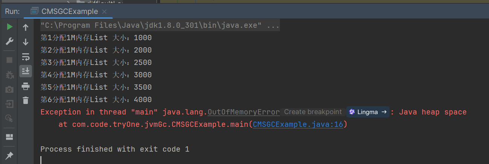

# 4、GC日志部分分析
-[log日志](cmsLog/1.log)

## 1、现在机器上的配置

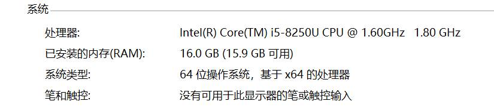

```
Memory: 4k page, physical 16672068k(6305752k free), swap 19686724k(5627108k free)
```

指的是系统页面大小为4KB。"physical 16672068k"表示物理内存总量约为16GB，其中有"6305752k free"约为6GB的空闲内存。"swap
19686724k"表示交换空间总量约为19GB，其中有"5627108k free"约为5GB的空闲交换空间。

## 2、该程序运行的参数

```angular2html
-XX:InitialHeapSize=266753088 // 设置JVM启动时堆的初始大小为约266MB。
-XX:MaxHeapSize=4268049408 // 设置JVM堆的最大大小为约4GB。
-XX:MaxNewSize=697933824 // 设置年轻代的最大大小为约697MB。
-XX:MaxTenuringThreshold=6 // 设置对象在年轻代中的最大存活次数为6次，之后会被移动到老年代。
-XX:OldPLABSize=16 // 设置老年代中PLAB(私有分配缓冲区)的大小。
-XX:+PrintGC //启用打印GC信息。
-XX:+PrintGCDateStamps // 启用打印GC的日期戳。
-XX:+PrintGCDetails // 启用打印GC的详细信息。
-XX:+PrintGCTimeStamps // 启用打印GC的时间戳。 -XX:
+UseCompressedClassPointers // 启用压缩类指针，减少内存使用，默认打开
-XX:+UseCompressedOops // 启用压缩普通对象指针，减少内存使用，默认打开。
-XX:+UseConcMarkSweepGC // 使用并发标记清除(CMS)垃圾收集器。
-XX:-UseLargePagesIndividualAllocation // 禁用大页的单独分配。
-XX:+UseParNewGC // 使用ParNew垃圾收集器，它是一个并行的年轻代收集器。
```

CMS（并发标记清除）垃圾收集器主要用于老年代，而ParNew垃圾收集器则是专门为年轻代设计的。当启用CMS垃圾收集器时，它通常会与ParNew垃圾收集器一起工作，因为ParNew是CMS的默认年轻代收集器。

## 3、垃圾回收过程

| 相对时间  | 日志及其解释                                                                                                                                                                                                                                                                                                                                                                                                                                                                                                                                                                                                                                                                                                                                                                                                                                                                                                                                                                                                                                                                                |
|-------|---------------------------------------------------------------------------------------------------------------------------------------------------------------------------------------------------------------------------------------------------------------------------------------------------------------------------------------------------------------------------------------------------------------------------------------------------------------------------------------------------------------------------------------------------------------------------------------------------------------------------------------------------------------------------------------------------------------------------------------------------------------------------------------------------------------------------------------------------------------------------------------------------------------------------------------------------------------------------------------------------------------------------------------------------------------------------------------|
| 0.224 | 2024-07-06T17:15:56.851+0800:  0.224: [GC (Allocation Failure)]  垃圾收集器在年轻代(Young Generation)中进行了一次垃圾回收，因为没有足够的空间分配新的对象。其中0.224表示jvm启动后的绝对时间。  [ParNew:  69734K->8222K(78656K), 0.0449721 secs] - 使用ParNew收集器，它将使用的内存从69734K减少到8222K，总共有78656K的空间。  69734K->66593K(253440K),  0.0452289 secs] - 整个堆的使用从69734K减少到66593K，堆的总大小为253440K。  [Times: user=0.19  sys=0.05, real=0.04 secs]  user: 垃圾收集过程中，所有GC线程在用户模式下执行的CPU时间总和。  sys: 垃圾收集过程中，所有GC线程在内核模式下执行的CPU时间总和。  real: 垃圾收集事件的总经过时间，也就是从开始到结束的墙钟时间（wall clock time）。                                                                                                                                                                                                                                                                                                                                                                                                                                                                                                                                                                  |
| 0.278 | 2024-07-06T17:15:56.905+0800: 0.278: [GC  (Allocation Failure) 2024-07-06T17:15:56.905+0800: 0.278: [ParNew:  77178K->8277K(78656K), 0.0356354 secs] 135549K->135088K(253440K),  0.0357393 secs] [Times: user=0.19 sys=0.05, real=0.04 secs]  第二次进行垃圾回收。过程和上面一样                                                                                                                                                                                                                                                                                                                                                                                                                                                                                                                                                                                                                                                                                                                                                                                                                       |
| 0.314 | 篇幅原因，省略时间戳  [GC (CMS Initial Mark)  [1 CMS-initial-mark: 126811K(174784K)] 136112K(253440K), 0.0006083 secs]  [Times: user=0.00 sys=0.00, real=0.00 secs]  [GC (CMS Initial Mark)] - 这表示进行的是CMS垃圾收集器的初始标记阶段。这是CMS收集器开始工作的第一步，用于标记老年代中可达的对象。  [1 CMS-initial-mark: 126811K(174784K)] - 在老年代中，初始标记阶段标记了126811K的存活对象，老年代的总大小为174784K。  136112K(253440K) - 在整个堆中，初始标记阶段结束时，堆的使用量为136112K，而堆的总大小为253440K。  0.0006083 secs - 初始标记阶段的持续时间，非常短，只有大约0.6毫秒。  [Times: user=0.00 sys=0.00, real=0.00  secs] - 这表示用户态、系统态和实际经过的时间。在这个例子中，所有这些时间都接近零，表明初始标记阶段几乎没有引  起任何停顿。                                                                                                                                                                                                                                                                                                                                                                                                                                                                                                                          |
| 0.315 | [CMS-concurrent-mark-start]   开始了CMS并发标记阶段。                                                                                                                                                                                                                                                                                                                                                                                                                                                                                                                                                                                                                                                                                                                                                                                                                                                                                                                                                                                                                                           |
| 0.318 | [CMS-concurrent-mark:  0.003/0.003 secs] [Times: user=0.00 sys=0.00, real=0.00 secs]  标记阶段结束，总共花费了0.003秒。  user=0.00 sys=0.00, real=0.00 secs表示在这个过程中用户态和内核态的CPU时间都是0，总时间也是0秒。这是由于计时精度或者这个阶段非常快                                                                                                                                                                                                                                                                                                                                                                                                                                                                                                                                                                                                                                                                                                                                                                                                                                                                                       |
|       | [CMS-concurrent-preclean-start]  说明在0.318开始了CMS并发预清理阶段。  [CMS-concurrent-preclean: 0.002/0.002  secs] [Times: user=0.00 sys=0.00, real=0.00 secs]  预清理阶段结束，总共花费了0.002秒。  同样的，CPU时间和总时间都是0秒。                                                                                                                                                                                                                                                                                                                                                                                                                                                                                                                                                                                                                                                                                                                                                                                                                                                                                           |
| 0.320 | [CMS-concurrent-abortable-preclean-start]  说明在17:15:56.946开始了CMS并发可中止预清理阶段。                                                                                                                                                                                                                                                                                                                                                                                                                                                                                                                                                                                                                                                                                                                                                                                                                                                                                                                                                                                                           |
| 1.088 | [CMS-concurrent-abortable-preclean:  0.067/0.769 secs] - 这表示CMS的可中断并发预清理阶段已经完成。这个阶段尝试清理一些工作，以减少最终标记阶段的工作量。它耗时0.769秒，其中用户态时间为3.08秒，系统态时间为0.55秒，实际时间为0.77秒                                                                                                                                                                                                                                                                                                                                                                                                                                                                                                                                                                                                                                                                                                                                                                                                                                                                                                                              |
| 1.089 | [GC (CMS Final Remark)   [YG occupancy: 11619 K (78656 K)]  [Rescan (parallel) , 0.0008016 secs]  [weak refs processing, 0.0000298 secs]  [class unloading, 0.0003171 secs]  [scrub symbol table, 0.0004576 secs]  [scrub string table, 0.0001314 secs]  [1 CMS-remark: 1085637K(1087004K)]  1097256K(1165660K), 0.0018498 secs] [Times: user=0.00 sys=0.00, real=0.00  secs]  [GC (CMS Final Remark)] - 这是CMS收集器的最终标记阶段，也称为"remark"阶段。这个阶段是为了完成老年代中存活对象的标记。  [YG occupancy: 11619 K  (78656 K)] - 在这个阶段开始时，年轻代占用了11619K的内存，总共有78656K的空间。  [Rescan (parallel) ,  0.0008016 secs] - 这是并行重新扫描阶段，用于重新检查对象引用，确保所有存活对象都被标记。耗时约0.8毫秒。  [weak refs processing,  0.0000298 secs] - 处理弱引用的阶段，耗时约0.03毫秒。  [class unloading,  0.0003171 secs] - 卸载不再使用的类的阶段，耗时约0.32毫秒。  [scrub symbol table,  0.0004576 secs] - 清理符号表的阶段，耗时约0.46毫秒。  [scrub string table,  0.0001314 secs] - 清理字符串表的阶段，耗时约0.13毫秒。  [1 CMS-remark: 1085637K(1087004K)] - 在老年代中，最终标记阶段结束时，存活对象占用了1085637K的内存，老年代总大小为1087004K。  1097256K(1165660K), 0.0018498 secs] - 在整个堆中，最终标记阶段结束时，堆的使用量为1097256K，而堆的总大小为1165660K。整个阶段耗时约1.85毫秒。 |
| 1.090 | [CMS-concurrent-sweep-start]  - 开始CMS的并发清除阶段，这个阶段会清除掉标记为垃圾的对象。                                                                                                                                                                                                                                                                                                                                                                                                                                                                                                                                                                                                                                                                                                                                                                                                                                                                                                                                                                                                                        |
| 1.091 | [CMS-concurrent-sweep:  0.001/0.001 secs] - 并发清除阶段完成，耗时1毫秒。                                                                                                                                                                                                                                                                                                                                                                                                                                                                                                                                                                                                                                                                                                                                                                                                                                                                                                                                                                                                                           |
| 1.097 | [CMS-concurrent-reset-start] - 开始CMS的并发重置阶段，这个阶段会重置CMS收集器的内部状态，为下一次垃圾回收做准备。                                                                                                                                                                                                                                                                                                                                                                                                                                                                                                                                                                                                                                                                                                                                                                                                                                                                                                                                                                                                           |
| 1.400 | [CMS-concurrent-reset:  0.039/0.304 secs] - 表示CMS垃圾收集器的并发重置阶段。  [Times: user=1.39 sys=0.41, real=0.30  secs] - 提供了执行该阶段时的时间消耗细节。其中用户态消耗的CPU 1.39秒，系统态消耗的CPU0.41秒。从开始到结束的实际经过0.30秒。                                                                                                                                                                                                                                                                                                                                                                                                                                                                                                                                                                                                                                                                                                                                                                                                                                                                                                    |

## 4、垃圾回收器特点的体现

由于之前的log只能体现垃圾回收器过程，所以下面增加参数

```angular2html
-XX:+PrintGCApplicationStoppedTime //打印因GC而导致应用程序停止的时间。
-XX:+PrintGCApplicationConcurrentTime//打印应用程序在并发GC期间的运行时间
```
-[包含应用程序停止的时间的日志](cmsLog/1detail.log)


### 1、0.314秒处，初始标记：

暂停所有的其他线程，并记录下直接与 root 相连的对象，速度很快 ；

```
Total time for which application threads were stopped: 0.0005789 seconds, Stopping threads took:  0.0000763 seconds
```

垃圾收集过程中，应用程序线程总共被暂停的时间0.0005789秒 实际停止线程的操作所花费的时间0.0000763 秒

### 2、并发标记阶段

这个阶段程序并没有停止，一直在进行新生代的垃圾回收

### 3、1.017秒处，重新标记阶段

程序进行了暂停，重新标记阶段结束，程序暂停时间是初始标记的大约三倍多。

```angular2html
Total time for which application threads were stopped: 0.0018594 seconds, Stopping threads took:  0.0000947 seconds
```

垃圾收集过程中，应用程序线程总共被暂停的时间0.0018594秒 实际停止线程的操作所花费的时间0.0000947秒

### 4、日志中的展示如图

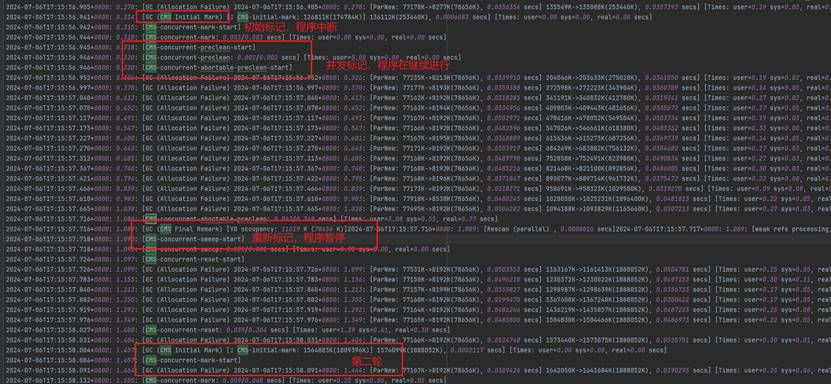

# 5、调整参数优化程序
重新编写调优程序
[进行调优的java程序](ZgcOptimization.java)
<details>
    <summary>进行调优的java程序</summary>

```java

public class CMSOptimization {
    public static void main(String[] args) {

        MemoryMXBean memoryMXBean = ManagementFactory.getMemoryMXBean();
        List<byte[]> memoryHog = new ArrayList<>();
        int k = 1;
        int allAllocate = 10000;
        int oneAllocate = 10;
        while (k <= allAllocate / oneAllocate) {
            for (int i = 0; i < oneAllocate; i++) {
                // 分配1MB的数组
                byte[] array = new byte[1024 * 1024];
                memoryHog.add(array);
            }

            MemoryUsage heapMemoryUsage = memoryMXBean.getHeapMemoryUsage();
            long usedHeapMemorySize = heapMemoryUsage.getUsed();
            long committedHeapMemorySize = heapMemoryUsage.getCommitted();
            System.out.println("第" + k++ + "次分配内存。已使用的堆内存大小：" + usedHeapMemorySize / (1024 * 1024) + " MB。已分配的堆内存：" + committedHeapMemorySize / (1024 * 1024) + " MB");
            // 模拟内存使用情况
            if (memoryHog.size() > oneAllocate) {
                memoryHog.subList(0, memoryHog.size()).clear();
            }
            try {
                // 暂停一段时间，模拟应用程序的其他工作
                Thread.sleep(oneAllocate);
            } catch (InterruptedException e) {
                e.printStackTrace();
            }
        }
    }
}

```

</details>
程序的介绍：程序分配10000M内存，并使用。中间有暂停程序10000ms作为模拟其他程序运行，可以通过调整oneAllocate的大小确定一次使用空间大小，中间打印各种数据。

## 1、对程序的Xmx（最大堆内存）参数进行调优
参数为
```
-XX:+UseConcMarkSweepGC
-XX:+PrintGCDetails
-XX:+PrintGCDateStamps
-Xmx4g
-Xloggc:./gc.log
-XX:+PrintGCApplicationStoppedTime
-XX:+PrintGCApplicationConcurrentTime
```
增加调整参数及其并分析日志得到下图，可以看出再最大堆达到256m以后，程序对堆变化就不敏感，甚至停止了。这是因为，我们的程序一次分配1m，10次才使用。所以该程序并不能最好的体现CMS的痛点。
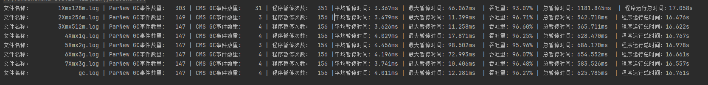
修改程序的oneAllocate为100，一次加入列表的大小为100M,此时128m并不能正常运行程序
使用脚本进行
脚本如下，脚本运行了从128m到2048m的堆内存的全部程序，并得到下面结果，

<details>
    <summary>Xmx参数调整脚本</summary>

```shell
@echo off
setlocal enabledelayedexpansion

rem 检查并创建gcLog目录
if not exist gcLog (
    mkdir gcLog
)

rem 字母序列数组
set "letters=a b c d e f g h i j k l m n o p q r s t u v w x y z"

rem 初始化字母索引
set "index=0"

rem 循环内存大小从128m到2048m，每次增加128m
for /L %%i in (128,128,256) do (
    rem 获取当前字母
    for /f "tokens=1,* delims= " %%a in ("!letters!") do (
        set "letter=%%a"
        set "letters=%%b"
        set "logfile=gcLog/!letter!Xmx%%igc.log"

        rem 运行Java程序
        F:\TencentKona-8.0.18-412\bin\java.exe -cp F:\java_learn\pure-test\src\main\java ^
            -XX:+UseConcMarkSweepGC ^
            -XX:+PrintGCDetails ^
            -XX:+PrintGCDateStamps ^
            -Xloggc:!logfile! ^
            -Xmx%%im ^
            -XX:+PrintGCApplicationStoppedTime ^
            -XX:+PrintGCApplicationConcurrentTime ^
            com.code.tryOne.jvmGc.CMSGC.CMSOptimization
    )
)

endlocal
pause

```
</details>
<details>
    <summary>Xmx参数调整脚本日志文件链接</summary>

- [aXmx128gc](cmsLog/Xmx/aXmx128gc.log)
- [bXmx256gc](cmsLog/Xmx/bXmx256gc.log)
- [cXmx384gc](cmsLog/Xmx/cXmx384gc.log)
- [dXmx512gc](cmsLog/Xmx/dXmx512gc.log)
- [eXmx640gc](cmsLog/Xmx/eXmx640gc.log)
- [fXmx768gc](cmsLog/Xmx/fXmx768gc.log)
- [gXmx896gc](cmsLog/Xmx/gXmx896gc.log)
- [hXmx1024gc](cmsLog/Xmx/hXmx1024gc.log)
- [iXmx1152gc](cmsLog/Xmx/iXmx1152gc.log)
- [jXmx1280gc](cmsLog/Xmx/jXmx1280gc.log)
- [kXmx1408gc](cmsLog/Xmx/kXmx1408gc.log)
- [lXmx1536gc](cmsLog/Xmx/lXmx1536gc.log)
- [mXmx1664gc](cmsLog/Xmx/mXmx1664gc.log)
- [nXmx1792gc](cmsLog/Xmx/nXmx1792gc.log)
- [oXmx1920gc](cmsLog/Xmx/oXmx1920gc.log)
- [pXmx2048gc](cmsLog/Xmx/pXmx2048gc.log)

</details>
通过分析程序分析得到下图，看出：最佳的堆空间分配是896M。这结果是该程序的最优堆空间大小
（其中当堆空间为128m时候程序异常终止不考虑在内）

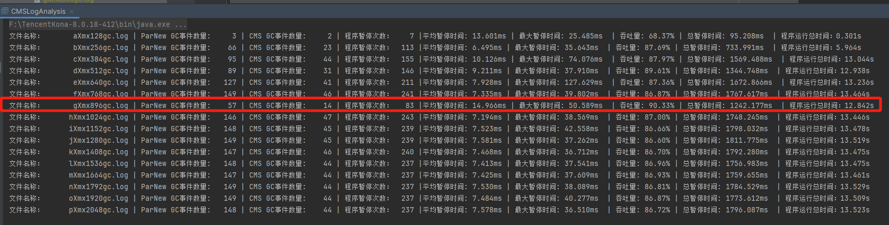

## 2、启用并发清除的增量模式: 适用于多核CPU，可以减少单次清除的暂停时间

参数为（最大堆设置为896M）
```
-XX:+UseConcMarkSweepGC
-XX:+PrintGCDetails
-XX:+PrintGCDateStamps
-Xmx896M
-Xloggc:./gc.log
-XX:+PrintGCApplicationStoppedTime
-XX:+PrintGCApplicationConcurrentTime
```

<details>
    <summary>并发清除的增量模式CMSIncrementalMode.log日志</summary>

- [aCMSIncrementalMode](cmsLog/IncrementalMode/aCMSIncrementalMode.log)
- [aXmx896gc](cmsLog/IncrementalMode/aXmx896gc.log)
- [bCMSIncrementalMode](cmsLog/IncrementalMode/bCMSIncrementalMode.log)
- [bXmx896gc](cmsLog/IncrementalMode/bXmx896gc.log)
- [cCMSIncrementalMode](cmsLog/IncrementalMode/cCMSIncrementalMode.log)
- [cXmx896gc](cmsLog/IncrementalMode/cXmx896gc.log)
- [dCMSIncrementalMode](cmsLog/IncrementalMode/dCMSIncrementalMode.log)
- [dXmx896gc](cmsLog/IncrementalMode/dXmx896gc.log)
- [eCMSIncrementalMode](cmsLog/IncrementalMode/dCMSIncrementalMode.log)
- [eXmx896gc](cmsLog/IncrementalMode/eXmx896gc.log)
- [fCMSIncrementalMode](cmsLog/IncrementalMode/fCMSIncrementalMode.log)
- [fXmx896gc](cmsLog/IncrementalMode/fXmx896gc.log)
- [gCMSIncrementalMode](cmsLog/IncrementalMode/gCMSIncrementalMode.log)
- [gXmx896gc](cmsLog/IncrementalMode/gXmx896gc.log)
- [hCMSIncrementalMode](cmsLog/IncrementalMode/hCMSIncrementalMode.log)
- [hXmx896gc](cmsLog/IncrementalMode/hXmx896gc.log)
- [iCMSIncrementalMode](cmsLog/IncrementalMode/iCMSIncrementalMode.log)
- [iXmx896gc](cmsLog/IncrementalMode/iXmx896gc.log)
- [jCMSIncrementalMode](cmsLog/IncrementalMode/jCMSIncrementalMode.log)
- [jXmx896gc](cmsLog/IncrementalMode/jXmx896gc.log)


</details>
增加参数

```
-XX:+CMSIncrementalMode
```
编写脚本，经过多次运行，得到日志（日志省略）分析得到如图结果，
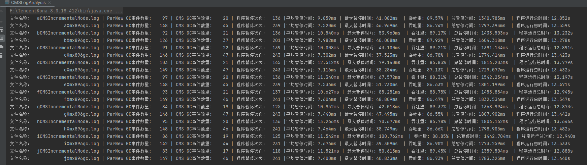
参数描述：-XX:+CMSIncrementalMode 该标志将开启CMS收集器的增量模式。增量模式经常暂停CMS过程，以便对应用程序线程作出完全的让步。因此，收集器将花更长的时间完成整个收集周期。
因此，只有通过测试后发现正常CMS周期对应用程序线程干扰太大时，才应该使用增量模式。
由于现代服务器有足够的处理器来适应并发的垃圾收集，所以这种情况发生得很少。
从 JDK 8 开始，这个选项已经被标记为过时，
因为 G1 (Garbage First) 收集器通常是一个更好的选择，它在减少停顿时间和提高吞吐量方面表现更优。

## 3、调整老年代和新生代的比例

首先分析程序：程序是一个内存密集型的测试程序，通过不断分配和清理内存来触发垃圾回收。
对于CMS垃圾回收器，合理的年轻代和老年代比例可以提高内存回收效率：
年轻代比例适中：适度增加年轻代内存大小，可以减少频繁的年轻代垃圾回收，但过大会导致老年代压力增大。
老年代比例较大：老年代需要足够大，以容纳生命周期较长的对象，避免频繁的老年代垃圾回收。

程序运行参数为
```shell
-XX:+UseConcMarkSweepGC
-XX:+PrintGCDetails
-XX:+PrintGCDateStamps
-Xmx896M
-Xloggc:./NewRatio1.log
-XX:+PrintGCApplicationStoppedTime
-XX:+PrintGCApplicationConcurrentTime
```
修改-XX:NewRatio参数
```shell
-XX:NewRatio=1
-XX:NewRatio=2
-XX:NewRatio=3
-XX:NewRatio=4
```
得到下面的日志记录
<details>
    <summary>调整NewRatio后的日志</summary>

- [NewRatio1](cmsLog/Ratio/aNewRatio1.log)
- [NewRatio2](cmsLog/Ratio/bNewRatio2.log)
- [NewRatio3](cmsLog/Ratio/cNewRatio3.log)
- [NewRatio4](cmsLog/Ratio/dNewRatio4.log)
- [NewRatio5](cmsLog/Ratio/eNewRatio5.log)

</details>
从图中可以看出，新生代和老年代比例在1：1的情况下，各方面性能最好

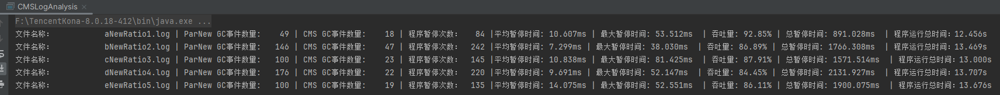
考虑在CMSIncrementalMode模式下选择NewRatio=1得到新日志[CMSIncrementalMode](cmsLog/Ratio/CMSIncrementalMode.log)，
使用程序分析得到下图，根据图中显示，性能有所提高，但有局限性。吞吐量和GC次数有明显提高，但总暂停时间提高不明显，而且增加了相应的平均暂停时间和最大暂停时间
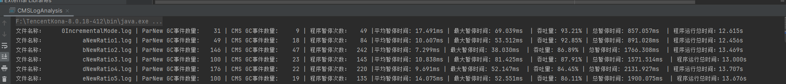

接下来考虑能不能把NewRatio调整到比1还小
所以考虑使用XX:NewSize直接指定新生代大小
```shell
-XX:NewSize=xxxm 
-XX:MaxNewSize=xxxm
```
得到如下的日志
<details>
    <summary>调整MaxNewSize后的日志</summary>

- [0IncrementalMode](cmsLog/MaxNewSize/0IncrementalMode.log)
- [1NewRatio1](cmsLog/MaxNewSize/1NewRatio1.log)
- [aMaxNewSize512m](cmsLog/MaxNewSize/aMaxNewSize512m.log)
- [bMaxNewSize544m](cmsLog/MaxNewSize/bMaxNewSize544m.log)
- [cMaxNewSize576m](cmsLog/MaxNewSize/cMaxNewSize576m.log)
- [dMaxNewSize608m](cmsLog/MaxNewSize/dMaxNewSize608m.log)
- [eMaxNewSize640m](cmsLog/MaxNewSize/eMaxNewSize640m.log)
- [fMaxNewSize672m](cmsLog/MaxNewSize/fMaxNewSize672m.log)
- [gMaxNewSize704m](cmsLog/MaxNewSize/gMaxNewSize704m.log)
- [hMaxNewSize736m](cmsLog/MaxNewSize/hMaxNewSize736m.log)
- [iMaxNewSize768m](cmsLog/MaxNewSize/iMaxNewSize768m.log)
- [jMaxNewSize800m](cmsLog/MaxNewSize/jMaxNewSize800m.log)
- [kMaxNewSize832m](cmsLog/MaxNewSize/kMaxNewSize832m.log)
- [IMaxNewSize864m](cmsLog/MaxNewSize/lMaxNewSize864m.log)
- [mMaxNewSize896m](cmsLog/MaxNewSize/mMaxNewSize896m.log)


</details>

分析结果，容易得出当最大堆内存为896m的时候，年轻代在768m的时候，性能最优。
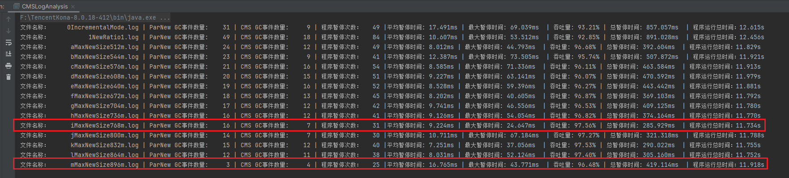

## 4、CMSParallelRemarkEnabled
在程序不变的情况下，使用参数如下
```shell
-XX:+UseConcMarkSweepGC
-XX:+PrintGCDetails
-XX:+PrintGCDateStamps
-Xmx896M
-Xloggc:./gc.log
-XX:NewSize=768m
-XX:MaxNewSize=768m
-XX:+PrintGCApplicationStoppedTime
-XX:+PrintGCApplicationConcurrentTime
```
然后增加参数
```shell
-XX:-CMSParallelRemarkEnabled
```
使用脚本运行10次得到下面的日志
<details>
    <summary>调整CMSParallelRemarkEnabled后的日志</summary>

- [agc](cmsLog/CMSParallelRemarkEnabled/agc.log)
- [aParallelRemarkEnabled](cmsLog/CMSParallelRemarkEnabled/aParallelRemarkEnabled.log)
- [bgc](cmsLog/CMSParallelRemarkEnabled/bgc.log)
- [bParallelRemarkEnabled](cmsLog/CMSParallelRemarkEnabled/bParallelRemarkEnabled.log)
- [cgc](cmsLog/CMSParallelRemarkEnabled/cgc.log)
- [cParallelRemarkEnabled](cmsLog/CMSParallelRemarkEnabled/cParallelRemarkEnabled.log)
- [dgc](cmsLog/CMSParallelRemarkEnabled/dgc.log)
- [dParallelRemarkEnabled](cmsLog/CMSParallelRemarkEnabled/dParallelRemarkEnabled.log)
- [egc](cmsLog/CMSParallelRemarkEnabled/egc.log)
- [eParallelRemarkEnabled](cmsLog/CMSParallelRemarkEnabled/eParallelRemarkEnabled.log)
- [fgc](cmsLog/CMSParallelRemarkEnabled/fgc.log)
- [fParallelRemarkEnabled](cmsLog/CMSParallelRemarkEnabled/fParallelRemarkEnabled.log)
- [ggc](cmsLog/CMSParallelRemarkEnabled/ggc.log)
- [gParallelRemarkEnabled](cmsLog/CMSParallelRemarkEnabled/gParallelRemarkEnabled.log)
- [hgc](cmsLog/CMSParallelRemarkEnabled/hgc.log)
- [hParallelRemarkEnabled](cmsLog/CMSParallelRemarkEnabled/hParallelRemarkEnabled.log)
- [igc](cmsLog/CMSParallelRemarkEnabled/igc.log)
- [iParallelRemarkEnabled](cmsLog/CMSParallelRemarkEnabled/iParallelRemarkEnabled.log)
- [jgc](cmsLog/CMSParallelRemarkEnabled/jgc.log)
- [jParallelRemarkEnabled](cmsLog/CMSParallelRemarkEnabled/jParallelRemarkEnabled.log)


</details>
使用分析程序进行分析得到下图
图中可以看出，性能并没有什么提高，这是因为该参数是默认开启的

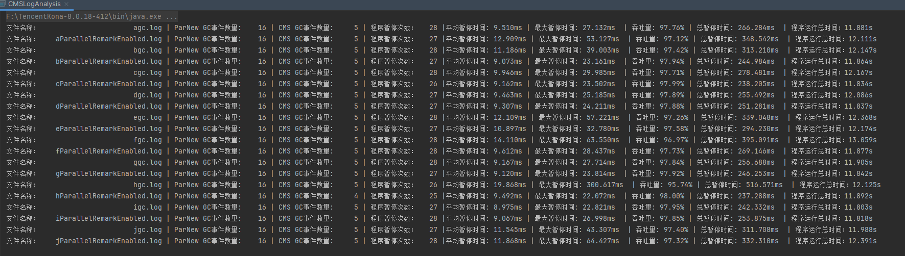

## 5、CMSParallelInitialMarkEnabled
开启该阶段的并行标记，使用多个线程进行标记，减少暂停时间
在程序不变的情况下，使用参数如下
```shell
-XX:+UseConcMarkSweepGC
-XX:+PrintGCDetails
-XX:+PrintGCDateStamps
-Xmx896M
-Xloggc:./gc.log
-XX:NewSize=768m
-XX:MaxNewSize=768m
-XX:+PrintGCApplicationStoppedTime
-XX:+PrintGCApplicationConcurrentTime
```
然后增加参数
```shell
-XX:-CMSParallelInitialMarkEnabled
```
通过脚本运行多次得到下面日志文件
<details>
    <summary>调整CMSParallelInitialMarkEnabled后的日志</summary>

- [agc](cmsLog/CMSParallellnitialMarkEnabled/agc.log)
- [a-ParallellnitialMarkEnabled](cmsLog/CMSParallellnitialMarkEnabled/a-ParallelInitialMarkEnabled.log)
- [bgc](cmsLog/CMSParallellnitialMarkEnabled/bgc.log)
- [b-ParallellnitialMarkEnabled](cmsLog/CMSParallellnitialMarkEnabled/b-ParallelInitialMarkEnabled.log)
- [cgc](cmsLog/CMSParallellnitialMarkEnabled/cgc.log)
- [c-ParallellnitialMarkEnabled](cmsLog/CMSParallellnitialMarkEnabled/c-ParallelInitialMarkEnabled.log)
- [dgc](cmsLog/CMSParallellnitialMarkEnabled/dgc.log)
- [d-ParallelnitialMarkEnabled](cmsLog/CMSParallellnitialMarkEnabled/d-ParallelInitialMarkEnabled.log)
- [egc](cmsLog/CMSParallellnitialMarkEnabled/egc.log)
- [e-ParallellnitialMarkEnabled](cmsLog/CMSParallellnitialMarkEnabled/e-ParallelInitialMarkEnabled.log)
- [fgc](cmsLog/CMSParallellnitialMarkEnabled/fgc.log)
- [f-ParallellnitialMarkEnabled](cmsLog/CMSParallellnitialMarkEnabled/f-ParallelInitialMarkEnabled.log)
- [ggc](cmsLog/CMSParallellnitialMarkEnabled/ggc.log)
- [g-ParallellnitialMarkEnabled](cmsLog/CMSParallellnitialMarkEnabled/g-ParallelInitialMarkEnabled.log)
- [hgc](cmsLog/CMSParallellnitialMarkEnabled/hgc.log)
- [h-ParallellnitialMarkEnabled](cmsLog/CMSParallellnitialMarkEnabled/h-ParallelInitialMarkEnabled.log)
- [igc](cmsLog/CMSParallellnitialMarkEnabled/igc.log)
- [i-ParallellnitialMarkEnabled](cmsLog/CMSParallellnitialMarkEnabled/i-ParallelInitialMarkEnabled.log)
- [jgc](cmsLog/CMSParallellnitialMarkEnabled/jgc.log)
- [j-ParallelnitialMarkEnabled](cmsLog/CMSParallellnitialMarkEnabled/j-ParallelInitialMarkEnabled.log)

</details>
程序变化不大，应该是没有击中程序弱点
分析如下图：

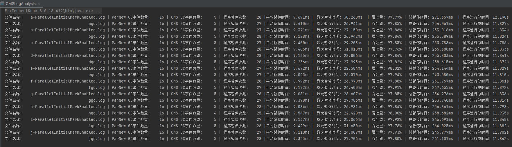


## 6、ConcGCThreads设置并发 GC 线程数
在上一步的基础上，使用脚本，运行ConcGCThreads从1到8

```shell
-XX:+UseConcMarkSweepGC
-XX:+PrintGCDetails
-XX:+PrintGCDateStamps
-Xmx896M
-Xloggc:./gc.log
-XX:NewSize=768m
-XX:MaxNewSize=768m
-XX:ConcGCThreads=1
-XX:+CMSParallelInitialMarkEnabled
-XX:+PrintGCApplicationStoppedTime
-XX:+PrintGCApplicationConcurrentTime
```
得到下面的日志记录
<details>
    <summary>调整ConcGCThreads后的日志</summary>

- [aConcGCThreads1m](cmsLog/ConcGCThreads/aConcGCThreads1m.log)
- [bConcGCThreads2m](cmsLog/ConcGCThreads/bConcGCThreads2m.log)
- [cConcGCThreads3m](cmsLog/ConcGCThreads/cConcGCThreads3m.log)
- [dConcGCThreads4m](cmsLog/ConcGCThreads/dConcGCThreads4m.log)
- [eConcGCThreads5m](cmsLog/ConcGCThreads/eConcGCThreads5m.log)
- [fConcGCThreads6m](cmsLog/ConcGCThreads/fConcGCThreads6m.log)
- [gConcGCThreads7m](cmsLog/ConcGCThreads/gConcGCThreads7m.log)
- [hConcGCThreads8m](cmsLog/ConcGCThreads/hConcGCThreads8m.log)
</details>
分析日志：增加参数对结果的优化程度并不明显，只要不是配置的ConcGCThreads=1或者ConcGCThreads=8，性能都差不多。

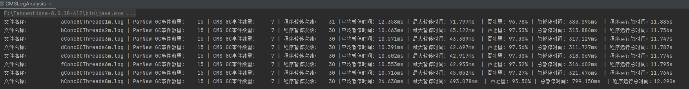
多次实验，效果并不优
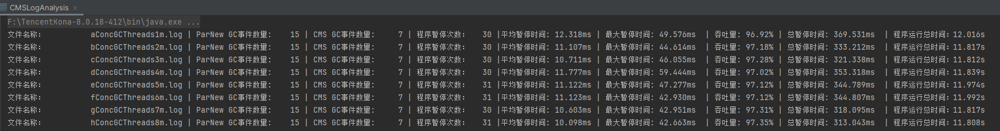

## 7、CMSScavengeBeforeRemark在CMS的重新标记阶段之前，先尽量执行一次Young GC

在程序不变的情况下，使用参数如下
```shell
-XX:+UseConcMarkSweepGC
-XX:+PrintGCDetails
-XX:+PrintGCDateStamps
-Xmx896M
-Xloggc:./gc.log
-XX:NewSize=768m
-XX:MaxNewSize=768m
-XX:+CMSParallelInitialMarkEnabled
-XX:+PrintGCApplicationStoppedTime
-XX:+PrintGCApplicationConcurrentTime
```
然后增加参数
```shell
-XX:+CMSScavengeBeforeRemark
```

得到日志[gc.log](cmsLog/CMSScavengeBeforeRemark/gc.log)和日志[CMSScavengeBeforeRemark.log](cmsLog/CMSScavengeBeforeRemark/ScavengeBeforeRemark.log)，使用分析程序进行分析得到下图
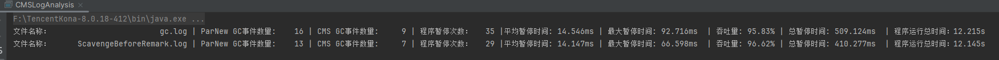
从图中可以看出，虽然GC次数有减少变化，且平均暂停时间和最大暂停时间以及总暂停时间都有明显减少，并且吞吐量也有提高。
考虑到程序已经是在优化了很多参数以后继续的优化，所以在运行一个不优化的程序，得到[1gc.log](cmsLog/CMSScavengeBeforeRemark/1gc.log)和日志[2CMSScavengeBeforeRemark.log](cmsLog/CMSScavengeBeforeRemark/2ScavengeBeforeRemark.log)对比一下
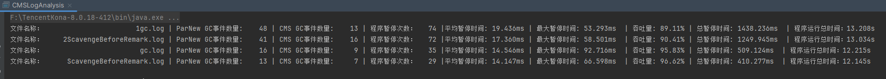
提升效果依然明显但幅度不大。

## 8、MaxTenuringThreshold （不成功）
对象连续躲过n次垃圾回收后会自动升入老年代
使用脚本运行从1到15的全部值
<details>
    <summary> 脚本如下</summary>

```shell
@echo off
setlocal enabledelayedexpansion

rem 检查并创建gcLog目录
if not exist gcLog (
    mkdir gcLog
)

rem 字母序列数组
set "letters=a b c d e f g h i j k l m n o p q r s t u v w x y z"

rem 初始化字母索引
set "index=0"

rem 循环内存大小从128m到2048m，每次增加128m
for /L %%i in (1,1,15) do (
    rem 获取当前字母
    for /f "tokens=1,* delims= " %%a in ("!letters!") do (
        set "letter=%%a"
        set "letters=%%b"
        set "logfile=gcLog/!letter!MaxTenuringThreshold%%i.log"

        rem 运行Java程序
        F:\TencentKona-8.0.18-412\bin\java.exe -cp F:\java_learn\pure-test\src\main\java ^
            -XX:+UseConcMarkSweepGC ^
            -XX:+PrintGCDetails ^
            -XX:+PrintGCDateStamps ^
            -Xloggc:!logfile! ^
            -Xmx896m ^
            -XX:MaxTenuringThreshold=%%i ^
            -XX:+PrintGCApplicationStoppedTime ^
            -XX:+PrintGCApplicationConcurrentTime ^
            com.code.tryOne.jvmGc.CMSGC.CMSOptimization

    )
)

endlocal
pause

```
</details>

<details>
    <summary>调整MaxTenuringThreshold后的日志</summary>

- [aMaxTenuringThreshold1](cmsLog/MaxTenuringThreshold/aMaxTenuringThreshold1.log)
- [bMaxTenuringThreshold2](cmsLog/MaxTenuringThreshold/bMaxTenuringThreshold2.log)
- [cMaxTenuringThreshold3](cmsLog/MaxTenuringThreshold/cMaxTenuringThreshold3.log)
- [dMaxTenuringThreshold4](cmsLog/MaxTenuringThreshold/dMaxTenuringThreshold4.log)
- [eMaxTenuringThreshold5](cmsLog/MaxTenuringThreshold/eMaxTenuringThreshold5.log)
- [fMaxTenuringThreshold6](cmsLog/MaxTenuringThreshold/fMaxTenuringThreshold6.log)
- [gMaxTenuringThreshold7](cmsLog/MaxTenuringThreshold/gMaxTenuringThreshold7.log)
- [hMaxTenuringThreshold8](cmsLog/MaxTenuringThreshold/hMaxTenuringThreshold8.log)
- [iMaxTenuringThreshold9](cmsLog/MaxTenuringThreshold/iMaxTenuringThreshold9.log)
- [jMaxTenuringThreshold10](cmsLog/MaxTenuringThreshold/jMaxTenuringThreshold10.log)
- [kMaxTenuringThreshold11](cmsLog/MaxTenuringThreshold/kMaxTenuringThreshold11.log)
- [lMaxTenuringThreshold12](cmsLog/MaxTenuringThreshold/lMaxTenuringThreshold12.log)
- [mMaxTenuringThreshold13](cmsLog/MaxTenuringThreshold/mMaxTenuringThreshold13.log)
- [nMaxTenuringThreshold14](cmsLog/MaxTenuringThreshold/nMaxTenuringThreshold14.log)
- [oMaxTenuringThreshold15](cmsLog/MaxTenuringThreshold/oMaxTenuringThreshold15.log)

</details>
图中可以看出，MaxTenuringThreshold参数并不能对该程序的调优有多大的用处

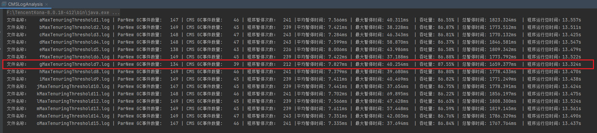

## 9、ParallelCMSThreads（不成功）
在程序不变的情况下，使用参数如下
```shell
-XX:+UseConcMarkSweepGC
-XX:+PrintGCDetails
-XX:+PrintGCDateStamps
-Xloggc:./ParallelCMSThreads8.log
-Xmx896M
-XX:+PrintGCApplicationStoppedTime
-XX:+PrintGCApplicationConcurrentTime
```
然后增加参数ParallelCMSThreads从1到8
```shell
-XX:ParallelCMSThreads=8
```
<details>
    <summary>调整ParallelCMSThreads后的日志</summary>

- [ParallelCMSThreads1](cmsLog/ParallelCMSThreads/ParallelCMSThreads1.log)
- [ParallelCMSThreads2](cmsLog/ParallelCMSThreads/ParallelCMSThreads2.log)
- [ParallelCMSThreads3](cmsLog/ParallelCMSThreads/ParallelCMSThreads3.log)
- [ParallelCMSThreads4](cmsLog/ParallelCMSThreads/ParallelCMSThreads4.log)
- [ParallelCMSThreads5](cmsLog/ParallelCMSThreads/ParallelCMSThreads5.log)
- [ParallelCMSThreads6](cmsLog/ParallelCMSThreads/ParallelCMSThreads6.log)
- [ParallelCMSThreads7](cmsLog/ParallelCMSThreads/ParallelCMSThreads7.log)
- [ParallelCMSThreads8](cmsLog/ParallelCMSThreads/ParallelCMSThreads8.log)
</details>
分析得到下面结果，从结果看，ParallelCMSThreads并不能击中要害，对程序帮助不大

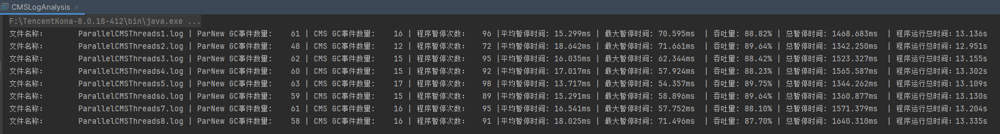

## 10、-XX:+UseCMSCompactAtFullCollection（不成功）
-XX:CMSFullGCsBeforeCompaction=0
参数介绍： <br>
CMSFullGCsBeforeCompaction 是在上一次CMS并发GC执行过后，到底还要再执行多少次full GC才会做压缩。默认是0，
也就是在默认配置下，每次CMS GC顶不住了而要转入full GC的时候都会做压缩。
把CMSFullGCsBeforeCompaction配置为10，就会让上面说的第一个条件变成每隔10次真正的full GC才做一次压缩（而不是每10次CMS并发GC就做一次压缩，目前VM里没有这样的参数）。这会使full GC更少做压缩，也就更容易使CMS的old gen受碎片化问题的困扰。
本来这个参数就是用来配置降低full GC压缩的频率，以期减少某些full GC的暂停时间。CMS回退到full GC时用的算法是mark-sweep-compact，
但compaction是可选的，不做的话碎片化会严重些但这次full GC的暂停时间会短些；这是个取舍。
<details>
    <summary>调整CMSFullGCsBeforeCompaction后的日志</summary>

- [aFullGCsBeforeCompaction1](cmsLog/FullGCsBeforeCompaction/aFullGCsBeforeCompaction1.log)
- [bFullGCsBeforeCompaction2](cmsLog/FullGCsBeforeCompaction/bFullGCsBeforeCompaction2.log)
- [cFullGCsBeforeCompaction3](cmsLog/FullGCsBeforeCompaction/cFullGCsBeforeCompaction3.log)
- [dFullGCsBeforeCompaction4](cmsLog/FullGCsBeforeCompaction/dFullGCsBeforeCompaction4.log)
- [eFullGCsBeforeCompaction5](cmsLog/FullGCsBeforeCompaction/eFullGCsBeforeCompaction5.log)
- [fFullGCsBeforeCompaction6](cmsLog/FullGCsBeforeCompaction/fFullGCsBeforeCompaction6.log)
- [gFullGCsBeforeCompaction7](cmsLog/FullGCsBeforeCompaction/gFullGCsBeforeCompaction7.log)
- [hFullGCsBeforeCompaction8](cmsLog/FullGCsBeforeCompaction/hFullGCsBeforeCompaction8.log)
- [iFullGCsBeforeCompaction9](cmsLog/FullGCsBeforeCompaction/iFullGCsBeforeCompaction9.log)
- [jFullGCsBeforeCompaction10](cmsLog/FullGCsBeforeCompaction/jFullGCsBeforeCompaction10.log)

</details>
从分析结果看，该参数并未击中程序痛点
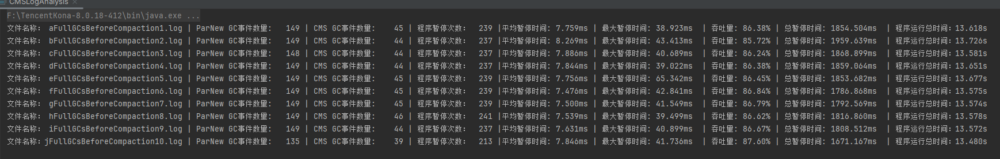


## 结论
最终的参数为下面参数
```shell
-XX:+UseConcMarkSweepGC
-XX:+PrintGCDetails
-XX:+PrintGCDateStamps
-Xmx896M
-Xloggc:./gc.log
-XX:NewSize=768m
-XX:MaxNewSize=768m
-XX:ConcGCThreads=2
-XX:+CMSScavengeBeforeRemark
-XX:+PrintGCApplicationStoppedTime
-XX:+PrintGCApplicationConcurrentTime
```
得到是[调优日志](cmsLog/finall/optimization.log)和[不调优日志](cmsLog/finall/Xmx896M.log)
使用程序进行分析得到下图：
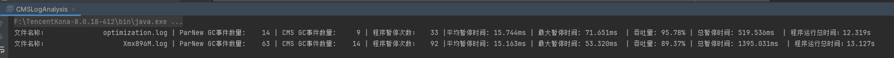
程序性能提升：

| 指标               | 趋势描述                    |
|------------------|-------------------------|
| CMS GC事件数量  | 14次 -> 9次               |
|ParNew GC事件数量| 63次 -> 14次              |
|程序暂停次数| 92次 -> 33次              |
| 平均暂停时间         | 平均暂停时间增多                |
| 最大暂停时间         | 最大暂停时间增加                |
| 吞吐量             | 89.37% -> 95.78%        |
| 程序总暂停时间        | 1395.031ms -> 519.536ms |